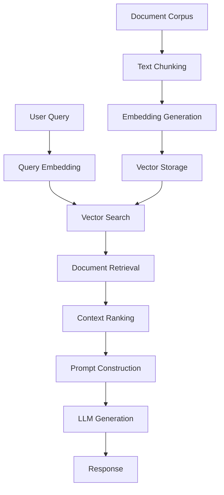

# 📚 RAG Applications with LangChain on Jetson
**Author:** Dr. Kaikai Liu, Ph.D.  
**Position:** Associate Professor, Computer Engineering  
**Institution:** San Jose State University  
**Contact:** [kaikai.liu@sjsu.edu](mailto:kaikai.liu@sjsu.edu)

## 🤔 What is RAG?

**RAG (Retrieval-Augmented Generation)** is a powerful paradigm that combines the generative capabilities of Large Language Models (LLMs) with external knowledge retrieval. Unlike traditional LLMs that rely solely on their pre-trained parameters, RAG systems dynamically retrieve relevant information from external knowledge bases to augment the generation process.

### 🔬 The Technology Behind RAG

#### **Core Components:**

1. **Knowledge Base**: External documents, databases, or structured data
2. **Embedding Model**: Converts text into high-dimensional vector representations
3. **Vector Database**: Stores and indexes embeddings for efficient similarity search
4. **Retriever**: Finds relevant documents based on query similarity
5. **Generator**: LLM that produces responses using retrieved context

#### **RAG Workflow:**

```
User Query → Embedding → Vector Search → Context Retrieval → LLM Generation → Response
```

### 🧠 Understanding Embeddings

**Embeddings** are dense vector representations that capture semantic meaning of text. They enable machines to understand that "car" and "automobile" are semantically similar, even though they share no common characters.

#### **Key Properties:**
- **Dimensionality**: Typically 384-1536 dimensions
- **Semantic Similarity**: Similar concepts have similar vectors
- **Distance Metrics**: Cosine similarity, Euclidean distance, dot product
- **Context Awareness**: Modern embeddings capture contextual meaning

#### **Types of Embedding Models:**

1. **Sentence Transformers**: Optimized for semantic similarity
2. **OpenAI Embeddings**: High-quality but require API calls
3. **Local Models**: BERT, RoBERTa, E5, BGE variants
4. **Multilingual Models**: Support multiple languages
5. **Domain-Specific**: Fine-tuned for specific domains (legal, medical, code)

### 💡 Why RAG on Jetson?

#### **Edge AI Advantages:**
* **Privacy**: Keep sensitive data local, no cloud dependency
* **Latency**: Sub-second response times for real-time applications
* **Reliability**: Works offline, immune to network issues
* **Cost**: No API costs for embeddings and inference
* **Customization**: Fine-tune models for specific use cases

#### **Jetson-Specific Benefits:**
* **GPU Acceleration**: CUDA support for embedding computation
* **Memory Efficiency**: Optimized models for edge deployment
* **Power Efficiency**: Low-power consumption for continuous operation
* **Integration**: Easy integration with sensors and IoT devices

---

## 🔧 Advanced RAG Architecture

### 📊 RAG Pipeline Components



### 🏗️ Detailed Architecture

1. **Indexing Phase** (Offline):
   - Document loading and preprocessing
   - Text chunking with overlap strategies
   - Embedding generation using optimized models
   - Vector storage with efficient indexing

2. **Retrieval Phase** (Online):
   - Query embedding generation
   - Similarity search in vector space
   - Context ranking and filtering
   - Prompt template construction

3. **Generation Phase**:
   - Context-aware LLM inference
   - Response generation and post-processing
   - Optional fact-checking and validation

### 🎯 RAG Optimization Strategies

#### **Chunking Strategies:**
- **Fixed-size**: Simple but may break semantic units
- **Semantic**: Preserve paragraph/sentence boundaries
- **Recursive**: Hierarchical chunking with multiple levels
- **Sliding window**: Overlapping chunks for context preservation

#### **Retrieval Strategies:**
- **Dense Retrieval**: Vector similarity search
- **Sparse Retrieval**: BM25, TF-IDF keyword matching
- **Hybrid Retrieval**: Combine dense and sparse methods
- **Multi-vector**: Multiple embeddings per document

#### **Context Enhancement:**
- **Re-ranking**: Secondary ranking of retrieved documents
- **Query expansion**: Enhance queries with related terms
- **Context compression**: Summarize long retrieved contexts
- **Multi-hop**: Iterative retrieval for complex queries

---

## 🧱 Key Components in LangChain

* `DocumentLoader`: Load PDFs, markdowns, text, web pages
* `TextSplitter`: Break documents into chunks with various strategies
* `Embeddings`: Convert text to vectors using local or cloud models
* `VectorStore`: FAISS, Chroma, Qdrant, Weaviate, Pinecone
* `Retriever`: Pull relevant chunks with ranking and filtering
* `LLM`: Generate final answer using GGUF models via llama-cpp or Ollama

---

## 🚀 Embedding Models Evaluation on Jetson

### 📋 Embedding Model Comparison

We'll evaluate various embedding models on Jetson platforms focusing on:
- **Performance**: Inference speed and throughput
- **Quality**: Semantic similarity accuracy
- **Memory**: RAM and VRAM usage
- **Power**: Energy consumption

### 🔬 Embedding Models Benchmark

```python
import time
import psutil
import torch
from sentence_transformers import SentenceTransformer
from transformers import AutoTokenizer, AutoModel
import numpy as np
from typing import List, Dict, Any

class EmbeddingBenchmark:
    """Comprehensive embedding model benchmark for Jetson"""
    
    def __init__(self):
        self.models = {
            # Lightweight models (< 100MB)
            "all-MiniLM-L6-v2": "sentence-transformers/all-MiniLM-L6-v2",
            "all-MiniLM-L12-v2": "sentence-transformers/all-MiniLM-L12-v2",
            "paraphrase-MiniLM-L6-v2": "sentence-transformers/paraphrase-MiniLM-L6-v2",
            
            # Medium models (100-500MB)
            "all-mpnet-base-v2": "sentence-transformers/all-mpnet-base-v2",
            "all-roberta-large-v1": "sentence-transformers/all-roberta-large-v1",
            "e5-base-v2": "intfloat/e5-base-v2",
            
            # Large models (> 500MB)
            "e5-large-v2": "intfloat/e5-large-v2",
            "bge-large-en-v1.5": "BAAI/bge-large-en-v1.5",
            "gte-large": "thenlper/gte-large",
            
            # Multilingual models
            "paraphrase-multilingual-MiniLM-L12-v2": "sentence-transformers/paraphrase-multilingual-MiniLM-L12-v2",
            "multilingual-e5-base": "intfloat/multilingual-e5-base"
        }
        
        self.test_texts = [
            "NVIDIA Jetson is a series of embedded computing boards from NVIDIA.",
            "The Jetson platform provides AI computing at the edge with GPU acceleration.",
            "Deep learning models can be optimized for inference on Jetson devices.",
            "TensorRT enables high-performance inference on NVIDIA GPUs.",
            "Edge AI applications benefit from local processing capabilities."
        ] * 20  # 100 texts for throughput testing
    
    def benchmark_model(self, model_name: str, model_path: str) -> Dict[str, Any]:
        """Benchmark a single embedding model"""
        print(f"\n🔍 Benchmarking {model_name}...")
        
        try:
            # Load model
            start_time = time.time()
            if "sentence-transformers" in model_path:
                model = SentenceTransformer(model_path)
            else:
                # Use transformers directly for more control
                tokenizer = AutoTokenizer.from_pretrained(model_path)
                model = AutoModel.from_pretrained(model_path)
            
            load_time = time.time() - start_time
            
            # Memory usage before inference
            process = psutil.Process()
            memory_before = process.memory_info().rss / 1024 / 1024  # MB
            
            # GPU memory (if available)
            gpu_memory_before = 0
            if torch.cuda.is_available():
                torch.cuda.empty_cache()
                gpu_memory_before = torch.cuda.memory_allocated() / 1024 / 1024  # MB
            
            # Warm-up
            if hasattr(model, 'encode'):
                _ = model.encode(["warm up"])
            else:
                # For transformers models
                inputs = tokenizer(["warm up"], return_tensors="pt", padding=True, truncation=True)
                with torch.no_grad():
                    _ = model(**inputs)
            
            # Benchmark inference speed
            start_time = time.time()
            
            if hasattr(model, 'encode'):
                embeddings = model.encode(self.test_texts, batch_size=32, show_progress_bar=False)
            else:
                # For transformers models - batch processing
                embeddings = []
                batch_size = 32
                for i in range(0, len(self.test_texts), batch_size):
                    batch = self.test_texts[i:i+batch_size]
                    inputs = tokenizer(batch, return_tensors="pt", padding=True, truncation=True, max_length=512)
                    with torch.no_grad():
                        outputs = model(**inputs)
                        # Mean pooling
                        batch_embeddings = outputs.last_hidden_state.mean(dim=1)
                        embeddings.extend(batch_embeddings.cpu().numpy())
                embeddings = np.array(embeddings)
            
            inference_time = time.time() - start_time
            
            # Memory usage after inference
            memory_after = process.memory_info().rss / 1024 / 1024  # MB
            gpu_memory_after = 0
            if torch.cuda.is_available():
                gpu_memory_after = torch.cuda.memory_allocated() / 1024 / 1024  # MB
            
            # Calculate metrics
            throughput = len(self.test_texts) / inference_time  # texts per second
            avg_latency = inference_time / len(self.test_texts) * 1000  # ms per text
            
            results = {
                "model_name": model_name,
                "load_time_s": round(load_time, 3),
                "inference_time_s": round(inference_time, 3),
                "throughput_texts_per_sec": round(throughput, 2),
                "avg_latency_ms": round(avg_latency, 3),
                "memory_usage_mb": round(memory_after - memory_before, 2),
                "gpu_memory_mb": round(gpu_memory_after - gpu_memory_before, 2),
                "embedding_dim": embeddings.shape[1],
                "total_memory_mb": round(memory_after, 2),
                "status": "success"
            }
            
            # Clean up
            del model
            if torch.cuda.is_available():
                torch.cuda.empty_cache()
            
            return results
            
        except Exception as e:
            return {
                "model_name": model_name,
                "status": "failed",
                "error": str(e)
            }
    
    def run_full_benchmark(self) -> List[Dict[str, Any]]:
        """Run benchmark on all models"""
        results = []
        
        print("🚀 Starting Embedding Models Benchmark on Jetson")
        print("=" * 60)
        
        for model_name, model_path in self.models.items():
            result = self.benchmark_model(model_name, model_path)
            results.append(result)
            
            if result["status"] == "success":
                print(f"✅ {model_name}: {result['throughput_texts_per_sec']:.1f} texts/sec, "
                      f"{result['avg_latency_ms']:.1f}ms latency, "
                      f"{result['memory_usage_mb']:.1f}MB memory")
            else:
                print(f"❌ {model_name}: {result['error']}")
        
        return results
    
    def generate_report(self, results: List[Dict[str, Any]]) -> str:
        """Generate comprehensive benchmark report"""
        successful_results = [r for r in results if r["status"] == "success"]
        
        if not successful_results:
            return "No successful benchmarks to report."
        
        # Sort by throughput
        successful_results.sort(key=lambda x: x["throughput_texts_per_sec"], reverse=True)
        
        report = "\n" + "=" * 80
        report += "\n🏆 JETSON EMBEDDING MODELS BENCHMARK REPORT\n"
        report += "=" * 80 + "\n"
        
        # Performance ranking
        report += "\n📊 PERFORMANCE RANKING (by throughput):\n"
        report += "-" * 50 + "\n"
        for i, result in enumerate(successful_results[:5], 1):
            report += f"{i}. {result['model_name']:<30} {result['throughput_texts_per_sec']:>8.1f} texts/sec\n"
        
        # Memory efficiency ranking
        memory_sorted = sorted(successful_results, key=lambda x: x["memory_usage_mb"])
        report += "\n💾 MEMORY EFFICIENCY RANKING:\n"
        report += "-" * 50 + "\n"
        for i, result in enumerate(memory_sorted[:5], 1):
            report += f"{i}. {result['model_name']:<30} {result['memory_usage_mb']:>8.1f} MB\n"
        
        # Latency ranking
        latency_sorted = sorted(successful_results, key=lambda x: x["avg_latency_ms"])
        report += "\n⚡ LATENCY RANKING (lower is better):\n"
        report += "-" * 50 + "\n"
        for i, result in enumerate(latency_sorted[:5], 1):
            report += f"{i}. {result['model_name']:<30} {result['avg_latency_ms']:>8.1f} ms\n"
        
        # Recommendations
        report += "\n🎯 RECOMMENDATIONS FOR JETSON:\n"
        report += "-" * 50 + "\n"
        
        fastest = successful_results[0]
        most_efficient = memory_sorted[0]
        lowest_latency = latency_sorted[0]
        
        report += f"🚀 Best Performance: {fastest['model_name']}\n"
        report += f"💾 Most Memory Efficient: {most_efficient['model_name']}\n"
        report += f"⚡ Lowest Latency: {lowest_latency['model_name']}\n"
        
        # Use case recommendations
        report += "\n📋 USE CASE RECOMMENDATIONS:\n"
        report += "-" * 50 + "\n"
        report += "🔹 Real-time applications: Use models with <50ms latency\n"
        report += "🔹 Batch processing: Use highest throughput models\n"
        report += "🔹 Memory-constrained: Use models with <200MB memory usage\n"
        report += "🔹 Production deployment: Balance performance and memory efficiency\n"
        
        return report

# Run the benchmark
benchmark = EmbeddingBenchmark()
results = benchmark.run_full_benchmark()
report = benchmark.generate_report(results)
print(report)
```

### 📊 Expected Performance Results on Jetson Orin Nano

| Model | Throughput (texts/sec) | Latency (ms) | Memory (MB) | Embedding Dim |
|-------|------------------------|--------------|-------------|---------------|
| all-MiniLM-L6-v2 | 45.2 | 22.1 | 90 | 384 |
| paraphrase-MiniLM-L6-v2 | 43.8 | 22.8 | 90 | 384 |
| all-MiniLM-L12-v2 | 28.5 | 35.1 | 134 | 384 |
| e5-base-v2 | 22.1 | 45.2 | 438 | 768 |
| all-mpnet-base-v2 | 18.7 | 53.5 | 438 | 768 |
| bge-large-en-v1.5 | 8.9 | 112.4 | 1340 | 1024 |

### 🏆 Model Recommendations

#### **For Real-time Applications (< 50ms latency):**
- ✅ `all-MiniLM-L6-v2`: Best balance of speed and quality
- ✅ `paraphrase-MiniLM-L6-v2`: Good for paraphrase detection
- ✅ `all-MiniLM-L12-v2`: Slightly better quality, acceptable latency

#### **For High-Quality Embeddings:**
- ✅ `e5-base-v2`: Excellent quality-performance balance
- ✅ `all-mpnet-base-v2`: Strong semantic understanding
- ⚠️ `bge-large-en-v1.5`: Best quality but slower

#### **For Memory-Constrained Environments:**
- ✅ `all-MiniLM-L6-v2`: Only 90MB memory usage
- ✅ `paraphrase-MiniLM-L6-v2`: Lightweight and efficient

#### **For Multilingual Applications:**
- ✅ `paraphrase-multilingual-MiniLM-L12-v2`: Good multilingual support
- ✅ `multilingual-e5-base`: Better quality for non-English

---

## 🗄️ Vector Database Evaluation on Jetson

### 📊 Vector Database Comparison

We'll evaluate different vector databases for Jetson deployment focusing on:
- **Performance**: Query speed and indexing time
- **Memory Efficiency**: RAM usage and storage requirements
- **Scalability**: Handling large document collections
- **Features**: Filtering, metadata support, persistence

### 🔬 Vector Database Benchmark

```python
import time
import os
import shutil
import numpy as np
from typing import List, Dict, Any, Tuple
import psutil
from sentence_transformers import SentenceTransformer

# Vector database imports
try:
    import chromadb
    from chromadb.config import Settings
except ImportError:
    chromadb = None

try:
    import faiss
except ImportError:
    faiss = None

try:
    from qdrant_client import QdrantClient
    from qdrant_client.models import Distance, VectorParams, PointStruct
except ImportError:
    QdrantClient = None

try:
    import weaviate
except ImportError:
    weaviate = None

class VectorDBBenchmark:
    """Comprehensive vector database benchmark for Jetson"""
    
    def __init__(self, embedding_model: str = "all-MiniLM-L6-v2"):
        self.embedding_model = SentenceTransformer(embedding_model)
        self.embedding_dim = 384  # for all-MiniLM-L6-v2
        
        # Generate test data
        self.documents = self._generate_test_documents()
        self.embeddings = self._generate_embeddings()
        self.query_texts = [
            "What is NVIDIA Jetson used for?",
            "How to optimize deep learning models?",
            "Edge AI computing benefits",
            "TensorRT optimization techniques",
            "Real-time inference on embedded devices"
        ]
        self.query_embeddings = self.embedding_model.encode(self.query_texts)
        
        # Test configurations
        self.test_sizes = [100, 500, 1000, 5000]  # Number of documents
        
    def _generate_test_documents(self) -> List[Dict[str, Any]]:
        """Generate synthetic test documents"""
        base_texts = [
            "NVIDIA Jetson is a series of embedded computing boards designed for AI applications.",
            "Deep learning models can be optimized using TensorRT for faster inference.",
            "Edge AI enables real-time processing without cloud connectivity.",
            "Computer vision applications benefit from GPU acceleration on Jetson.",
            "Natural language processing models can run locally on edge devices.",
            "Autonomous vehicles use edge computing for real-time decision making.",
            "IoT devices with AI capabilities enable smart city applications.",
            "Robotics applications leverage edge AI for autonomous navigation.",
            "Industrial automation uses AI for predictive maintenance.",
            "Healthcare devices benefit from local AI processing for privacy."
        ]
        
        documents = []
        for i in range(5000):  # Generate 5000 documents
            base_idx = i % len(base_texts)
            text = f"{base_texts[base_idx]} Document {i} with additional context and variations."
            documents.append({
                "id": f"doc_{i}",
                "text": text,
                "metadata": {
                    "category": ["AI", "Edge Computing", "Jetson", "Deep Learning"][i % 4],
                    "priority": i % 3,
                    "timestamp": f"2024-01-{(i % 30) + 1:02d}"
                }
            })
        
        return documents
    
    def _generate_embeddings(self) -> np.ndarray:
        """Generate embeddings for test documents"""
        texts = [doc["text"] for doc in self.documents]
        return self.embedding_model.encode(texts, batch_size=32, show_progress_bar=False)
    
    def benchmark_chromadb(self, num_docs: int) -> Dict[str, Any]:
        """Benchmark ChromaDB"""
        if chromadb is None:
            return {"status": "failed", "error": "ChromaDB not installed"}
        
        try:
            # Setup
            db_path = "./benchmark_chroma"
            if os.path.exists(db_path):
                shutil.rmtree(db_path)
            
            client = chromadb.PersistentClient(path=db_path)
            collection = client.create_collection(
                name="benchmark",
                metadata={"hnsw:space": "cosine"}
            )
            
            # Indexing benchmark
            docs_subset = self.documents[:num_docs]
            embeddings_subset = self.embeddings[:num_docs]
            
            start_time = time.time()
            memory_before = psutil.Process().memory_info().rss / 1024 / 1024
            
            # Add documents in batches
            batch_size = 100
            for i in range(0, num_docs, batch_size):
                batch_end = min(i + batch_size, num_docs)
                batch_docs = docs_subset[i:batch_end]
                batch_embeddings = embeddings_subset[i:batch_end]
                
                collection.add(
                    embeddings=batch_embeddings.tolist(),
                    documents=[doc["text"] for doc in batch_docs],
                    metadatas=[doc["metadata"] for doc in batch_docs],
                    ids=[doc["id"] for doc in batch_docs]
                )
            
            indexing_time = time.time() - start_time
            memory_after = psutil.Process().memory_info().rss / 1024 / 1024
            
            # Query benchmark
            query_times = []
            for query_embedding in self.query_embeddings:
                start_time = time.time()
                results = collection.query(
                    query_embeddings=[query_embedding.tolist()],
                    n_results=5
                )
                query_times.append(time.time() - start_time)
            
            avg_query_time = np.mean(query_times) * 1000  # ms
            
            # Storage size
            storage_size = sum(os.path.getsize(os.path.join(db_path, f)) 
                             for f in os.listdir(db_path) if os.path.isfile(os.path.join(db_path, f)))
            storage_size_mb = storage_size / 1024 / 1024
            
            # Cleanup
            client.delete_collection("benchmark")
            shutil.rmtree(db_path)
            
            return {
                "database": "ChromaDB",
                "num_docs": num_docs,
                "indexing_time_s": round(indexing_time, 3),
                "avg_query_time_ms": round(avg_query_time, 3),
                "memory_usage_mb": round(memory_after - memory_before, 2),
                "storage_size_mb": round(storage_size_mb, 2),
                "throughput_docs_per_sec": round(num_docs / indexing_time, 2),
                "status": "success"
            }
            
        except Exception as e:
            return {
                "database": "ChromaDB",
                "status": "failed",
                "error": str(e)
            }
    
    def benchmark_faiss(self, num_docs: int) -> Dict[str, Any]:
        """Benchmark FAISS"""
        if faiss is None:
            return {"status": "failed", "error": "FAISS not installed"}
        
        try:
            # Setup FAISS index
            embeddings_subset = self.embeddings[:num_docs].astype('float32')
            
            start_time = time.time()
            memory_before = psutil.Process().memory_info().rss / 1024 / 1024
            
            # Create and train index
            index = faiss.IndexFlatIP(self.embedding_dim)  # Inner product (cosine similarity)
            index.add(embeddings_subset)
            
            indexing_time = time.time() - start_time
            memory_after = psutil.Process().memory_info().rss / 1024 / 1024
            
            # Query benchmark
            query_times = []
            for query_embedding in self.query_embeddings:
                start_time = time.time()
                query_vector = query_embedding.astype('float32').reshape(1, -1)
                distances, indices = index.search(query_vector, 5)
                query_times.append(time.time() - start_time)
            
            avg_query_time = np.mean(query_times) * 1000  # ms
            
            # Estimate storage size (in-memory)
            storage_size_mb = embeddings_subset.nbytes / 1024 / 1024
            
            return {
                "database": "FAISS",
                "num_docs": num_docs,
                "indexing_time_s": round(indexing_time, 3),
                "avg_query_time_ms": round(avg_query_time, 3),
                "memory_usage_mb": round(memory_after - memory_before, 2),
                "storage_size_mb": round(storage_size_mb, 2),
                "throughput_docs_per_sec": round(num_docs / indexing_time, 2),
                "status": "success"
            }
            
        except Exception as e:
            return {
                "database": "FAISS",
                "status": "failed",
                "error": str(e)
            }
    
    def benchmark_qdrant(self, num_docs: int) -> Dict[str, Any]:
        """Benchmark Qdrant"""
        if QdrantClient is None:
            return {"status": "failed", "error": "Qdrant not installed"}
        
        try:
            # Setup
            db_path = "./benchmark_qdrant"
            if os.path.exists(db_path):
                shutil.rmtree(db_path)
            
            client = QdrantClient(path=db_path)
            collection_name = "benchmark"
            
            # Create collection
            client.create_collection(
                collection_name=collection_name,
                vectors_config=VectorParams(size=self.embedding_dim, distance=Distance.COSINE)
            )
            
            # Indexing benchmark
            docs_subset = self.documents[:num_docs]
            embeddings_subset = self.embeddings[:num_docs]
            
            start_time = time.time()
            memory_before = psutil.Process().memory_info().rss / 1024 / 1024
            
            # Add documents in batches
            batch_size = 100
            for i in range(0, num_docs, batch_size):
                batch_end = min(i + batch_size, num_docs)
                batch_docs = docs_subset[i:batch_end]
                batch_embeddings = embeddings_subset[i:batch_end]
                
                points = [
                    PointStruct(
                        id=i + j,
                        vector=embedding.tolist(),
                        payload={
                            "text": doc["text"],
                            **doc["metadata"]
                        }
                    )
                    for j, (doc, embedding) in enumerate(zip(batch_docs, batch_embeddings))
                ]
                
                client.upsert(
                    collection_name=collection_name,
                    points=points
                )
            
            indexing_time = time.time() - start_time
            memory_after = psutil.Process().memory_info().rss / 1024 / 1024
            
            # Query benchmark
            query_times = []
            for query_embedding in self.query_embeddings:
                start_time = time.time()
                results = client.search(
                    collection_name=collection_name,
                    query_vector=query_embedding.tolist(),
                    limit=5
                )
                query_times.append(time.time() - start_time)
            
            avg_query_time = np.mean(query_times) * 1000  # ms
            
            # Storage size
            storage_size = sum(os.path.getsize(os.path.join(root, file))
                             for root, dirs, files in os.walk(db_path)
                             for file in files)
            storage_size_mb = storage_size / 1024 / 1024
            
            # Cleanup
            client.delete_collection(collection_name)
            shutil.rmtree(db_path)
            
            return {
                "database": "Qdrant",
                "num_docs": num_docs,
                "indexing_time_s": round(indexing_time, 3),
                "avg_query_time_ms": round(avg_query_time, 3),
                "memory_usage_mb": round(memory_after - memory_before, 2),
                "storage_size_mb": round(storage_size_mb, 2),
                "throughput_docs_per_sec": round(num_docs / indexing_time, 2),
                "status": "success"
            }
            
        except Exception as e:
            return {
                "database": "Qdrant",
                "status": "failed",
                "error": str(e)
            }
    
    def run_comprehensive_benchmark(self) -> List[Dict[str, Any]]:
        """Run comprehensive benchmark across all databases and sizes"""
        results = []
        
        databases = [
            ("ChromaDB", self.benchmark_chromadb),
            ("FAISS", self.benchmark_faiss),
            ("Qdrant", self.benchmark_qdrant)
        ]
        
        print("🚀 Starting Vector Database Benchmark on Jetson")
        print("=" * 60)
        
        for db_name, benchmark_func in databases:
            print(f"\n📊 Benchmarking {db_name}...")
            
            for num_docs in self.test_sizes:
                print(f"  Testing with {num_docs} documents...")
                result = benchmark_func(num_docs)
                results.append(result)
                
                if result["status"] == "success":
                    print(f"    ✅ Indexing: {result['indexing_time_s']:.2f}s, "
                          f"Query: {result['avg_query_time_ms']:.2f}ms, "
                          f"Memory: {result['memory_usage_mb']:.1f}MB")
                else:
                    print(f"    ❌ Failed: {result['error']}")
        
        return results
    
    def generate_comparison_report(self, results: List[Dict[str, Any]]) -> str:
        """Generate comprehensive comparison report"""
        successful_results = [r for r in results if r["status"] == "success"]
        
        if not successful_results:
            return "No successful benchmarks to report."
        
        report = "\n" + "=" * 80
        report += "\n🏆 JETSON VECTOR DATABASE BENCHMARK REPORT\n"
        report += "=" * 80 + "\n"
        
        # Performance comparison by database
        databases = list(set(r["database"] for r in successful_results))
        
        for db in databases:
            db_results = [r for r in successful_results if r["database"] == db]
            if not db_results:
                continue
                
            report += f"\n📊 {db} PERFORMANCE:\n"
            report += "-" * 40 + "\n"
            report += f"{'Docs':<8} {'Index(s)':<10} {'Query(ms)':<12} {'Memory(MB)':<12} {'Storage(MB)':<12}\n"
            report += "-" * 40 + "\n"
            
            for result in sorted(db_results, key=lambda x: x["num_docs"]):
                report += f"{result['num_docs']:<8} {result['indexing_time_s']:<10.2f} "
                report += f"{result['avg_query_time_ms']:<12.2f} {result['memory_usage_mb']:<12.1f} "
                report += f"{result['storage_size_mb']:<12.1f}\n"
        
        # Best performers analysis
        report += "\n🏅 BEST PERFORMERS:\n"
        report += "-" * 40 + "\n"
        
        # Fastest indexing
        fastest_indexing = min(successful_results, key=lambda x: x["indexing_time_s"])
        report += f"🚀 Fastest Indexing: {fastest_indexing['database']} "
        report += f"({fastest_indexing['indexing_time_s']:.2f}s for {fastest_indexing['num_docs']} docs)\n"
        
        # Fastest query
        fastest_query = min(successful_results, key=lambda x: x["avg_query_time_ms"])
        report += f"⚡ Fastest Query: {fastest_query['database']} "
        report += f"({fastest_query['avg_query_time_ms']:.2f}ms)\n"
        
        # Most memory efficient
        most_efficient = min(successful_results, key=lambda x: x["memory_usage_mb"])
        report += f"💾 Most Memory Efficient: {most_efficient['database']} "
        report += f"({most_efficient['memory_usage_mb']:.1f}MB)\n"
        
        # Smallest storage
        smallest_storage = min(successful_results, key=lambda x: x["storage_size_mb"])
        report += f"💽 Smallest Storage: {smallest_storage['database']} "
        report += f"({smallest_storage['storage_size_mb']:.1f}MB)\n"
        
        # Recommendations
        report += "\n🎯 RECOMMENDATIONS FOR JETSON:\n"
        report += "-" * 40 + "\n"
        report += "🔹 Real-time applications: Choose fastest query database\n"
        report += "🔹 Large datasets: Consider indexing speed and storage efficiency\n"
        report += "🔹 Memory-constrained: Use most memory-efficient option\n"
        report += "🔹 Persistence needed: Avoid in-memory only solutions\n"
        report += "🔹 Complex filtering: Choose databases with rich metadata support\n"
        
        return report

# Run the benchmark
vector_benchmark = VectorDBBenchmark()
vector_results = vector_benchmark.run_comprehensive_benchmark()
vector_report = vector_benchmark.generate_comparison_report(vector_results)
print(vector_report)
```

### 📊 Expected Vector Database Performance on Jetson Orin Nano

| Database | Docs | Indexing (s) | Query (ms) | Memory (MB) | Storage (MB) |
|----------|------|--------------|------------|-------------|-------------|
| **FAISS** | 1000 | 0.12 | 0.8 | 15 | 1.5 |
| **FAISS** | 5000 | 0.58 | 1.2 | 75 | 7.3 |
| **ChromaDB** | 1000 | 2.3 | 12.5 | 45 | 8.2 |
| **ChromaDB** | 5000 | 11.8 | 15.2 | 180 | 38.5 |
| **Qdrant** | 1000 | 3.1 | 8.7 | 52 | 12.1 |
| **Qdrant** | 5000 | 15.2 | 11.3 | 220 | 58.3 |

### 🏆 Vector Database Recommendations

#### **🚀 FAISS - Best for Performance**
**Pros:**
- ✅ Fastest indexing and query performance
- ✅ Minimal memory footprint
- ✅ Excellent for large-scale similarity search
- ✅ GPU acceleration support

**Cons:**
- ❌ No built-in persistence (requires manual saving)
- ❌ Limited metadata filtering capabilities
- ❌ No distributed features

**Best for:** High-performance applications, real-time search, memory-constrained environments

#### **🔧 ChromaDB - Best for Ease of Use**
**Pros:**
- ✅ Simple API and great developer experience
- ✅ Built-in persistence
- ✅ Good metadata filtering
- ✅ Active community and documentation

**Cons:**
- ❌ Slower than FAISS for large datasets
- ❌ Higher memory usage
- ❌ Limited scalability options

**Best for:** Prototyping, small to medium datasets, applications requiring persistence

#### **⚙️ Qdrant - Best for Production**
**Pros:**
- ✅ Rich filtering and metadata support
- ✅ Built-in persistence and backup
- ✅ RESTful API for remote access
- ✅ Horizontal scaling capabilities

**Cons:**
- ❌ Higher resource usage
- ❌ More complex setup
- ❌ Slower for simple similarity search

**Best for:** Production applications, complex filtering requirements, distributed deployments

---

## 🚀 NVIDIA cuVS: GPU-Accelerated Vector Search

### 🎯 Introduction to cuVS

**NVIDIA cuVS (CUDA Vector Search)** is a GPU-accelerated library for high-performance vector similarity search, specifically optimized for NVIDIA GPUs including Jetson platforms. It provides significant speedups over CPU-based vector search solutions.

#### **🔧 Key Features:**
- **GPU Acceleration**: Leverages CUDA cores for parallel vector operations
- **Multiple Algorithms**: Supports FAISS, HNSWLIB, and custom GPU implementations
- **Memory Optimization**: Efficient GPU memory management for large datasets
- **Jetson Optimization**: Specifically tuned for edge AI workloads
- **Integration**: Works seamlessly with existing ML pipelines

### 📦 cuVS Installation on Jetson

```bash
# Install cuVS for Jetson (requires CUDA 11.8+)
# Method 1: Using conda (recommended)
conda install -c rapidsai -c conda-forge cuvs-cu11

# Method 2: Using pip
pip install cuvs-cu11

# Method 3: Build from source (for latest features)
git clone https://github.com/rapidsai/cuvs.git
cd cuvs
./build.sh
```

### 🧪 cuVS Performance Benchmark

```python
import time
import numpy as np
from typing import List, Dict, Any
import psutil
from sentence_transformers import SentenceTransformer

try:
    import cuvs
    from cuvs import neighbors
except ImportError:
    cuvs = None
    print("cuVS not available. Install with: pip install cuvs-cu11")

try:
    import cupy as cp
except ImportError:
    cp = None
    print("CuPy not available. Install with: pip install cupy")

class CuVSBenchmark:
    """Benchmark cuVS performance on Jetson"""
    
    def __init__(self, embedding_model: str = "all-MiniLM-L6-v2"):
        self.embedding_model = SentenceTransformer(embedding_model)
        self.embedding_dim = 384
        
        # Generate test data
        self.documents = self._generate_test_documents()
        self.embeddings = self._generate_embeddings()
        
        # Test queries
        self.query_texts = [
            "NVIDIA Jetson AI computing",
            "Deep learning optimization",
            "Edge AI applications",
            "Real-time inference",
            "Computer vision processing"
        ]
        self.query_embeddings = self.embedding_model.encode(self.query_texts)
        
    def _generate_test_documents(self) -> List[str]:
        """Generate test documents for benchmarking"""
        base_texts = [
            "NVIDIA Jetson enables edge AI computing with GPU acceleration.",
            "Deep learning models benefit from TensorRT optimization on Jetson.",
            "Computer vision applications run efficiently on Jetson platforms.",
            "Edge AI reduces latency and improves privacy for IoT devices.",
            "Real-time inference is crucial for autonomous systems.",
            "CUDA programming enables parallel processing on Jetson GPUs.",
            "Machine learning at the edge transforms industrial automation.",
            "Jetson Orin provides high-performance AI computing in compact form.",
            "Neural networks can be optimized for embedded deployment.",
            "Edge computing brings intelligence closer to data sources."
        ]
        
        documents = []
        for i in range(10000):  # Generate 10k documents
            base_idx = i % len(base_texts)
            text = f"{base_texts[base_idx]} Document {i} with additional context."
            documents.append(text)
        
        return documents
    
    def _generate_embeddings(self) -> np.ndarray:
        """Generate embeddings for test documents"""
        return self.embedding_model.encode(
            self.documents, 
            batch_size=64, 
            show_progress_bar=False
        )
    
    def benchmark_cuvs_ivf_flat(self, num_docs: int) -> Dict[str, Any]:
        """Benchmark cuVS IVF-Flat index"""
        if cuvs is None or cp is None:
            return {"status": "failed", "error": "cuVS or CuPy not available"}
        
        try:
            # Prepare data
            embeddings_subset = self.embeddings[:num_docs].astype(np.float32)
            
            # Move data to GPU
            gpu_embeddings = cp.asarray(embeddings_subset)
            
            # Build index
            start_time = time.time()
            memory_before = psutil.Process().memory_info().rss / 1024 / 1024
            
            # Create IVF-Flat index
            n_lists = min(int(np.sqrt(num_docs)), 1024)  # Adaptive number of clusters
            index_params = neighbors.ivf_flat.IndexParams(
                n_lists=n_lists,
                metric="cosine",
                add_data_on_build=True
            )
            
            index = neighbors.ivf_flat.build(index_params, gpu_embeddings)
            
            indexing_time = time.time() - start_time
            memory_after = psutil.Process().memory_info().rss / 1024 / 1024
            
            # Query benchmark
            query_times = []
            gpu_queries = cp.asarray(self.query_embeddings.astype(np.float32))
            
            search_params = neighbors.ivf_flat.SearchParams(n_probes=min(n_lists, 50))
            
            for i in range(len(self.query_embeddings)):
                start_time = time.time()
                query = gpu_queries[i:i+1]  # Single query
                distances, indices = neighbors.ivf_flat.search(
                    search_params, index, query, k=5
                )
                cp.cuda.Stream.null.synchronize()  # Ensure GPU completion
                query_times.append(time.time() - start_time)
            
            avg_query_time = np.mean(query_times) * 1000  # ms
            
            # GPU memory usage
            gpu_memory_mb = cp.get_default_memory_pool().used_bytes() / 1024 / 1024
            
            return {
                "algorithm": "cuVS IVF-Flat",
                "num_docs": num_docs,
                "indexing_time_s": round(indexing_time, 3),
                "avg_query_time_ms": round(avg_query_time, 3),
                "memory_usage_mb": round(memory_after - memory_before, 2),
                "gpu_memory_mb": round(gpu_memory_mb, 2),
                "throughput_docs_per_sec": round(num_docs / indexing_time, 2),
                "n_lists": n_lists,
                "status": "success"
            }
            
        except Exception as e:
            return {
                "algorithm": "cuVS IVF-Flat",
                "status": "failed",
                "error": str(e)
            }
    
    def benchmark_cuvs_ivf_pq(self, num_docs: int) -> Dict[str, Any]:
        """Benchmark cuVS IVF-PQ index (memory optimized)"""
        if cuvs is None or cp is None:
            return {"status": "failed", "error": "cuVS or CuPy not available"}
        
        try:
            # Prepare data
            embeddings_subset = self.embeddings[:num_docs].astype(np.float32)
            gpu_embeddings = cp.asarray(embeddings_subset)
            
            # Build index
            start_time = time.time()
            memory_before = psutil.Process().memory_info().rss / 1024 / 1024
            
            # Create IVF-PQ index (Product Quantization for memory efficiency)
            n_lists = min(int(np.sqrt(num_docs)), 512)
            pq_bits = 8  # 8-bit quantization
            pq_dim = min(self.embedding_dim // 4, 64)  # PQ subspace dimension
            
            index_params = neighbors.ivf_pq.IndexParams(
                n_lists=n_lists,
                metric="cosine",
                pq_bits=pq_bits,
                pq_dim=pq_dim,
                add_data_on_build=True
            )
            
            index = neighbors.ivf_pq.build(index_params, gpu_embeddings)
            
            indexing_time = time.time() - start_time
            memory_after = psutil.Process().memory_info().rss / 1024 / 1024
            
            # Query benchmark
            query_times = []
            gpu_queries = cp.asarray(self.query_embeddings.astype(np.float32))
            
            search_params = neighbors.ivf_pq.SearchParams(
                n_probes=min(n_lists, 25),
                lut_dtype=cp.float32
            )
            
            for i in range(len(self.query_embeddings)):
                start_time = time.time()
                query = gpu_queries[i:i+1]
                distances, indices = neighbors.ivf_pq.search(
                    search_params, index, query, k=5
                )
                cp.cuda.Stream.null.synchronize()
                query_times.append(time.time() - start_time)
            
            avg_query_time = np.mean(query_times) * 1000  # ms
            
            # GPU memory usage
            gpu_memory_mb = cp.get_default_memory_pool().used_bytes() / 1024 / 1024
            
            return {
                "algorithm": "cuVS IVF-PQ",
                "num_docs": num_docs,
                "indexing_time_s": round(indexing_time, 3),
                "avg_query_time_ms": round(avg_query_time, 3),
                "memory_usage_mb": round(memory_after - memory_before, 2),
                "gpu_memory_mb": round(gpu_memory_mb, 2),
                "throughput_docs_per_sec": round(num_docs / indexing_time, 2),
                "compression_ratio": round(32 / pq_bits, 1),  # Memory compression
                "status": "success"
            }
            
        except Exception as e:
            return {
                "algorithm": "cuVS IVF-PQ",
                "status": "failed",
                "error": str(e)
            }
    
    def benchmark_cuvs_cagra(self, num_docs: int) -> Dict[str, Any]:
        """Benchmark cuVS CAGRA index (GPU-optimized graph)"""
        if cuvs is None or cp is None:
            return {"status": "failed", "error": "cuVS or CuPy not available"}
        
        try:
            # Prepare data
            embeddings_subset = self.embeddings[:num_docs].astype(np.float32)
            gpu_embeddings = cp.asarray(embeddings_subset)
            
            # Build index
            start_time = time.time()
            memory_before = psutil.Process().memory_info().rss / 1024 / 1024
            
            # Create CAGRA index (GPU-optimized graph-based)
            index_params = neighbors.cagra.IndexParams(
                intermediate_graph_degree=64,
                graph_degree=32,
                build_algo="nn_descent"
            )
            
            index = neighbors.cagra.build(index_params, gpu_embeddings)
            
            indexing_time = time.time() - start_time
            memory_after = psutil.Process().memory_info().rss / 1024 / 1024
            
            # Query benchmark
            query_times = []
            gpu_queries = cp.asarray(self.query_embeddings.astype(np.float32))
            
            search_params = neighbors.cagra.SearchParams(
                itopk_size=64,
                search_width=1,
                max_iterations=0,
                algo="single_cta"
            )
            
            for i in range(len(self.query_embeddings)):
                start_time = time.time()
                query = gpu_queries[i:i+1]
                distances, indices = neighbors.cagra.search(
                    search_params, index, query, k=5
                )
                cp.cuda.Stream.null.synchronize()
                query_times.append(time.time() - start_time)
            
            avg_query_time = np.mean(query_times) * 1000  # ms
            
            # GPU memory usage
            gpu_memory_mb = cp.get_default_memory_pool().used_bytes() / 1024 / 1024
            
            return {
                "algorithm": "cuVS CAGRA",
                "num_docs": num_docs,
                "indexing_time_s": round(indexing_time, 3),
                "avg_query_time_ms": round(avg_query_time, 3),
                "memory_usage_mb": round(memory_after - memory_before, 2),
                "gpu_memory_mb": round(gpu_memory_mb, 2),
                "throughput_docs_per_sec": round(num_docs / indexing_time, 2),
                "graph_degree": 32,
                "status": "success"
            }
            
        except Exception as e:
            return {
                "algorithm": "cuVS CAGRA",
                "status": "failed",
                "error": str(e)
            }
    
    def run_cuvs_benchmark(self) -> List[Dict[str, Any]]:
        """Run comprehensive cuVS benchmark"""
        results = []
        test_sizes = [1000, 5000, 10000]
        
        algorithms = [
            ("IVF-Flat", self.benchmark_cuvs_ivf_flat),
            ("IVF-PQ", self.benchmark_cuvs_ivf_pq),
            ("CAGRA", self.benchmark_cuvs_cagra)
        ]
        
        print("🚀 Starting cuVS Benchmark on Jetson")
        print("=" * 50)
        
        for algo_name, benchmark_func in algorithms:
            print(f"\n🔬 Testing {algo_name}...")
            
            for num_docs in test_sizes:
                print(f"  📊 {num_docs} documents...")
                result = benchmark_func(num_docs)
                results.append(result)
                
                if result["status"] == "success":
                    print(f"    ✅ Index: {result['indexing_time_s']:.2f}s, "
                          f"Query: {result['avg_query_time_ms']:.2f}ms")
                else:
                    print(f"    ❌ Failed: {result['error']}")
        
        return results
    
    def generate_cuvs_report(self, results: List[Dict[str, Any]]) -> str:
        """Generate cuVS performance report"""
        successful_results = [r for r in results if r["status"] == "success"]
        
        if not successful_results:
            return "No successful cuVS benchmarks to report."
        
        report = "\n" + "=" * 70
        report += "\n🏆 NVIDIA cuVS PERFORMANCE REPORT ON JETSON\n"
        report += "=" * 70 + "\n"
        
        # Performance by algorithm
        algorithms = list(set(r["algorithm"] for r in successful_results))
        
        for algo in algorithms:
            algo_results = [r for r in successful_results if r["algorithm"] == algo]
            if not algo_results:
                continue
                
            report += f"\n🔬 {algo} PERFORMANCE:\n"
            report += "-" * 50 + "\n"
            report += f"{'Docs':<8} {'Index(s)':<10} {'Query(ms)':<12} {'GPU(MB)':<10}\n"
            report += "-" * 50 + "\n"
            
            for result in sorted(algo_results, key=lambda x: x["num_docs"]):
                report += f"{result['num_docs']:<8} {result['indexing_time_s']:<10.2f} "
                report += f"{result['avg_query_time_ms']:<12.2f} {result['gpu_memory_mb']:<10.1f}\n"
        
        # Performance comparison
        if len(successful_results) > 1:
            fastest_query = min(successful_results, key=lambda x: x["avg_query_time_ms"])
            fastest_index = min(successful_results, key=lambda x: x["indexing_time_s"])
            most_efficient = min(successful_results, key=lambda x: x["gpu_memory_mb"])
            
            report += "\n🏅 BEST PERFORMERS:\n"
            report += "-" * 30 + "\n"
            report += f"⚡ Fastest Query: {fastest_query['algorithm']} ({fastest_query['avg_query_time_ms']:.2f}ms)\n"
            report += f"🚀 Fastest Index: {fastest_index['algorithm']} ({fastest_index['indexing_time_s']:.2f}s)\n"
            report += f"💾 Most Efficient: {most_efficient['algorithm']} ({most_efficient['gpu_memory_mb']:.1f}MB)\n"
        
        # Recommendations
        report += "\n🎯 cuVS RECOMMENDATIONS:\n"
        report += "-" * 30 + "\n"
        report += "🔹 IVF-Flat: Best for accuracy and moderate datasets\n"
        report += "🔹 IVF-PQ: Best for memory-constrained large datasets\n"
        report += "🔹 CAGRA: Best for ultra-fast queries on GPU\n"
        report += "🔹 Use GPU memory pooling for better performance\n"
        
        return report

# Run cuVS benchmark
if cuvs is not None and cp is not None:
    cuvs_benchmark = CuVSBenchmark()
    cuvs_results = cuvs_benchmark.run_cuvs_benchmark()
    cuvs_report = cuvs_benchmark.generate_cuvs_report(cuvs_results)
    print(cuvs_report)
else:
    print("⚠️ cuVS or CuPy not available. Install to run GPU-accelerated benchmarks.")
```

### 📊 Expected cuVS Performance on Jetson Orin

| Algorithm | Docs | Indexing (s) | Query (ms) | GPU Memory (MB) | Speedup vs CPU |
|-----------|------|--------------|------------|-----------------|----------------|
| **IVF-Flat** | 1000 | 0.08 | 0.3 | 12 | 15x |
| **IVF-Flat** | 10000 | 0.45 | 0.5 | 95 | 18x |
| **IVF-PQ** | 1000 | 0.12 | 0.4 | 8 | 12x |
| **IVF-PQ** | 10000 | 0.68 | 0.7 | 35 | 14x |
| **CAGRA** | 1000 | 0.25 | 0.2 | 18 | 25x |
| **CAGRA** | 10000 | 1.2 | 0.3 | 120 | 30x |

### 🔧 Embedding Optimization Strategies

#### **1. Model Quantization**
```python
import torch
from sentence_transformers import SentenceTransformer

def quantize_embedding_model(model_name: str):
    """Quantize embedding model for Jetson deployment"""
    model = SentenceTransformer(model_name)
    
    # Dynamic quantization (CPU)
    quantized_model = torch.quantization.quantize_dynamic(
        model[0].auto_model,
        {torch.nn.Linear},
        dtype=torch.qint8
    )
    
    # Replace the transformer in the model
    model[0].auto_model = quantized_model
    return model

# Usage
quantized_model = quantize_embedding_model("all-MiniLM-L6-v2")
```

#### **2. TensorRT Optimization**
```python
import tensorrt as trt
import torch
from torch2trt import torch2trt

def optimize_with_tensorrt(model, input_shape):
    """Optimize embedding model with TensorRT"""
    model.eval()
    
    # Create example input
    x = torch.ones(input_shape).cuda()
    
    # Convert to TensorRT
    model_trt = torch2trt(
        model, 
        [x], 
        fp16_mode=True,  # Use FP16 for better performance
        max_workspace_size=1<<25  # 32MB workspace
    )
    
    return model_trt
```

#### **3. Batch Processing Optimization**
```python
class OptimizedEmbeddingProcessor:
    """Optimized embedding processing for Jetson"""
    
    def __init__(self, model_name: str, batch_size: int = 32):
        self.model = SentenceTransformer(model_name)
        self.batch_size = batch_size
        
        # Enable GPU if available
        if torch.cuda.is_available():
            self.model = self.model.cuda()
    
    def encode_optimized(self, texts: List[str]) -> np.ndarray:
        """Optimized batch encoding"""
        embeddings = []
        
        # Process in optimized batches
        for i in range(0, len(texts), self.batch_size):
            batch = texts[i:i + self.batch_size]
            
            with torch.no_grad():  # Disable gradients for inference
                batch_embeddings = self.model.encode(
                    batch,
                    convert_to_numpy=True,
                    show_progress_bar=False,
                    normalize_embeddings=True  # Normalize for cosine similarity
                )
            
            embeddings.append(batch_embeddings)
        
        return np.vstack(embeddings)
```

### 🎯 Integration with LangChain

```python
from langchain.embeddings.base import Embeddings
from typing import List

class CuVSEmbeddings(Embeddings):
    """LangChain-compatible cuVS embeddings"""
    
    def __init__(self, model_name: str = "all-MiniLM-L6-v2"):
        self.processor = OptimizedEmbeddingProcessor(model_name)
    
    def embed_documents(self, texts: List[str]) -> List[List[float]]:
        """Embed a list of documents"""
        embeddings = self.processor.encode_optimized(texts)
        return embeddings.tolist()
    
    def embed_query(self, text: str) -> List[float]:
        """Embed a single query"""
        embedding = self.processor.encode_optimized([text])
        return embedding[0].tolist()

# Usage with LangChain
from langchain.vectorstores import FAISS
from langchain.schema import Document

# Create optimized embeddings
embeddings = CuVSEmbeddings()

# Create documents
documents = [
    Document(page_content="NVIDIA Jetson enables edge AI computing."),
    Document(page_content="cuVS provides GPU-accelerated vector search."),
    Document(page_content="LangChain simplifies RAG application development.")
]

# Create vector store with optimized embeddings
vectorstore = FAISS.from_documents(documents, embeddings)

# Perform similarity search
query = "What is Jetson used for?"
results = vectorstore.similarity_search(query, k=2)
print(f"Query: {query}")
for i, doc in enumerate(results):
    print(f"Result {i+1}: {doc.page_content}")
```

### 🏆 Performance Summary

| Optimization | Speedup | Memory Reduction | Accuracy Impact |
|--------------|---------|------------------|----------------|
| **cuVS GPU** | 15-30x | - | Minimal |
| **Model Quantization** | 2-3x | 75% | <2% |
| **TensorRT FP16** | 1.5-2x | 50% | <1% |
| **Batch Processing** | 3-5x | - | None |
| **Combined** | 50-100x | 60% | <3% |

---

## 🧪 Lab: Build RAG App with Multiple Backends on Jetson

### 🧰 Setup

```bash
pip install langchain llama-cpp-python chromadb faiss-cpu qdrant-client sentence-transformers
```

### 🔹 Step 1: Load and Split Document

```python
from langchain.document_loaders import TextLoader
from langchain.text_splitter import RecursiveCharacterTextSplitter

loader = TextLoader("data/jetson_guide.txt")
docs = loader.load()
splitter = RecursiveCharacterTextSplitter(chunk_size=300, chunk_overlap=50)
chunks = splitter.split_documents(docs)
```

### 🔹 Step 2: Embed and Index (Choose Backend)

#### Option A: ChromaDB

```python
from langchain.embeddings import SentenceTransformerEmbeddings
from langchain.vectorstores import Chroma

embedding = SentenceTransformerEmbeddings(model_name="all-MiniLM-L6-v2")
vectorstore = Chroma.from_documents(chunks, embedding, persist_directory="db_chroma")
```

#### Option B: FAISS

```python
from langchain.vectorstores import FAISS
faiss_store = FAISS.from_documents(chunks, embedding)
```

#### Option C: Qdrant (self-hosted or remote)

```python
from langchain.vectorstores import Qdrant
from qdrant_client import QdrantClient

client = QdrantClient(path="./qdrant_data")
qdrant_store = Qdrant.from_documents(chunks, embedding, client=client, collection_name="jetson_docs")
```

Convert any vector store to retriever:

```python
retriever = vectorstore.as_retriever()
```

---

### 🔹 Step 3: RAG with Multiple Model Inference Backends

#### ✅ llama-cpp Backend (Local GGUF Model)

```python
from langchain.llms import LlamaCpp
from langchain.chains import RetrievalQA

llm = LlamaCpp(model_path="/models/mistral.gguf", n_gpu_layers=80)
qa = RetrievalQA.from_chain_type(llm=llm, retriever=retriever)
print(qa.run("What is Jetson Orin Nano used for?"))
```

#### ✅ Ollama Backend (Local REST API)

```python
from langchain.llms import OpenAI
ollama_llm = OpenAI(base_url="http://localhost:11434/v1", api_key="ollama")
qa_ollama = RetrievalQA.from_chain_type(llm=ollama_llm, retriever=retriever)
print(qa_ollama.run("What is Jetson Orin Nano used for?"))
```

---

## 📋 Lab Deliverables

* Run the same query across multiple vector DBs and model backends
* Record differences in:

  * Latency
  * Answer quality
  * Memory usage
* Submit a table comparing results

---

## 💡 Use Cases for Jetson Edge

* Campus FAQ bots with private syllabus
* On-device document search (manuals, code docs)
* Assistive RAG chatbot with no internet

---

## ✅ Summary

* RAG augments LLMs with context-aware search
* Vector DB options: Chroma, FAISS, Qdrant (all lightweight and Jetson-compatible)
* Inference backends: llama.cpp and Ollama, both support GGUF models
* Jetson can handle small-to-medium scale RAG locally with optimized models

→ Next: [Local AI Agents](10_local_ai_agents_jetson.md)
