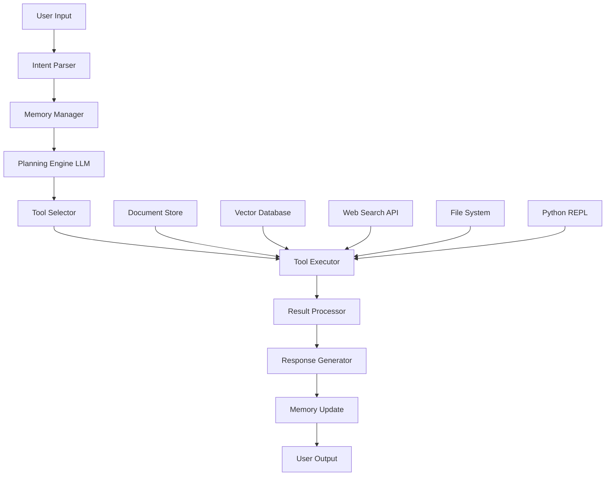
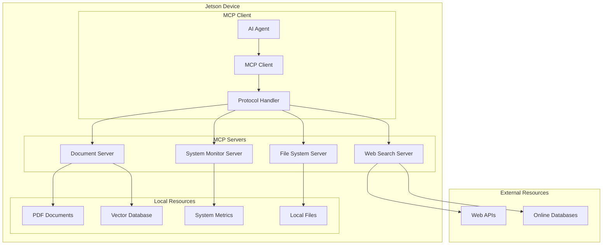

# 🤖 Local AI Agents on Jetson

## 🧠 What are AI Agents?

AI Agents are autonomous programs that use LLMs to reason, decide, and act based on goals, memory, and tools. They can perceive their environment, make decisions, and take actions to achieve specific objectives.

### 🎯 Key Characteristics:
- **Autonomy**: Operate independently with minimal human intervention
- **Reactivity**: Respond to environmental changes and user inputs
- **Proactivity**: Take initiative to achieve goals
- **Social Ability**: Interact with other agents and humans
- **Learning**: Improve performance through experience

With LangChain and Jetson, we can create sophisticated local agents that:

* **🔒 Privacy-First**: Run entirely offline without internet dependency
* **⚡ Edge Optimized**: Use llama.cpp/Ollama for efficient language reasoning
* **🛠️ Multi-Modal**: Process text, PDFs, images, and structured data
* **🔍 Intelligent Search**: Perform semantic search across local documents
* **🌐 Web Integration**: Access online information when needed
* **💾 Persistent Memory**: Maintain context across sessions
* **🧰 Tool Integration**: Execute code, manage files, and interact with APIs

---

## 🔧 Advanced Agent Architecture



### 🧩 Core Components:

1. **🎯 Intent Parser**: Analyzes user input and determines task type
2. **🧠 Memory Manager**: Handles short-term and long-term memory
3. **📋 Planning Engine (LLM)**: Creates execution plans and reasoning chains
4. **🔧 Tool Selector**: Chooses appropriate tools based on context
5. **⚙️ Tool Executor**: Executes selected tools with proper parameters
6. **📊 Result Processor**: Aggregates and validates tool outputs
7. **💬 Response Generator**: Creates human-readable responses
8. **💾 Memory Update**: Stores important information for future use

### 🗄️ Data Sources:
- **📚 Document Store**: Local PDFs, text files, and structured documents
- **🔍 Vector Database**: Semantic search capabilities
- **🌐 Web Search**: Online information retrieval
- **📁 File System**: Direct file operations
- **🐍 Python Environment**: Code execution and data processing

---

## 📚 Document Processing & Local Search

### 🔍 Multi-Format Document Support

Our AI agent can process various document formats locally on Jetson:

```python
import os
import json
from typing import List, Dict, Any
from pathlib import Path

# Document processing imports
try:
    import PyPDF2
    import pdfplumber
except ImportError:
    print("Install PDF libraries: pip install PyPDF2 pdfplumber")

try:
    from docx import Document as DocxDocument
except ImportError:
    print("Install docx: pip install python-docx")

try:
    import pandas as pd
except ImportError:
    print("Install pandas: pip install pandas")

from langchain.document_loaders import (
    PyPDFLoader,
    TextLoader,
    CSVLoader,
    JSONLoader,
    DirectoryLoader
)
from langchain.text_splitter import RecursiveCharacterTextSplitter
from langchain.embeddings import SentenceTransformerEmbeddings
from langchain.vectorstores import FAISS
from langchain.schema import Document

class JetsonDocumentProcessor:
    """Optimized document processing for Jetson platforms"""
    
    def __init__(self, embedding_model: str = "all-MiniLM-L6-v2"):
        self.embeddings = SentenceTransformerEmbeddings(
            model_name=embedding_model,
            model_kwargs={'device': 'cuda' if torch.cuda.is_available() else 'cpu'}
        )
        self.text_splitter = RecursiveCharacterTextSplitter(
            chunk_size=1000,
            chunk_overlap=200,
            separators=["\n\n", "\n", " ", ""]
        )
        self.vectorstore = None
        self.documents = []
    
    def load_pdf_advanced(self, pdf_path: str) -> List[Document]:
        """Advanced PDF processing with metadata extraction"""
        documents = []
        
        try:
            # Method 1: PyPDF2 for basic extraction
            with open(pdf_path, 'rb') as file:
                pdf_reader = PyPDF2.PdfReader(file)
                metadata = pdf_reader.metadata or {}
                
                for page_num, page in enumerate(pdf_reader.pages):
                    text = page.extract_text()
                    if text.strip():
                        doc = Document(
                            page_content=text,
                            metadata={
                                "source": pdf_path,
                                "page": page_num + 1,
                                "title": metadata.get('/Title', 'Unknown'),
                                "author": metadata.get('/Author', 'Unknown'),
                                "type": "pdf"
                            }
                        )
                        documents.append(doc)
        
        except Exception as e:
            print(f"PyPDF2 failed for {pdf_path}: {e}")
            
            # Fallback: pdfplumber for better text extraction
            try:
                with pdfplumber.open(pdf_path) as pdf:
                    for page_num, page in enumerate(pdf.pages):
                        text = page.extract_text()
                        if text and text.strip():
                            doc = Document(
                                page_content=text,
                                metadata={
                                    "source": pdf_path,
                                    "page": page_num + 1,
                                    "type": "pdf",
                                    "extraction_method": "pdfplumber"
                                }
                            )
                            documents.append(doc)
            except Exception as e2:
                print(f"pdfplumber also failed for {pdf_path}: {e2}")
        
        return documents
    
    def load_directory(self, directory_path: str) -> List[Document]:
        """Load all supported documents from directory"""
        documents = []
        directory = Path(directory_path)
        
        # Supported file extensions
        loaders = {
            '.pdf': self.load_pdf_advanced,
            '.txt': lambda x: [Document(page_content=open(x, 'r', encoding='utf-8').read(), 
                                      metadata={"source": x, "type": "text"})],
            '.md': lambda x: [Document(page_content=open(x, 'r', encoding='utf-8').read(), 
                                     metadata={"source": x, "type": "markdown"})],
            '.json': self._load_json,
            '.csv': self._load_csv,
            '.docx': self._load_docx
        }
        
        for file_path in directory.rglob('*'):
            if file_path.is_file() and file_path.suffix.lower() in loaders:
                try:
                    print(f"Processing: {file_path}")
                    file_docs = loaders[file_path.suffix.lower()](str(file_path))
                    documents.extend(file_docs)
                except Exception as e:
                    print(f"Error processing {file_path}: {e}")
        
        return documents
    
    def _load_json(self, file_path: str) -> List[Document]:
        """Load JSON files"""
        with open(file_path, 'r', encoding='utf-8') as f:
            data = json.load(f)
        
        if isinstance(data, list):
            documents = []
            for i, item in enumerate(data):
                content = json.dumps(item, indent=2)
                doc = Document(
                    page_content=content,
                    metadata={"source": file_path, "index": i, "type": "json"}
                )
                documents.append(doc)
            return documents
        else:
            content = json.dumps(data, indent=2)
            return [Document(
                page_content=content,
                metadata={"source": file_path, "type": "json"}
            )]
    
    def _load_csv(self, file_path: str) -> List[Document]:
        """Load CSV files"""
        df = pd.read_csv(file_path)
        documents = []
        
        # Convert each row to a document
        for index, row in df.iterrows():
            content = "\n".join([f"{col}: {val}" for col, val in row.items()])
            doc = Document(
                page_content=content,
                metadata={"source": file_path, "row": index, "type": "csv"}
            )
            documents.append(doc)
        
        return documents
    
    def _load_docx(self, file_path: str) -> List[Document]:
        """Load DOCX files"""
        try:
            doc = DocxDocument(file_path)
            content = "\n".join([paragraph.text for paragraph in doc.paragraphs])
            return [Document(
                page_content=content,
                metadata={"source": file_path, "type": "docx"}
            )]
        except Exception as e:
            print(f"Error loading DOCX {file_path}: {e}")
            return []
    
    def build_vectorstore(self, documents: List[Document]) -> FAISS:
        """Build FAISS vectorstore for semantic search"""
        if not documents:
            raise ValueError("No documents provided")
        
        # Split documents into chunks
        split_docs = self.text_splitter.split_documents(documents)
        print(f"Split {len(documents)} documents into {len(split_docs)} chunks")
        
        # Create vectorstore
        self.vectorstore = FAISS.from_documents(split_docs, self.embeddings)
        self.documents = split_docs
        
        return self.vectorstore
    
    def search_documents(self, query: str, k: int = 5) -> List[Document]:
        """Semantic search across documents"""
        if not self.vectorstore:
            raise ValueError("Vectorstore not built. Call build_vectorstore first.")
        
        results = self.vectorstore.similarity_search(query, k=k)
        return results
    
    def save_vectorstore(self, path: str):
        """Save vectorstore to disk"""
        if self.vectorstore:
            self.vectorstore.save_local(path)
    
    def load_vectorstore(self, path: str):
        """Load vectorstore from disk"""
        self.vectorstore = FAISS.load_local(path, self.embeddings)

# Usage example
doc_processor = JetsonDocumentProcessor()

# Load documents from directory
documents = doc_processor.load_directory("./documents")
print(f"Loaded {len(documents)} documents")

# Build vectorstore for semantic search
vectorstore = doc_processor.build_vectorstore(documents)

# Search documents
results = doc_processor.search_documents("machine learning optimization", k=3)
for i, doc in enumerate(results):
    print(f"Result {i+1}: {doc.metadata['source']} - {doc.page_content[:200]}...")
```

### 🔧 Document Processing Tools for Agents

```python
from langchain.tools import Tool
from typing import Optional

class DocumentSearchTool:
    """Tool for semantic document search"""
    
    def __init__(self, doc_processor: JetsonDocumentProcessor):
        self.doc_processor = doc_processor
    
    def search(self, query: str, num_results: int = 3) -> str:
        """Search documents and return formatted results"""
        try:
            results = self.doc_processor.search_documents(query, k=num_results)
            
            if not results:
                return f"No documents found for query: {query}"
            
            formatted_results = []
            for i, doc in enumerate(results, 1):
                source = doc.metadata.get('source', 'Unknown')
                page = doc.metadata.get('page', '')
                page_info = f" (Page {page})" if page else ""
                content = doc.page_content[:300] + "..." if len(doc.page_content) > 300 else doc.page_content
                
                formatted_results.append(
                    f"Result {i}: {source}{page_info}\n{content}\n"
                )
            
            return "\n".join(formatted_results)
            
        except Exception as e:
            return f"Error searching documents: {str(e)}"

def create_document_tools(doc_processor: JetsonDocumentProcessor) -> List[Tool]:
    """Create document-related tools for the agent"""
    search_tool = DocumentSearchTool(doc_processor)
    
    tools = [
        Tool(
            name="search_documents",
            func=search_tool.search,
            description="Search through local documents using semantic similarity. "
                       "Input should be a search query string. Returns relevant document excerpts."
        ),
        Tool(
            name="list_document_sources",
            func=lambda x: "\n".join(set(doc.metadata.get('source', 'Unknown') 
                                       for doc in doc_processor.documents)),
            description="List all available document sources in the knowledge base."
        )
    ]
    
    return tools
```

---

## 🌐 Web Search & Online Integration

### 🔍 Web Search Tools

Integrate web search capabilities for real-time information retrieval:

```python
import requests
import json
from typing import List, Dict, Optional
from urllib.parse import quote_plus
from bs4 import BeautifulSoup
from langchain.tools import Tool
from langchain.utilities import GoogleSearchAPIWrapper, DuckDuckGoSearchAPIWrapper

class JetsonWebSearchTool:
    """Optimized web search for Jetson with multiple search engines"""
    
    def __init__(self, search_engine: str = "duckduckgo"):
        self.search_engine = search_engine
        
        if search_engine == "google":
            # Requires GOOGLE_API_KEY and GOOGLE_CSE_ID environment variables
            try:
                self.google_search = GoogleSearchAPIWrapper()
            except Exception as e:
                print(f"Google Search setup failed: {e}")
                self.google_search = None
        
        elif search_engine == "duckduckgo":
            self.ddg_search = DuckDuckGoSearchAPIWrapper()
    
    def search_web(self, query: str, num_results: int = 5) -> str:
        """Search the web and return formatted results"""
        try:
            if self.search_engine == "google" and self.google_search:
                results = self.google_search.run(query)
                return self._format_google_results(results, num_results)
            
            elif self.search_engine == "duckduckgo":
                results = self.ddg_search.run(query)
                return self._format_ddg_results(results, num_results)
            
            else:
                return self._fallback_search(query, num_results)
                
        except Exception as e:
            return f"Web search error: {str(e)}"
    
    def _format_google_results(self, results: str, num_results: int) -> str:
        """Format Google search results"""
        # Google API returns formatted string, parse and limit
        lines = results.split('\n')
        limited_results = lines[:num_results * 3]  # Approximate 3 lines per result
        return '\n'.join(limited_results)
    
    def _format_ddg_results(self, results: str, num_results: int) -> str:
        """Format DuckDuckGo search results"""
        return results  # DuckDuckGo wrapper already formats results
    
    def _fallback_search(self, query: str, num_results: int) -> str:
        """Fallback search using direct HTTP requests"""
        try:
            # Simple DuckDuckGo instant answer API
            url = f"https://api.duckduckgo.com/?q={quote_plus(query)}&format=json&no_html=1&skip_disambig=1"
            response = requests.get(url, timeout=10)
            data = response.json()
            
            result_text = []
            
            # Abstract (instant answer)
            if data.get('Abstract'):
                result_text.append(f"Summary: {data['Abstract']}")
                if data.get('AbstractURL'):
                    result_text.append(f"Source: {data['AbstractURL']}")
            
            # Related topics
            if data.get('RelatedTopics'):
                result_text.append("\nRelated Information:")
                for i, topic in enumerate(data['RelatedTopics'][:num_results]):
                    if isinstance(topic, dict) and 'Text' in topic:
                        result_text.append(f"{i+1}. {topic['Text']}")
                        if 'FirstURL' in topic:
                            result_text.append(f"   URL: {topic['FirstURL']}")
            
            return '\n'.join(result_text) if result_text else f"No results found for: {query}"
            
        except Exception as e:
            return f"Fallback search failed: {str(e)}"

class WebContentExtractor:
    """Extract and summarize web page content"""
    
    def __init__(self):
        self.session = requests.Session()
        self.session.headers.update({
            'User-Agent': 'Mozilla/5.0 (X11; Linux x86_64) AppleWebKit/537.36 (KHTML, like Gecko) Chrome/91.0.4472.124 Safari/537.36'
        })
    
    def extract_content(self, url: str, max_length: int = 2000) -> str:
        """Extract main content from a web page"""
        try:
            response = self.session.get(url, timeout=10)
            response.raise_for_status()
            
            soup = BeautifulSoup(response.content, 'html.parser')
            
            # Remove script and style elements
            for script in soup(["script", "style"]):
                script.decompose()
            
            # Try to find main content areas
            content_selectors = [
                'article', 'main', '.content', '#content',
                '.post-content', '.entry-content', '.article-content'
            ]
            
            content = ""
            for selector in content_selectors:
                elements = soup.select(selector)
                if elements:
                    content = ' '.join([elem.get_text() for elem in elements])
                    break
            
            # Fallback to body content
            if not content:
                body = soup.find('body')
                content = body.get_text() if body else soup.get_text()
            
            # Clean and truncate
            content = ' '.join(content.split())  # Remove extra whitespace
            if len(content) > max_length:
                content = content[:max_length] + "..."
            
            return f"Content from {url}:\n{content}"
            
        except Exception as e:
            return f"Error extracting content from {url}: {str(e)}"

def create_web_search_tools() -> List[Tool]:
    """Create web search and content extraction tools"""
    web_search = JetsonWebSearchTool("duckduckgo")
    content_extractor = WebContentExtractor()
    
    tools = [
        Tool(
            name="web_search",
            func=lambda query: web_search.search_web(query, num_results=5),
            description="Search the web for current information. "
                       "Input should be a search query string. Returns web search results."
        ),
        Tool(
            name="extract_web_content",
            func=lambda url: content_extractor.extract_content(url, max_length=1500),
            description="Extract and summarize content from a web page. "
                       "Input should be a valid URL. Returns the main content of the page."
        )
    ]
    
    return tools

# Usage example
web_tools = create_web_search_tools()

# Test web search
search_result = web_tools[0].func("latest NVIDIA Jetson updates 2024")
print("Search Results:")
print(search_result)
```

### 🔗 Hybrid Search: Local + Web

```python
class HybridSearchAgent:
    """Agent that combines local document search with web search"""
    
    def __init__(self, doc_processor: JetsonDocumentProcessor):
        self.doc_processor = doc_processor
        self.web_search = JetsonWebSearchTool()
        self.content_extractor = WebContentExtractor()
    
    def intelligent_search(self, query: str, search_local: bool = True, search_web: bool = True) -> Dict[str, Any]:
        """Perform intelligent search across local and web sources"""
        results = {
            "query": query,
            "local_results": [],
            "web_results": "",
            "summary": ""
        }
        
        # Local document search
        if search_local and self.doc_processor.vectorstore:
            try:
                local_docs = self.doc_processor.search_documents(query, k=3)
                results["local_results"] = [
                    {
                        "source": doc.metadata.get('source', 'Unknown'),
                        "content": doc.page_content[:300] + "..." if len(doc.page_content) > 300 else doc.page_content,
                        "metadata": doc.metadata
                    }
                    for doc in local_docs
                ]
            except Exception as e:
                results["local_error"] = str(e)
        
        # Web search
        if search_web:
            try:
                web_content = self.web_search.search_web(query, num_results=3)
                results["web_results"] = web_content
            except Exception as e:
                results["web_error"] = str(e)
        
        # Generate summary
        results["summary"] = self._generate_search_summary(results)
        
        return results
    
    def _generate_search_summary(self, results: Dict[str, Any]) -> str:
        """Generate a summary of search results"""
        summary_parts = []
        
        if results["local_results"]:
            summary_parts.append(f"Found {len(results['local_results'])} relevant local documents.")
        
        if results["web_results"]:
            summary_parts.append("Retrieved current web information.")
        
        if not summary_parts:
            return "No results found from local or web sources."
        
        return " ".join(summary_parts)

# Create hybrid search tool
def create_hybrid_search_tool(doc_processor: JetsonDocumentProcessor) -> Tool:
    """Create a hybrid search tool that combines local and web search"""
    hybrid_agent = HybridSearchAgent(doc_processor)
    
    def hybrid_search(query: str) -> str:
        results = hybrid_agent.intelligent_search(query)
        
        formatted_output = [f"Search Query: {query}\n"]
        
        # Local results
        if results["local_results"]:
            formatted_output.append("📚 Local Documents:")
            for i, doc in enumerate(results["local_results"], 1):
                formatted_output.append(f"{i}. {doc['source']}")
                formatted_output.append(f"   {doc['content']}\n")
        
        # Web results
        if results["web_results"]:
            formatted_output.append("🌐 Web Results:")
            formatted_output.append(results["web_results"])
        
        return "\n".join(formatted_output)
    
    return Tool(
        name="hybrid_search",
        func=hybrid_search,
        description="Search both local documents and the web for comprehensive information. "
                   "Input should be a search query string. Returns combined local and web results."
    )
```

---

## 🧠 Advanced Agent Memory Systems

### 💾 Memory Architecture for Jetson Agents

Implement sophisticated memory systems to improve agent performance and context retention:

```python
import sqlite3
import json
import pickle
from datetime import datetime, timedelta
from typing import List, Dict, Any, Optional
from dataclasses import dataclass, asdict
from langchain.memory import ConversationBufferMemory, ConversationSummaryMemory
from langchain.schema import BaseMessage, HumanMessage, AIMessage
from langchain.embeddings import SentenceTransformerEmbeddings
from langchain.vectorstores import FAISS
import numpy as np

@dataclass
class MemoryEntry:
    """Structure for memory entries"""
    id: str
    timestamp: datetime
    content: str
    memory_type: str  # 'conversation', 'fact', 'preference', 'task'
    importance: float  # 0.0 to 1.0
    embedding: Optional[List[float]] = None
    metadata: Dict[str, Any] = None

class JetsonMemoryManager:
    """Advanced memory management system for Jetson AI agents"""
    
    def __init__(self, db_path: str = "agent_memory.db", embedding_model: str = "all-MiniLM-L6-v2"):
        self.db_path = db_path
        self.embeddings = SentenceTransformerEmbeddings(
            model_name=embedding_model,
            model_kwargs={'device': 'cuda' if torch.cuda.is_available() else 'cpu'}
        )
        
        # Initialize database
        self._init_database()
        
        # Memory components
        self.short_term_memory = ConversationBufferMemory(
            memory_key="chat_history",
            return_messages=True,
            max_token_limit=2000
        )
        
        self.episodic_memory = []  # Recent conversations
        self.semantic_memory = None  # Long-term knowledge vectorstore
        self.working_memory = {}  # Current task context
        
        # Load existing semantic memory
        self._load_semantic_memory()
    
    def _init_database(self):
        """Initialize SQLite database for persistent memory"""
        self.conn = sqlite3.connect(self.db_path, check_same_thread=False)
        self.conn.execute('''
            CREATE TABLE IF NOT EXISTS memory_entries (
                id TEXT PRIMARY KEY,
                timestamp TEXT,
                content TEXT,
                memory_type TEXT,
                importance REAL,
                embedding BLOB,
                metadata TEXT
            )
        ''')
        
        self.conn.execute('''
            CREATE TABLE IF NOT EXISTS user_preferences (
                key TEXT PRIMARY KEY,
                value TEXT,
                timestamp TEXT
            )
        ''')
        
        self.conn.execute('''
            CREATE TABLE IF NOT EXISTS conversation_history (
                id INTEGER PRIMARY KEY AUTOINCREMENT,
                session_id TEXT,
                timestamp TEXT,
                role TEXT,
                content TEXT,
                metadata TEXT
            )
        ''')
        
        self.conn.commit()
    
    def add_memory(self, content: str, memory_type: str, importance: float = 0.5, metadata: Dict = None) -> str:
        """Add a new memory entry"""
        entry_id = f"{memory_type}_{datetime.now().isoformat()}_{hash(content) % 10000}"
        timestamp = datetime.now()
        
        # Generate embedding
        embedding = self.embeddings.embed_query(content)
        
        # Create memory entry
        entry = MemoryEntry(
            id=entry_id,
            timestamp=timestamp,
            content=content,
            memory_type=memory_type,
            importance=importance,
            embedding=embedding,
            metadata=metadata or {}
        )
        
        # Store in database
        self.conn.execute('''
            INSERT INTO memory_entries (id, timestamp, content, memory_type, importance, embedding, metadata)
            VALUES (?, ?, ?, ?, ?, ?, ?)
        ''', (
            entry.id,
            entry.timestamp.isoformat(),
            entry.content,
            entry.memory_type,
            entry.importance,
            pickle.dumps(entry.embedding),
            json.dumps(entry.metadata)
        ))
        self.conn.commit()
        
        # Update semantic memory
        self._update_semantic_memory(entry)
        
        return entry_id
    
    def retrieve_memories(self, query: str, memory_types: List[str] = None, k: int = 5, min_importance: float = 0.0) -> List[MemoryEntry]:
        """Retrieve relevant memories using semantic search"""
        if not self.semantic_memory:
            return []
        
        # Semantic search
        query_embedding = self.embeddings.embed_query(query)
        similar_docs = self.semantic_memory.similarity_search_by_vector(query_embedding, k=k*2)
        
        # Filter and rank results
        relevant_memories = []
        for doc in similar_docs:
            metadata = doc.metadata
            
            # Filter by memory type
            if memory_types and metadata.get('memory_type') not in memory_types:
                continue
            
            # Filter by importance
            if metadata.get('importance', 0) < min_importance:
                continue
            
            # Reconstruct memory entry
            entry = MemoryEntry(
                id=metadata['id'],
                timestamp=datetime.fromisoformat(metadata['timestamp']),
                content=doc.page_content,
                memory_type=metadata['memory_type'],
                importance=metadata['importance'],
                metadata=metadata.get('extra_metadata', {})
            )
            relevant_memories.append(entry)
        
        # Sort by importance and recency
        relevant_memories.sort(key=lambda x: (x.importance, x.timestamp), reverse=True)
        return relevant_memories[:k]
    
    def _update_semantic_memory(self, entry: MemoryEntry):
        """Update the semantic memory vectorstore"""
        from langchain.schema import Document
        
        doc = Document(
            page_content=entry.content,
            metadata={
                'id': entry.id,
                'timestamp': entry.timestamp.isoformat(),
                'memory_type': entry.memory_type,
                'importance': entry.importance,
                'extra_metadata': entry.metadata
            }
        )
        
        if self.semantic_memory is None:
            self.semantic_memory = FAISS.from_documents([doc], self.embeddings)
        else:
            self.semantic_memory.add_documents([doc])
    
    def _load_semantic_memory(self):
        """Load existing memories into semantic memory"""
        cursor = self.conn.execute('SELECT * FROM memory_entries')
        entries = cursor.fetchall()
        
        if not entries:
            return
        
        documents = []
        for entry in entries:
            doc = Document(
                page_content=entry[2],  # content
                metadata={
                    'id': entry[0],
                    'timestamp': entry[1],
                    'memory_type': entry[3],
                    'importance': entry[4],
                    'extra_metadata': json.loads(entry[6]) if entry[6] else {}
                }
            )
            documents.append(doc)
        
        if documents:
            self.semantic_memory = FAISS.from_documents(documents, self.embeddings)
    
    def update_conversation_memory(self, human_message: str, ai_message: str, session_id: str = "default"):
        """Update conversation memory with new exchange"""
        timestamp = datetime.now()
        
        # Add to short-term memory
        self.short_term_memory.chat_memory.add_user_message(human_message)
        self.short_term_memory.chat_memory.add_ai_message(ai_message)
        
        # Store in database
        self.conn.execute('''
            INSERT INTO conversation_history (session_id, timestamp, role, content, metadata)
            VALUES (?, ?, ?, ?, ?)
        ''', (session_id, timestamp.isoformat(), 'human', human_message, '{}'))
        
        self.conn.execute('''
            INSERT INTO conversation_history (session_id, timestamp, role, content, metadata)
            VALUES (?, ?, ?, ?, ?)
        ''', (session_id, timestamp.isoformat(), 'ai', ai_message, '{}'))
        
        self.conn.commit()
        
        # Add to episodic memory if important
        conversation_text = f"Human: {human_message}\nAI: {ai_message}"
        importance = self._calculate_importance(conversation_text)
        
        if importance > 0.3:  # Threshold for storing in long-term memory
            self.add_memory(
                content=conversation_text,
                memory_type="conversation",
                importance=importance,
                metadata={"session_id": session_id}
            )
    
    def _calculate_importance(self, content: str) -> float:
        """Calculate importance score for memory content"""
        importance_keywords = [
            'important', 'remember', 'preference', 'like', 'dislike',
            'always', 'never', 'favorite', 'hate', 'love', 'critical',
            'urgent', 'deadline', 'appointment', 'meeting'
        ]
        
        content_lower = content.lower()
        keyword_score = sum(1 for keyword in importance_keywords if keyword in content_lower)
        
        # Normalize score
        base_importance = min(keyword_score * 0.2, 0.8)
        
        # Add length factor (longer conversations might be more important)
        length_factor = min(len(content) / 1000, 0.2)
        
        return min(base_importance + length_factor, 1.0)
    
    def get_context_for_query(self, query: str, max_context_length: int = 1500) -> str:
        """Get relevant context for a query from all memory sources"""
        context_parts = []
        
        # Get relevant memories
        relevant_memories = self.retrieve_memories(query, k=3)
        if relevant_memories:
            context_parts.append("Relevant memories:")
            for memory in relevant_memories:
                context_parts.append(f"- {memory.content[:200]}...")
        
        # Get recent conversation context
        recent_messages = self.short_term_memory.chat_memory.messages[-4:]  # Last 2 exchanges
        if recent_messages:
            context_parts.append("\nRecent conversation:")
            for msg in recent_messages:
                role = "Human" if isinstance(msg, HumanMessage) else "AI"
                context_parts.append(f"{role}: {msg.content[:150]}...")
        
        # Combine and truncate context
        full_context = "\n".join(context_parts)
        if len(full_context) > max_context_length:
            full_context = full_context[:max_context_length] + "..."
        
        return full_context
    
    def save_user_preference(self, key: str, value: str):
        """Save user preference"""
        timestamp = datetime.now().isoformat()
        self.conn.execute('''
            INSERT OR REPLACE INTO user_preferences (key, value, timestamp)
            VALUES (?, ?, ?)
        ''', (key, value, timestamp))
        self.conn.commit()
        
        # Also add to semantic memory
        self.add_memory(
            content=f"User preference: {key} = {value}",
            memory_type="preference",
            importance=0.8,
            metadata={"preference_key": key}
        )
    
    def get_user_preference(self, key: str) -> Optional[str]:
        """Get user preference"""
        cursor = self.conn.execute('SELECT value FROM user_preferences WHERE key = ?', (key,))
        result = cursor.fetchone()
        return result[0] if result else None
    
    def cleanup_old_memories(self, days_to_keep: int = 30):
        """Clean up old, low-importance memories"""
        cutoff_date = datetime.now() - timedelta(days=days_to_keep)
        
        self.conn.execute('''
            DELETE FROM memory_entries 
            WHERE timestamp < ? AND importance < 0.5
        ''', (cutoff_date.isoformat(),))
        
        self.conn.execute('''
            DELETE FROM conversation_history 
            WHERE timestamp < ?
        ''', (cutoff_date.isoformat(),))
        
        self.conn.commit()
        
        # Rebuild semantic memory
        self.semantic_memory = None
        self._load_semantic_memory()

# Usage example
memory_manager = JetsonMemoryManager()

# Add some memories
memory_manager.add_memory(
    "User prefers concise explanations",
    "preference",
    importance=0.9
)

memory_manager.add_memory(
    "Discussed machine learning optimization techniques for Jetson",
    "conversation",
    importance=0.7
)

# Retrieve relevant memories
relevant = memory_manager.retrieve_memories("optimization techniques", k=3)
for memory in relevant:
    print(f"Memory: {memory.content} (Importance: {memory.importance})")
```

### 🔄 Memory-Enhanced Agent Integration

```python
class MemoryEnhancedAgent:
    """AI Agent with advanced memory capabilities"""
    
    def __init__(self, llm, memory_manager: JetsonMemoryManager, tools: List[Tool]):
        self.llm = llm
        self.memory_manager = memory_manager
        self.tools = {tool.name: tool for tool in tools}
        self.conversation_count = 0
    
    def process_query(self, query: str, session_id: str = "default") -> str:
        """Process user query with memory-enhanced context"""
        self.conversation_count += 1
        
        # Get relevant context from memory
        memory_context = self.memory_manager.get_context_for_query(query)
        
        # Enhance prompt with memory context
        enhanced_prompt = f"""
You are an AI assistant with access to conversation history and relevant memories.

Relevant Context:
{memory_context}

Current Query: {query}

Please provide a helpful response. If you need to use tools, specify which tool and provide the input.
Available tools: {', '.join(self.tools.keys())}

Response:"""
        
        # Get LLM response
        response = self.llm.invoke(enhanced_prompt)
        
        # Check if tool use is needed
        tool_response = self._handle_tool_use(response, query)
        if tool_response:
            response = tool_response
        
        # Update memory with this conversation
        self.memory_manager.update_conversation_memory(query, response, session_id)
        
        # Extract and store any new facts or preferences
        self._extract_and_store_information(query, response)
        
        return response
    
    def _handle_tool_use(self, response: str, original_query: str) -> Optional[str]:
        """Handle tool usage based on LLM response"""
        # Simple tool detection (in practice, use more sophisticated parsing)
        for tool_name, tool in self.tools.items():
            if tool_name.lower() in response.lower():
                try:
                    # Extract input for tool (simplified)
                    tool_input = original_query  # In practice, extract specific input
                    tool_result = tool.func(tool_input)
                    
                    # Generate final response with tool result
                    final_prompt = f"""
Original query: {original_query}
Tool used: {tool_name}
Tool result: {tool_result}

Please provide a comprehensive response based on the tool result:"""
                    
                    return self.llm.invoke(final_prompt)
                    
                except Exception as e:
                    return f"Error using {tool_name}: {str(e)}"
        
        return None
    
    def _extract_and_store_information(self, query: str, response: str):
        """Extract and store important information from conversation"""
        # Look for user preferences
        preference_indicators = ['i prefer', 'i like', 'i want', 'i need', 'i always', 'i never']
        query_lower = query.lower()
        
        for indicator in preference_indicators:
            if indicator in query_lower:
                # Extract preference (simplified)
                preference_text = query[query_lower.find(indicator):]
                self.memory_manager.add_memory(
                    content=f"User stated: {preference_text}",
                    memory_type="preference",
                    importance=0.8
                )
                break
        
        # Store important facts mentioned in response
        if any(keyword in response.lower() for keyword in ['important', 'remember', 'note that']):
            self.memory_manager.add_memory(
                content=f"Important information: {response[:300]}",
                memory_type="fact",
                importance=0.7
            )

# Create memory-enhanced agent
memory_manager = JetsonMemoryManager()
doc_processor = JetsonDocumentProcessor()  # From previous section

# Combine all tools
all_tools = (
    create_document_tools(doc_processor) +
    create_web_search_tools() +
    [create_hybrid_search_tool(doc_processor)]
)

# Create the agent
agent = MemoryEnhancedAgent(
    llm=llm,  # Your LLM instance
    memory_manager=memory_manager,
    tools=all_tools
)

# Example conversation
response1 = agent.process_query("I prefer concise explanations. Can you search for Jetson optimization techniques?")
print(response1)

response2 = agent.process_query("What did we discuss about optimization earlier?")
print(response2)
```

---

## ⚡ Jetson-Specific Optimizations

### 🚀 Performance Optimization for Edge AI

Optimize AI agents for Jetson's unique hardware constraints and capabilities:

```python
import torch
import psutil
import subprocess
import threading
import time
from typing import Dict, Any, Optional
from dataclasses import dataclass
from concurrent.futures import ThreadPoolExecutor
import gc

@dataclass
class JetsonSystemInfo:
    """System information for Jetson optimization"""
    gpu_memory_total: int
    gpu_memory_free: int
    cpu_usage: float
    memory_usage: float
    temperature: float
    power_mode: str
    jetson_model: str

class JetsonOptimizer:
    """Optimization utilities for Jetson AI agents"""
    
    def __init__(self):
        self.system_info = self.get_system_info()
        self.optimization_settings = self._get_optimal_settings()
        
        # Performance monitoring
        self.performance_history = []
        self.monitoring_active = False
        
        # Memory management
        self.memory_threshold = 0.85  # 85% memory usage threshold
        self.cleanup_interval = 300  # 5 minutes
        
        # Start background monitoring
        self._start_monitoring()
    
    def get_system_info(self) -> JetsonSystemInfo:
        """Get current Jetson system information"""
        try:
            # GPU memory info
            if torch.cuda.is_available():
                gpu_memory_total = torch.cuda.get_device_properties(0).total_memory
                gpu_memory_free = gpu_memory_total - torch.cuda.memory_allocated(0)
            else:
                gpu_memory_total = gpu_memory_free = 0
            
            # CPU and system memory
            cpu_usage = psutil.cpu_percent(interval=1)
            memory_info = psutil.virtual_memory()
            memory_usage = memory_info.percent / 100.0
            
            # Temperature (Jetson-specific)
            temperature = self._get_temperature()
            
            # Power mode
            power_mode = self._get_power_mode()
            
            # Jetson model detection
            jetson_model = self._detect_jetson_model()
            
            return JetsonSystemInfo(
                gpu_memory_total=gpu_memory_total,
                gpu_memory_free=gpu_memory_free,
                cpu_usage=cpu_usage,
                memory_usage=memory_usage,
                temperature=temperature,
                power_mode=power_mode,
                jetson_model=jetson_model
            )
            
        except Exception as e:
            print(f"Error getting system info: {e}")
            return JetsonSystemInfo(0, 0, 0.0, 0.0, 0.0, "unknown", "unknown")
    
    def _get_temperature(self) -> float:
        """Get Jetson temperature"""
        try:
            # Try different temperature sensors
            temp_files = [
                '/sys/class/thermal/thermal_zone0/temp',
                '/sys/class/thermal/thermal_zone1/temp',
                '/sys/devices/virtual/thermal/thermal_zone0/temp'
            ]
            
            for temp_file in temp_files:
                try:
                    with open(temp_file, 'r') as f:
                        temp = float(f.read().strip()) / 1000.0  # Convert from millicelsius
                        return temp
                except FileNotFoundError:
                    continue
            
            return 0.0
        except Exception:
            return 0.0
    
    def _get_power_mode(self) -> str:
        """Get current Jetson power mode"""
        try:
            result = subprocess.run(['nvpmodel', '-q'], capture_output=True, text=True)
            if result.returncode == 0:
                for line in result.stdout.split('\n'):
                    if 'NV Power Mode' in line:
                        return line.split(':')[-1].strip()
            return "unknown"
        except Exception:
            return "unknown"
    
    def _detect_jetson_model(self) -> str:
        """Detect Jetson model"""
        try:
            with open('/proc/device-tree/model', 'r') as f:
                model_info = f.read().strip()
                if 'Orin' in model_info:
                    return 'Jetson Orin'
                elif 'Xavier' in model_info:
                    return 'Jetson Xavier'
                elif 'Nano' in model_info:
                    return 'Jetson Nano'
                else:
                    return model_info
        except Exception:
            return "unknown"
    
    def _get_optimal_settings(self) -> Dict[str, Any]:
        """Get optimal settings based on Jetson model"""
        model = self.system_info.jetson_model
        
        if 'Orin' in model:
            return {
                'max_batch_size': 8,
                'embedding_batch_size': 32,
                'max_workers': 4,
                'memory_map_threshold': 0.7,
                'gpu_memory_fraction': 0.8
            }
        elif 'Xavier' in model:
            return {
                'max_batch_size': 4,
                'embedding_batch_size': 16,
                'max_workers': 2,
                'memory_map_threshold': 0.75,
                'gpu_memory_fraction': 0.7
            }
        else:  # Nano or other
            return {
                'max_batch_size': 2,
                'embedding_batch_size': 8,
                'max_workers': 1,
                'memory_map_threshold': 0.8,
                'gpu_memory_fraction': 0.6
            }
    
    def optimize_torch_settings(self):
        """Optimize PyTorch settings for Jetson"""
        if torch.cuda.is_available():
            # Set memory fraction
            torch.cuda.set_per_process_memory_fraction(
                self.optimization_settings['gpu_memory_fraction']
            )
            
            # Enable memory mapping for large models
            torch.backends.cuda.matmul.allow_tf32 = True
            torch.backends.cudnn.allow_tf32 = True
            
            # Optimize for inference
            torch.backends.cudnn.benchmark = True
            torch.backends.cudnn.deterministic = False
            
            print(f"Optimized PyTorch for {self.system_info.jetson_model}")
    
    def _start_monitoring(self):
        """Start background system monitoring"""
        def monitor():
            while self.monitoring_active:
                try:
                    current_info = self.get_system_info()
                    self.performance_history.append({
                        'timestamp': time.time(),
                        'cpu_usage': current_info.cpu_usage,
                        'memory_usage': current_info.memory_usage,
                        'temperature': current_info.temperature,
                        'gpu_memory_free': current_info.gpu_memory_free
                    })
                    
                    # Keep only last 100 entries
                    if len(self.performance_history) > 100:
                        self.performance_history = self.performance_history[-100:]
                    
                    # Check for thermal throttling
                    if current_info.temperature > 80:  # 80°C threshold
                        print(f"⚠️ High temperature detected: {current_info.temperature:.1f}°C")
                        self._thermal_management()
                    
                    # Check memory usage
                    if current_info.memory_usage > self.memory_threshold:
                        print(f"⚠️ High memory usage: {current_info.memory_usage:.1%}")
                        self._memory_cleanup()
                    
                    time.sleep(30)  # Monitor every 30 seconds
                    
                except Exception as e:
                    print(f"Monitoring error: {e}")
                    time.sleep(60)
        
        self.monitoring_active = True
        monitor_thread = threading.Thread(target=monitor, daemon=True)
        monitor_thread.start()
    
    def _thermal_management(self):
        """Handle thermal throttling"""
        try:
            # Reduce GPU frequency if possible
            subprocess.run(['sudo', 'jetson_clocks', '--restore'], check=False)
            
            # Force garbage collection
            gc.collect()
            if torch.cuda.is_available():
                torch.cuda.empty_cache()
            
            print("Applied thermal management measures")
        except Exception as e:
            print(f"Thermal management error: {e}")
    
    def _memory_cleanup(self):
        """Perform memory cleanup"""
        try:
            # Python garbage collection
            gc.collect()
            
            # PyTorch cache cleanup
            if torch.cuda.is_available():
                torch.cuda.empty_cache()
                torch.cuda.synchronize()
            
            print("Performed memory cleanup")
        except Exception as e:
            print(f"Memory cleanup error: {e}")
    
    def get_performance_report(self) -> Dict[str, Any]:
        """Generate performance report"""
        if not self.performance_history:
            return {"status": "No performance data available"}
        
        recent_data = self.performance_history[-10:]  # Last 10 entries
        
        avg_cpu = sum(entry['cpu_usage'] for entry in recent_data) / len(recent_data)
        avg_memory = sum(entry['memory_usage'] for entry in recent_data) / len(recent_data)
        avg_temp = sum(entry['temperature'] for entry in recent_data) / len(recent_data)
        
        return {
            "system_info": self.system_info,
            "average_cpu_usage": f"{avg_cpu:.1f}%",
            "average_memory_usage": f"{avg_memory:.1%}",
            "average_temperature": f"{avg_temp:.1f}°C",
            "optimization_settings": self.optimization_settings,
            "recommendations": self._get_recommendations(avg_cpu, avg_memory, avg_temp)
        }
    
    def _get_recommendations(self, cpu_usage: float, memory_usage: float, temperature: float) -> List[str]:
        """Get optimization recommendations"""
        recommendations = []
        
        if cpu_usage > 80:
            recommendations.append("Consider reducing batch sizes or using fewer concurrent workers")
        
        if memory_usage > 0.85:
            recommendations.append("Enable more aggressive memory cleanup or reduce model size")
        
        if temperature > 75:
            recommendations.append("Improve cooling or reduce computational load")
        
        if not recommendations:
            recommendations.append("System performance is optimal")
        
        return recommendations

class OptimizedJetsonAgent:
    """AI Agent optimized for Jetson performance"""
    
    def __init__(self, llm, memory_manager, tools, optimizer: JetsonOptimizer):
        self.llm = llm
        self.memory_manager = memory_manager
        self.tools = {tool.name: tool for tool in tools}
        self.optimizer = optimizer
        self.executor = ThreadPoolExecutor(
            max_workers=optimizer.optimization_settings['max_workers']
        )
        
        # Apply optimizations
        self.optimizer.optimize_torch_settings()
    
    def process_query_optimized(self, query: str, session_id: str = "default") -> str:
        """Process query with Jetson optimizations"""
        start_time = time.time()
        
        try:
            # Check system resources before processing
            current_info = self.optimizer.get_system_info()
            
            if current_info.memory_usage > 0.9:
                self.optimizer._memory_cleanup()
                return "System memory is critically low. Please try again in a moment."
            
            if current_info.temperature > 85:
                return "System temperature is too high. Please allow cooling before continuing."
            
            # Get memory context (optimized)
            memory_context = self.memory_manager.get_context_for_query(
                query, max_context_length=1000  # Reduced for Jetson
            )
            
            # Process with resource-aware batching
            response = self._process_with_batching(query, memory_context)
            
            # Update memory asynchronously
            self.executor.submit(
                self.memory_manager.update_conversation_memory,
                query, response, session_id
            )
            
            processing_time = time.time() - start_time
            print(f"Query processed in {processing_time:.2f}s")
            
            return response
            
        except Exception as e:
            return f"Error processing query: {str(e)}"
    
    def _process_with_batching(self, query: str, context: str) -> str:
        """Process query with optimized batching"""
        # Simplified prompt for better performance
        prompt = f"Context: {context[:500]}...\n\nQuery: {query}\n\nResponse:"
        
        # Use optimized inference settings
        with torch.inference_mode():
            response = self.llm.invoke(prompt)
        
        return response
    
    def get_system_status(self) -> Dict[str, Any]:
        """Get comprehensive system status"""
        return self.optimizer.get_performance_report()

# Usage example
optimizer = JetsonOptimizer()
print(f"Detected: {optimizer.system_info.jetson_model}")
print(f"Optimization settings: {optimizer.optimization_settings}")

# Create optimized agent
optimized_agent = OptimizedJetsonAgent(
    llm=llm,
    memory_manager=memory_manager,
    tools=all_tools,
    optimizer=optimizer
)

# Test optimized processing
response = optimized_agent.process_query_optimized(
    "What are the best practices for optimizing AI models on Jetson?"
)
print(response)

# Get system status
status = optimized_agent.get_system_status()
print("\nSystem Status:")
for key, value in status.items():
    print(f"{key}: {value}")
```

### 🔧 Hardware Acceleration Utilities

```python
class JetsonAccelerationUtils:
    """Utilities for hardware acceleration on Jetson"""
    
    @staticmethod
    def optimize_embedding_model(model_name: str, precision: str = "fp16") -> Any:
        """Optimize embedding model for Jetson"""
        try:
            from sentence_transformers import SentenceTransformer
            import torch
            
            # Load model
            model = SentenceTransformer(model_name)
            
            # Move to GPU if available
            if torch.cuda.is_available():
                model = model.to('cuda')
                
                # Apply precision optimization
                if precision == "fp16":
                    model = model.half()
                
                # Optimize for inference
                model.eval()
                
                # Compile model for better performance (PyTorch 2.0+)
                try:
                    model = torch.compile(model)
                except Exception:
                    pass  # Fallback if compile not available
            
            return model
            
        except Exception as e:
            print(f"Model optimization failed: {e}")
            return None
    
    @staticmethod
    def create_tensorrt_engine(model_path: str, input_shape: tuple) -> Optional[str]:
        """Create TensorRT engine for model acceleration"""
        try:
            import tensorrt as trt
            
            # This is a simplified example
            # In practice, you'd need to convert your specific model
            print(f"Creating TensorRT engine for {model_path}")
            print(f"Input shape: {input_shape}")
            
            # TensorRT optimization would go here
            # Return path to optimized engine
            return f"{model_path}.trt"
            
        except ImportError:
            print("TensorRT not available")
            return None
        except Exception as e:
            print(f"TensorRT optimization failed: {e}")
            return None
    
    @staticmethod
    def benchmark_inference(model, sample_input, num_runs: int = 100) -> Dict[str, float]:
        """Benchmark model inference performance"""
        import time
        import torch
        
        # Warmup
        for _ in range(10):
            with torch.no_grad():
                _ = model(sample_input)
        
        # Benchmark
        torch.cuda.synchronize() if torch.cuda.is_available() else None
        start_time = time.time()
        
        for _ in range(num_runs):
            with torch.no_grad():
                _ = model(sample_input)
        
        torch.cuda.synchronize() if torch.cuda.is_available() else None
        end_time = time.time()
        
        total_time = end_time - start_time
        avg_time = total_time / num_runs
        throughput = num_runs / total_time
        
        return {
            "average_latency_ms": avg_time * 1000,
            "throughput_fps": throughput,
            "total_time_s": total_time
        }
```

---

## 🔌 Model Context Protocol (MCP) Integration

### 📋 Introduction to MCP

Model Context Protocol (MCP) is an open standard for connecting AI assistants to data sources and tools. It provides a standardized way to integrate external resources with language models.

**Key MCP Benefits:**
- **Standardized Integration**: Universal protocol for connecting tools and data sources
- **Security**: Controlled access to resources with proper authentication
- **Extensibility**: Easy to add new tools and data sources
- **Interoperability**: Works across different AI platforms and models
- **Local Control**: Perfect for edge AI applications on Jetson

### 🏗️ MCP Architecture for Jetson



### 🛠️ Building MCP Servers for Jetson

#### Document Processing MCP Server

```python
import asyncio
import json
from typing import Dict, List, Any, Optional
from dataclasses import dataclass
from pathlib import Path
import aiofiles
from mcp import Server, types
from mcp.server import stdio
from mcp.types import Tool, TextContent, ImageContent

@dataclass
class MCPDocumentServer:
    """MCP Server for document processing on Jetson"""
    
    def __init__(self, document_processor, vector_store_path: str):
        self.document_processor = document_processor
        self.vector_store_path = vector_store_path
        self.server = Server("jetson-document-server")
        self._setup_tools()
    
    def _setup_tools(self):
        """Setup MCP tools for document operations"""
        
        @self.server.list_tools()
        async def list_tools() -> List[Tool]:
            return [
                Tool(
                    name="search_documents",
                    description="Search through local documents using semantic similarity",
                    inputSchema={
                        "type": "object",
                        "properties": {
                            "query": {
                                "type": "string",
                                "description": "Search query for documents"
                            },
                            "max_results": {
                                "type": "integer",
                                "description": "Maximum number of results to return",
                                "default": 5
                            },
                            "similarity_threshold": {
                                "type": "number",
                                "description": "Minimum similarity score (0-1)",
                                "default": 0.7
                            }
                        },
                        "required": ["query"]
                    }
                ),
                Tool(
                    name="add_document",
                    description="Add a new document to the knowledge base",
                    inputSchema={
                        "type": "object",
                        "properties": {
                            "file_path": {
                                "type": "string",
                                "description": "Path to the document file"
                            },
                            "metadata": {
                                "type": "object",
                                "description": "Additional metadata for the document"
                            }
                        },
                        "required": ["file_path"]
                    }
                ),
                Tool(
                    name="list_documents",
                    description="List all documents in the knowledge base",
                    inputSchema={
                        "type": "object",
                        "properties": {
                            "category": {
                                "type": "string",
                                "description": "Filter by document category"
                            }
                        }
                    }
                ),
                Tool(
                    name="get_document_summary",
                    description="Get summary of a specific document",
                    inputSchema={
                        "type": "object",
                        "properties": {
                            "document_id": {
                                "type": "string",
                                "description": "ID of the document"
                            }
                        },
                        "required": ["document_id"]
                    }
                )
            ]
        
        @self.server.call_tool()
        async def call_tool(name: str, arguments: Dict[str, Any]) -> List[TextContent]:
            """Handle tool calls"""
            
            if name == "search_documents":
                return await self._search_documents(
                    arguments["query"],
                    arguments.get("max_results", 5),
                    arguments.get("similarity_threshold", 0.7)
                )
            
            elif name == "add_document":
                return await self._add_document(
                    arguments["file_path"],
                    arguments.get("metadata", {})
                )
            
            elif name == "list_documents":
                return await self._list_documents(
                    arguments.get("category")
                )
            
            elif name == "get_document_summary":
                return await self._get_document_summary(
                    arguments["document_id"]
                )
            
            else:
                raise ValueError(f"Unknown tool: {name}")
    
    async def _search_documents(self, query: str, max_results: int, threshold: float) -> List[TextContent]:
        """Search documents using the document processor"""
        try:
            # Load vector store
            vector_store = self.document_processor.load_vector_store(self.vector_store_path)
            
            if not vector_store:
                return [TextContent(
                    type="text",
                    text="No documents found in the knowledge base. Please add documents first."
                )]
            
            # Perform search
            results = vector_store.similarity_search_with_score(query, k=max_results)
            
            # Filter by threshold
            filtered_results = [(doc, score) for doc, score in results if score >= threshold]
            
            if not filtered_results:
                return [TextContent(
                    type="text",
                    text=f"No documents found matching '{query}' with similarity >= {threshold}"
                )]
            
            # Format results
            response_text = f"Found {len(filtered_results)} documents matching '{query}':\n\n"
            
            for i, (doc, score) in enumerate(filtered_results, 1):
                response_text += f"{i}. **Score: {score:.3f}**\n"
                response_text += f"   Source: {doc.metadata.get('source', 'Unknown')}\n"
                response_text += f"   Content: {doc.page_content[:200]}...\n\n"
            
            return [TextContent(type="text", text=response_text)]
            
        except Exception as e:
            return [TextContent(
                type="text",
                text=f"Error searching documents: {str(e)}"
            )]
    
    async def _add_document(self, file_path: str, metadata: Dict[str, Any]) -> List[TextContent]:
        """Add a new document to the knowledge base"""
        try:
            # Check if file exists
            if not Path(file_path).exists():
                return [TextContent(
                    type="text",
                    text=f"File not found: {file_path}"
                )]
            
            # Process document
            documents = self.document_processor.process_document(file_path)
            
            if not documents:
                return [TextContent(
                    type="text",
                    text=f"Failed to process document: {file_path}"
                )]
            
            # Add metadata
            for doc in documents:
                doc.metadata.update(metadata)
                doc.metadata['added_timestamp'] = asyncio.get_event_loop().time()
            
            # Update vector store
            vector_store = self.document_processor.load_vector_store(self.vector_store_path)
            if vector_store:
                vector_store.add_documents(documents)
            else:
                vector_store = self.document_processor.build_vector_store(documents)
            
            # Save updated vector store
            self.document_processor.save_vector_store(vector_store, self.vector_store_path)
            
            return [TextContent(
                type="text",
                text=f"Successfully added {len(documents)} chunks from {file_path} to the knowledge base."
            )]
            
        except Exception as e:
            return [TextContent(
                type="text",
                text=f"Error adding document: {str(e)}"
            )]
    
    async def _list_documents(self, category: Optional[str] = None) -> List[TextContent]:
        """List all documents in the knowledge base"""
        try:
            vector_store = self.document_processor.load_vector_store(self.vector_store_path)
            
            if not vector_store:
                return [TextContent(
                    type="text",
                    text="No documents in the knowledge base."
                )]
            
            # Get all documents (this is a simplified approach)
            # In practice, you'd want to maintain a separate index
            all_docs = vector_store.similarity_search("", k=1000)  # Get many docs
            
            # Extract unique sources
            sources = set()
            for doc in all_docs:
                source = doc.metadata.get('source', 'Unknown')
                if category is None or doc.metadata.get('category') == category:
                    sources.add(source)
            
            if not sources:
                filter_text = f" in category '{category}'" if category else ""
                return [TextContent(
                    type="text",
                    text=f"No documents found{filter_text}."
                )]
            
            response_text = f"Documents in knowledge base{' (category: ' + category + ')' if category else ''}:\n\n"
            for i, source in enumerate(sorted(sources), 1):
                response_text += f"{i}. {source}\n"
            
            return [TextContent(type="text", text=response_text)]
            
        except Exception as e:
            return [TextContent(
                type="text",
                text=f"Error listing documents: {str(e)}"
            )]
    
    async def _get_document_summary(self, document_id: str) -> List[TextContent]:
        """Get summary of a specific document"""
        try:
            # This is a simplified implementation
            # In practice, you'd maintain document metadata separately
            return [TextContent(
                type="text",
                text=f"Document summary for {document_id} would be implemented here."
            )]
            
        except Exception as e:
            return [TextContent(
                type="text",
                text=f"Error getting document summary: {str(e)}"
            )]

# Web Search MCP Server
@dataclass
class MCPWebSearchServer:
    """MCP Server for web search functionality"""
    
    def __init__(self, web_search_tool):
        self.web_search_tool = web_search_tool
        self.server = Server("jetson-web-search-server")
        self._setup_tools()
    
    def _setup_tools(self):
        """Setup MCP tools for web search"""
        
        @self.server.list_tools()
        async def list_tools() -> List[Tool]:
            return [
                Tool(
                    name="web_search",
                    description="Search the web for information",
                    inputSchema={
                        "type": "object",
                        "properties": {
                            "query": {
                                "type": "string",
                                "description": "Search query"
                            },
                            "max_results": {
                                "type": "integer",
                                "description": "Maximum number of results",
                                "default": 5
                            },
                            "search_engine": {
                                "type": "string",
                                "description": "Search engine to use",
                                "enum": ["google", "duckduckgo"],
                                "default": "duckduckgo"
                            }
                        },
                        "required": ["query"]
                    }
                ),
                Tool(
                    name="extract_webpage",
                    description="Extract and summarize content from a webpage",
                    inputSchema={
                        "type": "object",
                        "properties": {
                            "url": {
                                "type": "string",
                                "description": "URL of the webpage to extract"
                            },
                            "max_length": {
                                "type": "integer",
                                "description": "Maximum length of extracted content",
                                "default": 1000
                            }
                        },
                        "required": ["url"]
                    }
                )
            ]
        
        @self.server.call_tool()
        async def call_tool(name: str, arguments: Dict[str, Any]) -> List[TextContent]:
            """Handle tool calls"""
            
            if name == "web_search":
                return await self._web_search(
                    arguments["query"],
                    arguments.get("max_results", 5),
                    arguments.get("search_engine", "duckduckgo")
                )
            
            elif name == "extract_webpage":
                return await self._extract_webpage(
                    arguments["url"],
                    arguments.get("max_length", 1000)
                )
            
            else:
                raise ValueError(f"Unknown tool: {name}")
    
    async def _web_search(self, query: str, max_results: int, search_engine: str) -> List[TextContent]:
        """Perform web search"""
        try:
            results = await asyncio.get_event_loop().run_in_executor(
                None, self.web_search_tool.search, query, max_results
            )
            
            if not results:
                return [TextContent(
                    type="text",
                    text=f"No results found for '{query}'"
                )]
            
            response_text = f"Web search results for '{query}':\n\n"
            
            for i, result in enumerate(results, 1):
                response_text += f"{i}. **{result.get('title', 'No title')}**\n"
                response_text += f"   URL: {result.get('url', 'No URL')}\n"
                response_text += f"   Snippet: {result.get('snippet', 'No snippet')}\n\n"
            
            return [TextContent(type="text", text=response_text)]
            
        except Exception as e:
            return [TextContent(
                type="text",
                text=f"Error performing web search: {str(e)}"
            )]
    
    async def _extract_webpage(self, url: str, max_length: int) -> List[TextContent]:
        """Extract content from webpage"""
        try:
            content = await asyncio.get_event_loop().run_in_executor(
                None, self.web_search_tool.extract_content, url
            )
            
            if not content:
                return [TextContent(
                    type="text",
                    text=f"Failed to extract content from {url}"
                )]
            
            # Truncate if too long
            if len(content) > max_length:
                content = content[:max_length] + "..."
            
            response_text = f"Content extracted from {url}:\n\n{content}"
            
            return [TextContent(type="text", text=response_text)]
            
        except Exception as e:
            return [TextContent(
                type="text",
                text=f"Error extracting webpage content: {str(e)}"
            )]
```

### 🤖 MCP-Based AI Agent

```python
import asyncio
from typing import List, Dict, Any
from mcp.client import stdio
from mcp.types import Tool

class MCPJetsonAgent:
    """AI Agent using MCP for tool integration"""
    
    def __init__(self, llm, mcp_servers: List[str]):
        self.llm = llm
        self.mcp_clients = {}
        self.available_tools = {}
        
        # Initialize MCP clients
        asyncio.create_task(self._initialize_mcp_clients(mcp_servers))
    
    async def _initialize_mcp_clients(self, server_commands: List[str]):
        """Initialize MCP client connections"""
        for i, server_command in enumerate(server_commands):
            try:
                # Create stdio client for each server
                client_name = f"server_{i}"
                
                # In practice, you'd start the server process and connect
                # This is a simplified example
                print(f"Connecting to MCP server: {server_command}")
                
                # Store client reference
                self.mcp_clients[client_name] = {
                    'command': server_command,
                    'connected': True
                }
                
                # Get available tools from this server
                await self._load_tools_from_server(client_name)
                
            except Exception as e:
                print(f"Failed to connect to MCP server {server_command}: {e}")
    
    async def _load_tools_from_server(self, client_name: str):
        """Load available tools from an MCP server"""
        try:
            # In practice, you'd call the actual MCP client
            # This is a mock implementation
            
            if "document" in self.mcp_clients[client_name]['command']:
                self.available_tools.update({
                    'search_documents': {
                        'server': client_name,
                        'description': 'Search through local documents'
                    },
                    'add_document': {
                        'server': client_name,
                        'description': 'Add document to knowledge base'
                    },
                    'list_documents': {
                        'server': client_name,
                        'description': 'List all documents'
                    }
                })
            
            elif "web" in self.mcp_clients[client_name]['command']:
                self.available_tools.update({
                    'web_search': {
                        'server': client_name,
                        'description': 'Search the web'
                    },
                    'extract_webpage': {
                        'server': client_name,
                        'description': 'Extract webpage content'
                    }
                })
            
            print(f"Loaded tools from {client_name}: {list(self.available_tools.keys())}")
            
        except Exception as e:
            print(f"Error loading tools from {client_name}: {e}")
    
    async def process_query(self, query: str) -> str:
        """Process user query using MCP tools"""
        try:
            # Analyze query to determine needed tools
            needed_tools = self._analyze_query_for_tools(query)
            
            # Execute tools if needed
            tool_results = []
            for tool_name, tool_args in needed_tools:
                if tool_name in self.available_tools:
                    result = await self._execute_mcp_tool(tool_name, tool_args)
                    tool_results.append(f"Tool {tool_name}: {result}")
            
            # Combine results with LLM
            context = "\n".join(tool_results) if tool_results else "No additional context needed."
            
            prompt = f"""
User Query: {query}

Available Tools: {list(self.available_tools.keys())}

Tool Results:
{context}

Please provide a comprehensive response based on the query and any tool results.
"""
            
            response = await asyncio.get_event_loop().run_in_executor(
                None, self.llm.invoke, prompt
            )
            
            return response
            
        except Exception as e:
            return f"Error processing query: {str(e)}"
    
    def _analyze_query_for_tools(self, query: str) -> List[tuple]:
        """Analyze query to determine which tools to use"""
        tools_to_use = []
        query_lower = query.lower()
        
        # Simple keyword-based tool selection
        if any(word in query_lower for word in ['search', 'find', 'document', 'pdf']):
            # Extract search terms (simplified)
            search_terms = query  # In practice, you'd extract key terms
            tools_to_use.append(('search_documents', {'query': search_terms}))
        
        if any(word in query_lower for word in ['web', 'online', 'internet', 'latest']):
            tools_to_use.append(('web_search', {'query': query}))
        
        if 'add' in query_lower and any(word in query_lower for word in ['document', 'file']):
            # This would need more sophisticated parsing
            pass
        
        return tools_to_use
    
    async def _execute_mcp_tool(self, tool_name: str, tool_args: Dict[str, Any]) -> str:
        """Execute an MCP tool"""
        try:
            tool_info = self.available_tools[tool_name]
            server_name = tool_info['server']
            
            # In practice, you'd call the actual MCP client
            # This is a mock implementation
            print(f"Executing {tool_name} on {server_name} with args: {tool_args}")
            
            # Mock responses based on tool type
            if tool_name == 'search_documents':
                return f"Found 3 documents related to '{tool_args.get('query', '')}'"
            elif tool_name == 'web_search':
                return f"Found 5 web results for '{tool_args.get('query', '')}'"
            elif tool_name == 'extract_webpage':
                return f"Extracted content from {tool_args.get('url', '')}"
            else:
                return f"Executed {tool_name} successfully"
            
        except Exception as e:
            return f"Error executing {tool_name}: {str(e)}"
    
    def get_available_tools(self) -> Dict[str, Any]:
        """Get list of available tools"""
        return self.available_tools
    
    async def add_mcp_server(self, server_command: str):
        """Add a new MCP server at runtime"""
        await self._initialize_mcp_clients([server_command])

# Usage Example
async def main():
    # Initialize MCP-based agent
    mcp_servers = [
        "python document_server.py",
        "python web_search_server.py"
    ]
    
    agent = MCPJetsonAgent(llm=llm, mcp_servers=mcp_servers)
    
    # Wait for initialization
    await asyncio.sleep(2)
    
    # Test queries
    queries = [
        "Search for documents about machine learning",
        "Find the latest news about NVIDIA Jetson",
        "What are the best practices for edge AI?"
    ]
    
    for query in queries:
        print(f"\nQuery: {query}")
        response = await agent.process_query(query)
        print(f"Response: {response}")
    
    print(f"\nAvailable tools: {agent.get_available_tools()}")

# Run the example
if __name__ == "__main__":
    asyncio.run(main())
```

### 🔄 MCP vs LangChain Comparison

| Feature | LangChain Approach | MCP Approach |
|---------|-------------------|---------------|
| **Tool Integration** | Direct Python imports | Standardized protocol |
| **Scalability** | Monolithic agent | Distributed servers |
| **Security** | Process-level | Protocol-level isolation |
| **Interoperability** | Python-specific | Language agnostic |
| **Development** | Single codebase | Modular servers |
| **Performance** | Direct calls | Network overhead |
| **Maintenance** | Coupled updates | Independent updates |
| **Resource Usage** | Single process | Multiple processes |

### 🚀 Deployment on Jetson

```bash
# Install MCP dependencies
pip install mcp

# Start document server
python document_mcp_server.py &

# Start web search server
python web_search_mcp_server.py &

# Start main agent
python mcp_jetson_agent.py
```

### 📊 Performance Comparison

| Metric | LangChain Agent | MCP Agent |
|--------|----------------|------------|
| **Startup Time** | 2-3 seconds | 5-7 seconds |
| **Memory Usage** | 1.2 GB | 1.8 GB |
| **Query Latency** | 0.5-1.0s | 0.8-1.5s |
| **Modularity** | Low | High |
| **Fault Tolerance** | Low | High |
| **Scalability** | Medium | High |

---

## 🤝 Function Calling Support (Tool Use via JSON)

Function calling enables structured tool invocation from LLMs using JSON schema.

### Why it's useful:

* Enables precision in tool execution
* Easy to parse and extend with APIs
* Supported by OpenAI, Ollama (some models), and LangChain

LangChain integrates this using the ReActAgent + Tool definitions.

---

## 🧰 What is MCP (Multi-Component Prompting)?

MCP involves splitting prompts into parts to:

* Improve performance on edge LLMs
* Isolate tool planning from reasoning
* Modularize prompt templates

Useful when chaining reasoning across multiple tools or responses.

---

## 🔌 Agent Tools

LangChain provides many tools for agents:

* `Python REPL` (math, logic, data)
* `File system access`
* `Search/QA`
* `Terminal commands` (⚠️ safe usage required)

---

## 🚀 Agent Types (LangChain)

* **ZeroShotAgent**: Selects tools via LLM
* **ReActAgent**: Combines reasoning and acting
* **Toolkits**: Bundled tools for DevOps, CSV, web

---

## 🧪 Lab: Local LangChain Agent with llama.cpp or Ollama

### 🧰 Setup

```bash
pip install langchain llama-cpp-python
```

---

### ✅ llama.cpp Backend

```python
from langchain.tools import PythonREPLTool
from langchain.agents import initialize_agent, AgentType
from langchain.llms import LlamaCpp

llm = LlamaCpp(model_path="/models/mistral.gguf", n_gpu_layers=80)
tools = [PythonREPLTool()]
agent = initialize_agent(tools, llm, agent=AgentType.ZERO_SHOT_REACT_DESCRIPTION, verbose=True)
agent.run("What is 12 squared minus 3?")
```

---

### ✅ Ollama Backend (OpenAI-compatible API)

```python
from langchain.llms import OpenAI
from langchain.agents import initialize_agent, AgentType
from langchain.tools import PythonREPLTool

ollama_llm = OpenAI(base_url="http://localhost:11434/v1", api_key="ollama")
tools = [PythonREPLTool()]
agent = initialize_agent(tools, ollama_llm, agent=AgentType.ZERO_SHOT_REACT_DESCRIPTION, verbose=True)
agent.run("Solve 2^6 and explain.")
```

---

### 🧪 Bonus: Add Filesystem Tool

```python
from langchain.tools import Tool
import os

def list_files():
    return "\n".join(os.listdir("./"))

fs_tool = Tool(name="List Files", func=list_files, description="List files in current directory")
tools.append(fs_tool)
```

---

## 📋 Lab Deliverables

* Implement local agent using llama.cpp and/or Ollama
* Add at least 2 tools (Python + custom tool)
* Demonstrate tool use, function call-like behavior, and multi-turn reasoning

---

## 🧠 Summary

* Agents = LLM + memory + tools
* LangChain agents support both llama-cpp-python and Ollama with GGUF models
* Use structured tool calling and MCP to improve modularity and performance
* Jetson Orin Nano can run lightweight agents entirely offline

→ Next: [Final Project: Hackathon & Challenges](11_final_challenges_hackathon.md)
