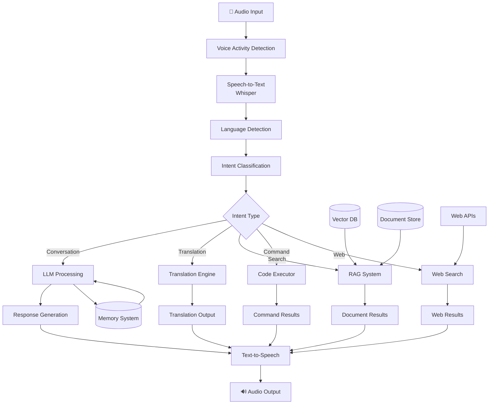

# 🗣️ Advanced Local Voice Assistant with Jetson + LLM

NVIDIA Jetson Orin Nano can be used to create a sophisticated local voice assistant that:

* **Real-time multi-language voice interaction** with automatic language detection
* **Live translation** between 100+ languages with voice output
* **RAG-powered document search** for local knowledge base queries
* **Command execution** and Python code running capabilities
* **Online search integration** with web content summarization
* **Multimodal interaction** combining voice, vision, and text
* **Privacy-first operation** with all processing on-device

This tutorial shows how to build a **comprehensive local AI assistant** using Whisper, LLMs, advanced TTS, RAG systems, and tool integration—all optimized for Jetson edge deployment.

---

## 🏗️ Advanced Voice Assistant Architecture

### System Overview

Our advanced voice assistant uses a modular architecture that combines multiple AI components:



### Core Components

#### 🎙️ **Audio Processing Pipeline**
- **Voice Activity Detection (VAD)**: Detects when user is speaking
- **Noise Cancellation**: Removes background noise for better recognition
- **Audio Preprocessing**: Normalizes audio for optimal STT performance
- **Real-time Streaming**: Processes audio in chunks for low latency

#### 🧠 **AI Processing Engine**
- **Speech-to-Text**: Whisper model optimized for Jetson
- **Language Detection**: Automatic identification of spoken language
- **Intent Classification**: Determines user's intent (chat, translate, search, etc.)
- **LLM Processing**: Local language model for conversation and reasoning
- **Response Generation**: Contextual and personalized responses

#### 🔧 **Tool Integration System**
- **RAG Engine**: Vector search through local documents
- **Translation Engine**: Multi-language translation with context
- **Code Executor**: Safe Python code execution environment
- **Web Search**: Online information retrieval and summarization
- **Command Runner**: System command execution with safety checks

#### 💾 **Memory & Storage**
- **Conversation Memory**: Short and long-term conversation context
- **User Preferences**: Personalized settings and behavior
- **Document Store**: Local knowledge base with metadata
- **Vector Database**: Semantic search index for documents
- **Cache System**: Optimized caching for repeated queries

---

## 🎯 Voice Assistant Capabilities

### 🗣️ **Core Voice Features**
- Real-time speech-to-text in 99+ languages
- Natural language understanding and conversation
- High-quality text-to-speech with voice cloning
- Automatic language detection and switching
- Voice activity detection and noise cancellation

### 🌍 **Translation & Multilingual**
- Live conversation translation between any languages
- Document translation with context preservation
- Cultural context and idiom explanation
- Pronunciation guidance and language learning

### 📚 **Knowledge & Search**
- RAG-based search through local documents (PDFs, texts, etc.)
- Web search with intelligent summarization
- Code execution and system command running
- Real-time information retrieval and fact-checking

### 🤖 **AI Agent Capabilities**
- Task planning and multi-step execution
- Tool usage and API integration
- Memory and conversation context
- Personalized responses based on user preferences

---

## 📦 Tools & Models Used

| Task           | Tool / Model             |
| -------------- | ------------------------ |
| Speech-to-Text | Whisper (tiny.en, base)  |
| LLM Inference  | llama.cpp, Ollama        |
| Translation    | M2M100, NLLB (fairseq)   |
| Text-to-Speech | Coqui TTS, eSpeak        |
| Visual Input   | OpenCV + YOLO or OWL-ViT |

---

## ⚙️ Installation on Jetson

```bash
# Whisper ASR
pip install openai-whisper

# LLM Inference (choose one)
pip install llama-cpp-python
# or Ollama: https://ollama.com/download

# TTS
pip install TTS  # Coqui TTS
sudo apt install espeak ffmpeg

# Vision support
pip install opencv-python
pip install ultralytics  # for YOLOv8
```

---

## 🎤 Advanced Audio Processing & Multi-Language STT

### Enhanced Audio Dependencies

```bash
# Core audio processing
pip install openai-whisper faster-whisper
pip install pyaudio soundfile librosa
pip install webrtcvad noisereduce
pip install langdetect polyglot

# For advanced audio processing
pip install torch torchaudio
pip install transformers datasets
```

### Advanced Audio Processing Pipeline

```python
import whisper
import pyaudio
import wave
import tempfile
import os
import numpy as np
import librosa
import noisereduce as nr
import webrtcvad
from typing import List, Tuple, Optional
import threading
import queue
import time
from langdetect import detect
import torch

class AdvancedAudioProcessor:
    """Advanced audio processing with VAD, noise reduction, and optimization"""
    
    def __init__(self, 
                 model_size: str = "base",
                 sample_rate: int = 16000,
                 chunk_duration: float = 0.5,
                 vad_aggressiveness: int = 2):
        
        # Initialize Whisper model with optimization
        self.device = "cuda" if torch.cuda.is_available() else "cpu"
        self.model = whisper.load_model(model_size, device=self.device)
        
        # Audio parameters
        self.sample_rate = sample_rate
        self.chunk_duration = chunk_duration
        self.chunk_size = int(sample_rate * chunk_duration)
        
        # Voice Activity Detection
        self.vad = webrtcvad.Vad(vad_aggressiveness)
        
        # Audio streaming
        self.audio = pyaudio.PyAudio()
        self.is_listening = False
        self.audio_queue = queue.Queue()
        
        # Language detection cache
        self.detected_language = None
        self.language_confidence = 0.0
        
        print(f"🎙️ Audio processor initialized on {self.device}")
    
    def preprocess_audio(self, audio_data: np.ndarray) -> np.ndarray:
        """Advanced audio preprocessing with noise reduction"""
        # Normalize audio
        audio_data = audio_data.astype(np.float32)
        audio_data = audio_data / np.max(np.abs(audio_data))
        
        # Noise reduction
        audio_data = nr.reduce_noise(y=audio_data, sr=self.sample_rate)
        
        # Apply high-pass filter to remove low-frequency noise
        audio_data = librosa.effects.preemphasis(audio_data)
        
        return audio_data
    
    def detect_voice_activity(self, audio_chunk: bytes) -> bool:
        """Detect if audio chunk contains speech"""
        try:
            # VAD requires specific sample rates
            if self.sample_rate in [8000, 16000, 32000, 48000]:
                frame_duration = int(len(audio_chunk) / (self.sample_rate * 2) * 1000)
                if frame_duration in [10, 20, 30]:
                    return self.vad.is_speech(audio_chunk, self.sample_rate)
            return True  # Fallback to assuming speech
        except:
            return True
    
    def detect_language(self, text: str) -> Tuple[str, float]:
        """Detect language of transcribed text"""
        try:
            if len(text.strip()) < 10:
                return self.detected_language or "en", 0.5
            
            detected_lang = detect(text)
            confidence = 0.8  # Simplified confidence
            
            # Update cached language if confidence is high
            if confidence > 0.7:
                self.detected_language = detected_lang
                self.language_confidence = confidence
            
            return detected_lang, confidence
        except:
            return "en", 0.5
    
    def stream_audio(self, duration: Optional[float] = None):
        """Stream audio from microphone with real-time processing"""
        stream = self.audio.open(
            format=pyaudio.paInt16,
            channels=1,
            rate=self.sample_rate,
            input=True,
            frames_per_buffer=self.chunk_size,
            stream_callback=self._audio_callback
        )
        
        self.is_listening = True
        stream.start_stream()
        
        print("🎤 Listening... (Press Ctrl+C to stop)")
        
        try:
            if duration:
                time.sleep(duration)
            else:
                while self.is_listening:
                    time.sleep(0.1)
        except KeyboardInterrupt:
            print("\n🛑 Stopping audio stream...")
        finally:
            self.is_listening = False
            stream.stop_stream()
            stream.close()
    
    def _audio_callback(self, in_data, frame_count, time_info, status):
        """Callback for real-time audio processing"""
        if self.detect_voice_activity(in_data):
            self.audio_queue.put(in_data)
        return (None, pyaudio.paContinue)
    
    def get_audio_chunks(self, min_chunks: int = 10) -> List[bytes]:
        """Collect audio chunks from queue"""
        chunks = []
        timeout = time.time() + 5.0  # 5 second timeout
        
        while len(chunks) < min_chunks and time.time() < timeout:
            try:
                chunk = self.audio_queue.get(timeout=0.1)
                chunks.append(chunk)
            except queue.Empty:
                if chunks:  # If we have some chunks, break
                    break
                continue
        
        return chunks
    
    def transcribe_chunks(self, audio_chunks: List[bytes]) -> dict:
        """Transcribe audio chunks with language detection"""
        if not audio_chunks:
            return {"text": "", "language": "en", "confidence": 0.0}
        
        # Combine chunks into single audio array
        audio_data = np.frombuffer(b''.join(audio_chunks), dtype=np.int16)
        audio_data = audio_data.astype(np.float32) / 32768.0
        
        # Preprocess audio
        audio_data = self.preprocess_audio(audio_data)
        
        # Transcribe with Whisper
        with tempfile.NamedTemporaryFile(suffix=".wav", delete=False) as temp_file:
            librosa.output.write_wav(temp_file.name, audio_data, self.sample_rate)
            
            # Use language hint if available
            options = {}
            if self.detected_language:
                options["language"] = self.detected_language
            
            result = self.model.transcribe(temp_file.name, **options)
            os.unlink(temp_file.name)
        
        # Detect language of transcribed text
        detected_lang, confidence = self.detect_language(result["text"])
        
        return {
            "text": result["text"].strip(),
            "language": detected_lang,
            "confidence": confidence,
            "whisper_language": result.get("language", "en")
        }
    
    def listen_continuously(self, callback_func):
        """Continuous listening with callback for transcribed text"""
        def process_audio():
            while self.is_listening:
                chunks = self.get_audio_chunks()
                if chunks:
                    result = self.transcribe_chunks(chunks)
                    if result["text"]:
                        callback_func(result)
                time.sleep(0.1)
        
        # Start audio streaming in separate thread
        audio_thread = threading.Thread(target=self.stream_audio)
        process_thread = threading.Thread(target=process_audio)
        
        audio_thread.start()
        process_thread.start()
        
        return audio_thread, process_thread
    
    def __del__(self):
        self.is_listening = False
        if hasattr(self, 'audio'):
            self.audio.terminate()

# Usage example
def on_speech_detected(result):
    print(f"🗣️ [{result['language']}] {result['text']}")
    print(f"   Confidence: {result['confidence']:.2f}")

# Initialize processor
audio_processor = AdvancedAudioProcessor(model_size="base")

# Start continuous listening
audio_thread, process_thread = audio_processor.listen_continuously(on_speech_detected)

# Let it run for 30 seconds
time.sleep(30)
audio_processor.is_listening = False
```

### Jetson-Optimized Whisper

```python
class JetsonOptimizedWhisper:
    """Whisper optimized specifically for Jetson hardware"""
    
    def __init__(self, model_size: str = "base"):
        # Enable Jetson optimizations
        if torch.cuda.is_available():
            torch.backends.cudnn.benchmark = True
            torch.backends.cuda.matmul.allow_tf32 = True
            
            # Set memory fraction for Jetson
            torch.cuda.set_per_process_memory_fraction(0.7)
        
        # Load model with optimizations
        self.device = "cuda" if torch.cuda.is_available() else "cpu"
        self.model = whisper.load_model(model_size, device=self.device)
        
        # Compile model for faster inference (PyTorch 2.0+)
        try:
            self.model = torch.compile(self.model)
            print("✅ Model compiled for faster inference")
        except:
            print("⚠️ Model compilation not available")
    
    def transcribe_optimized(self, audio_path: str, language: str = None) -> dict:
        """Optimized transcription for Jetson"""
        options = {
            "fp16": torch.cuda.is_available(),  # Use FP16 on GPU
            "language": language,
            "task": "transcribe"
        }
        
        with torch.cuda.amp.autocast(enabled=torch.cuda.is_available()):
            result = self.model.transcribe(audio_path, **options)
        
        return result
```

## 🌍 Advanced Translation Engine

### Multi-Language Translation Dependencies

```bash
# Translation libraries
pip install transformers torch
pip install sentencepiece protobuf
pip install googletrans==4.0.0rc1
pip install deep-translator
pip install polyglot pyicu pycld2

# Language detection and processing
pip install langdetect fasttext
pip install spacy

# Download language models
python -m spacy download en_core_web_sm
python -m spacy download es_core_news_sm
python -m spacy download fr_core_news_sm
```

### Advanced Translation System

```python
import torch
from transformers import MarianMTModel, MarianTokenizer, pipeline
from deep_translator import GoogleTranslator, MyMemoryTranslator
from typing import Dict, List, Tuple, Optional
import spacy
import re
from dataclasses import dataclass
from langdetect import detect, detect_langs
import threading
import time

@dataclass
class TranslationResult:
    """Structure for translation results"""
    original_text: str
    translated_text: str
    source_language: str
    target_language: str
    confidence: float
    cultural_notes: List[str]
    pronunciation_guide: Optional[str] = None

class AdvancedTranslationEngine:
    """Advanced translation engine with context awareness and cultural intelligence"""
    
    def __init__(self, device: str = "auto"):
        self.device = "cuda" if device == "auto" and torch.cuda.is_available() else "cpu"
        
        # Initialize translation models
        self.models = {}
        self.tokenizers = {}
        
        # Language pairs for local models
        self.supported_pairs = [
            ("en", "es"), ("en", "fr"), ("en", "de"), ("en", "zh"),
            ("es", "en"), ("fr", "en"), ("de", "en"), ("zh", "en")
        ]
        
        # Cultural context database
        self.cultural_contexts = {
            "greetings": {
                "en": ["hello", "hi", "hey", "good morning", "good evening"],
                "es": ["hola", "buenos días", "buenas tardes", "buenas noches"],
                "fr": ["bonjour", "bonsoir", "salut"],
                "de": ["hallo", "guten tag", "guten morgen", "guten abend"]
            },
            "politeness": {
                "en": ["please", "thank you", "excuse me", "sorry"],
                "es": ["por favor", "gracias", "disculpe", "lo siento"],
                "fr": ["s'il vous plaît", "merci", "excusez-moi", "désolé"],
                "de": ["bitte", "danke", "entschuldigung", "es tut mir leid"]
            }
        }
        
        # Initialize spaCy models for context analysis
        self.nlp_models = {}
        self._load_nlp_models()
        
        print(f"🌍 Translation engine initialized on {self.device}")
    
    def _load_nlp_models(self):
        """Load spaCy models for different languages"""
        models_to_load = {
            "en": "en_core_web_sm",
            "es": "es_core_news_sm",
            "fr": "fr_core_news_sm"
        }
        
        for lang, model_name in models_to_load.items():
            try:
                self.nlp_models[lang] = spacy.load(model_name)
            except OSError:
                print(f"⚠️ {model_name} not found for {lang}")
    
    def load_translation_model(self, source_lang: str, target_lang: str):
        """Load specific translation model for language pair"""
        model_key = f"{source_lang}-{target_lang}"
        
        if model_key in self.models:
            return
        
        try:
            model_name = f"Helsinki-NLP/opus-mt-{source_lang}-{target_lang}"
            tokenizer = MarianTokenizer.from_pretrained(model_name)
            model = MarianMTModel.from_pretrained(model_name)
            
            if self.device == "cuda":
                model = model.to(self.device)
                model = model.half()  # Use FP16 for memory efficiency
            
            self.tokenizers[model_key] = tokenizer
            self.models[model_key] = model
            
            print(f"✅ Loaded model for {source_lang} → {target_lang}")
        except Exception as e:
            print(f"❌ Failed to load model for {source_lang} → {target_lang}: {e}")
    
    def detect_language_advanced(self, text: str) -> Tuple[str, float]:
        """Advanced language detection with confidence scoring"""
        try:
            # Use langdetect for primary detection
            detections = detect_langs(text)
            primary_lang = detections[0].lang
            confidence = detections[0].prob
            
            # Validate with cultural context
            cultural_score = self._calculate_cultural_score(text, primary_lang)
            adjusted_confidence = (confidence + cultural_score) / 2
            
            return primary_lang, adjusted_confidence
        except:
            return "en", 0.5
    
    def _calculate_cultural_score(self, text: str, detected_lang: str) -> float:
        """Calculate cultural context score for language detection"""
        text_lower = text.lower()
        score = 0.0
        total_checks = 0
        
        for category, lang_phrases in self.cultural_contexts.items():
            if detected_lang in lang_phrases:
                phrases = lang_phrases[detected_lang]
                for phrase in phrases:
                    total_checks += 1
                    if phrase in text_lower:
                        score += 1.0
        
        return score / max(total_checks, 1)
    
    def extract_context(self, text: str, language: str) -> Dict:
        """Extract linguistic and cultural context from text"""
        context = {
            "entities": [],
            "sentiment": "neutral",
            "formality": "neutral",
            "cultural_elements": []
        }
        
        if language in self.nlp_models:
            nlp = self.nlp_models[language]
            doc = nlp(text)
            
            # Extract named entities
            context["entities"] = [(ent.text, ent.label_) for ent in doc.ents]
            
            # Analyze formality (simplified)
            formal_indicators = ["please", "would", "could", "may i", "excuse me"]
            informal_indicators = ["hey", "yeah", "gonna", "wanna", "sup"]
            
            text_lower = text.lower()
            formal_count = sum(1 for indicator in formal_indicators if indicator in text_lower)
            informal_count = sum(1 for indicator in informal_indicators if indicator in text_lower)
            
            if formal_count > informal_count:
                context["formality"] = "formal"
            elif informal_count > formal_count:
                context["formality"] = "informal"
        
        return context
    
    def translate_with_context(self, 
                             text: str, 
                             target_language: str,
                             source_language: str = None,
                             preserve_formality: bool = True) -> TranslationResult:
        """Translate text with context preservation"""
        
        # Detect source language if not provided
        if not source_language:
            source_language, confidence = self.detect_language_advanced(text)
        else:
            confidence = 0.9
        
        # Extract context from source text
        source_context = self.extract_context(text, source_language)
        
        # Perform translation
        translated_text = self._translate_text(text, source_language, target_language)
        
        # Generate cultural notes
        cultural_notes = self._generate_cultural_notes(text, source_language, target_language)
        
        # Generate pronunciation guide if needed
        pronunciation = self._generate_pronunciation_guide(translated_text, target_language)
        
        return TranslationResult(
            original_text=text,
            translated_text=translated_text,
            source_language=source_language,
            target_language=target_language,
            confidence=confidence,
            cultural_notes=cultural_notes,
            pronunciation_guide=pronunciation
        )
    
    def _translate_text(self, text: str, source_lang: str, target_lang: str) -> str:
        """Core translation function with fallback strategies"""
        model_key = f"{source_lang}-{target_lang}"
        
        # Try local model first
        if (source_lang, target_lang) in self.supported_pairs:
            self.load_translation_model(source_lang, target_lang)
            
            if model_key in self.models:
                try:
                    tokenizer = self.tokenizers[model_key]
                    model = self.models[model_key]
                    
                    inputs = tokenizer(text, return_tensors="pt", padding=True)
                    if self.device == "cuda":
                        inputs = {k: v.to(self.device) for k, v in inputs.items()}
                    
                    with torch.no_grad():
                        outputs = model.generate(**inputs, max_length=512)
                    
                    translated = tokenizer.decode(outputs[0], skip_special_tokens=True)
                    return translated
                except Exception as e:
                    print(f"⚠️ Local translation failed: {e}")
        
        # Fallback to online translation
        try:
            translator = GoogleTranslator(source=source_lang, target=target_lang)
            return translator.translate(text)
        except:
            try:
                translator = MyMemoryTranslator(source=source_lang, target=target_lang)
                return translator.translate(text)
            except:
                return f"[Translation failed: {text}]"
    
    def _generate_cultural_notes(self, text: str, source_lang: str, target_lang: str) -> List[str]:
        """Generate cultural context notes for translation"""
        notes = []
        text_lower = text.lower()
        
        # Check for cultural elements
        cultural_patterns = {
            "greetings": "This is a greeting that may have different cultural implications",
            "politeness": "Politeness levels vary between cultures",
            "time_references": "Time expressions may need cultural context",
            "food_terms": "Food terms often don't have direct translations"
        }
        
        for category, lang_phrases in self.cultural_contexts.items():
            if source_lang in lang_phrases:
                for phrase in lang_phrases[source_lang]:
                    if phrase in text_lower:
                        if category in cultural_patterns:
                            notes.append(cultural_patterns[category])
                        break
        
        return notes
    
    def _generate_pronunciation_guide(self, text: str, language: str) -> Optional[str]:
        """Generate basic pronunciation guide"""
        # Simplified pronunciation mapping
        pronunciation_guides = {
            "es": {
                "ñ": "ny", "rr": "rolled r", "j": "h", "ll": "y"
            },
            "fr": {
                "ç": "s", "é": "ay", "è": "eh", "ê": "eh"
            },
            "de": {
                "ü": "ue", "ö": "oe", "ä": "ae", "ß": "ss"
            }
        }
        
        if language in pronunciation_guides:
            guide = text
            for char, replacement in pronunciation_guides[language].items():
                guide = guide.replace(char, f"[{replacement}]")
            return guide if guide != text else None
        
        return None
    
    def translate_conversation(self, 
                             conversation: List[str], 
                             target_language: str,
                             source_language: str = None) -> List[TranslationResult]:
        """Translate entire conversation with context continuity"""
        results = []
        detected_language = source_language
        
        for utterance in conversation:
            if not detected_language:
                detected_language, _ = self.detect_language_advanced(utterance)
            
            result = self.translate_with_context(
                utterance, 
                target_language, 
                detected_language
            )
            results.append(result)
        
        return results

# Real-time Translation Assistant
class RealTimeTranslator:
    """Real-time translation for voice conversations"""
    
    def __init__(self, audio_processor, translation_engine):
        self.audio_processor = audio_processor
        self.translation_engine = translation_engine
        self.conversation_history = []
        self.target_language = "en"
        self.is_translating = False
    
    def set_target_language(self, language: str):
        """Set target language for translation"""
        self.target_language = language
        print(f"🌍 Target language set to: {language}")
    
    def start_real_time_translation(self):
        """Start real-time translation mode"""
        self.is_translating = True
        
        def on_speech_translated(speech_result):
            if not self.is_translating:
                return
            
            # Translate the speech
            translation_result = self.translation_engine.translate_with_context(
                speech_result["text"],
                self.target_language,
                speech_result["language"]
            )
            
            # Display results
            print(f"\n🗣️ [{speech_result['language']}]: {translation_result.original_text}")
            print(f"🌍 [{self.target_language}]: {translation_result.translated_text}")
            
            if translation_result.cultural_notes:
                print(f"📝 Cultural notes: {', '.join(translation_result.cultural_notes)}")
            
            if translation_result.pronunciation_guide:
                print(f"🔤 Pronunciation: {translation_result.pronunciation_guide}")
            
            # Store in conversation history
            self.conversation_history.append(translation_result)
        
        # Start continuous listening with translation
        return self.audio_processor.listen_continuously(on_speech_translated)
    
    def stop_translation(self):
        """Stop real-time translation"""
        self.is_translating = False
        self.audio_processor.is_listening = False
    
    def get_conversation_summary(self) -> str:
        """Get summary of translated conversation"""
        if not self.conversation_history:
            return "No conversation to summarize."
        
        summary = "📋 Conversation Summary:\n"
        for i, result in enumerate(self.conversation_history[-10:], 1):  # Last 10 exchanges
            summary += f"{i}. [{result.source_language}] {result.original_text}\n"
            summary += f"   [{result.target_language}] {result.translated_text}\n\n"
        
        return summary

# Usage example
translation_engine = AdvancedTranslationEngine()
audio_processor = AdvancedAudioProcessor()
real_time_translator = RealTimeTranslator(audio_processor, translation_engine)

# Set target language and start translation
real_time_translator.set_target_language("es")  # Translate to Spanish
audio_thread, process_thread = real_time_translator.start_real_time_translation()
```

## 📚 RAG-Powered Document Search System

### RAG Dependencies for Voice Assistant

```bash
# Document processing and RAG
pip install langchain langchain-community
pip install faiss-cpu faiss-gpu  # Use faiss-gpu if CUDA available
pip install sentence-transformers
pip install pypdf2 python-docx
pip install chromadb

# Advanced document processing
pip install unstructured[local-inference]
pip install pytesseract pillow
pip install python-magic-bin  # For file type detection
```

### Advanced Document Processing for Voice Queries

```python
import os
import json
from typing import List, Dict, Optional, Tuple
from pathlib import Path
import logging
from dataclasses import dataclass

# LangChain imports
from langchain.text_splitter import RecursiveCharacterTextSplitter
from langchain.embeddings import HuggingFaceEmbeddings
from langchain.vectorstores import FAISS, Chroma
from langchain.document_loaders import (
    PyPDFLoader, TextLoader, UnstructuredWordDocumentLoader,
    CSVLoader, JSONLoader
)
from langchain.schema import Document

# Additional imports
import torch
from sentence_transformers import SentenceTransformer
import numpy as np
from datetime import datetime
import hashlib

@dataclass
class DocumentSearchResult:
    """Structure for document search results"""
    content: str
    source: str
    score: float
    metadata: Dict
    summary: Optional[str] = None

class VoiceRAGProcessor:
    """RAG system optimized for voice queries and Jetson hardware"""
    
    def __init__(self, 
                 documents_path: str = "./documents",
                 vector_store_path: str = "./vector_store",
                 embedding_model: str = "all-MiniLM-L6-v2",
                 chunk_size: int = 500,
                 chunk_overlap: int = 50):
        
        self.documents_path = Path(documents_path)
        self.vector_store_path = Path(vector_store_path)
        self.chunk_size = chunk_size
        self.chunk_overlap = chunk_overlap
        
        # Initialize embeddings with Jetson optimization
        self.device = "cuda" if torch.cuda.is_available() else "cpu"
        self.embeddings = HuggingFaceEmbeddings(
            model_name=f"sentence-transformers/{embedding_model}",
            model_kwargs={'device': self.device}
        )
        
        # Text splitter for chunking
        self.text_splitter = RecursiveCharacterTextSplitter(
            chunk_size=chunk_size,
            chunk_overlap=chunk_overlap,
            length_function=len,
            separators=["\n\n", "\n", ". ", " ", ""]
        )
        
        # Vector store
        self.vector_store = None
        self.document_metadata = {}
        
        # Initialize or load existing vector store
        self._initialize_vector_store()
        
        print(f"📚 RAG processor initialized on {self.device}")
        print(f"📁 Documents path: {self.documents_path}")
        print(f"🗃️ Vector store path: {self.vector_store_path}")
    
    def _initialize_vector_store(self):
        """Initialize or load existing vector store"""
        try:
            if self.vector_store_path.exists():
                self.vector_store = FAISS.load_local(
                    str(self.vector_store_path), 
                    self.embeddings
                )
                
                # Load metadata
                metadata_path = self.vector_store_path / "metadata.json"
                if metadata_path.exists():
                    with open(metadata_path, 'r') as f:
                        self.document_metadata = json.load(f)
                
                print(f"✅ Loaded existing vector store with {self.vector_store.index.ntotal} documents")
            else:
                print("🆕 Creating new vector store...")
                self._build_vector_store()
        except Exception as e:
            print(f"⚠️ Error loading vector store: {e}")
            print("🔄 Rebuilding vector store...")
            self._build_vector_store()
    
    def _build_vector_store(self):
        """Build vector store from documents"""
        if not self.documents_path.exists():
            self.documents_path.mkdir(parents=True, exist_ok=True)
            print(f"📁 Created documents directory: {self.documents_path}")
            return
        
        documents = self._load_all_documents()
        
        if documents:
            self.vector_store = FAISS.from_documents(documents, self.embeddings)
            self._save_vector_store()
            print(f"✅ Built vector store with {len(documents)} document chunks")
        else:
            print("📭 No documents found to index")
    
    def _load_all_documents(self) -> List[Document]:
        """Load and process all documents from the documents directory"""
        documents = []
        supported_extensions = {
            '.pdf': self._load_pdf,
            '.txt': self._load_text,
            '.md': self._load_text,
            '.docx': self._load_docx,
            '.csv': self._load_csv,
            '.json': self._load_json
        }
        
        for file_path in self.documents_path.rglob('*'):
            if file_path.is_file() and file_path.suffix.lower() in supported_extensions:
                try:
                    loader_func = supported_extensions[file_path.suffix.lower()]
                    file_documents = loader_func(file_path)
                    
                    # Add file metadata
                    for doc in file_documents:
                        doc.metadata.update({
                            'file_path': str(file_path),
                            'file_name': file_path.name,
                            'file_size': file_path.stat().st_size,
                            'last_modified': datetime.fromtimestamp(file_path.stat().st_mtime).isoformat()
                        })
                    
                    documents.extend(file_documents)
                    
                    # Store document metadata
                    file_hash = self._get_file_hash(file_path)
                    self.document_metadata[str(file_path)] = {
                        'hash': file_hash,
                        'chunks': len(file_documents),
                        'processed_at': datetime.now().isoformat()
                    }
                    
                    print(f"📄 Processed: {file_path.name} ({len(file_documents)} chunks)")
                    
                except Exception as e:
                    print(f"❌ Error processing {file_path}: {e}")
        
        return documents
    
    def _load_pdf(self, file_path: Path) -> List[Document]:
        """Load PDF document"""
        loader = PyPDFLoader(str(file_path))
        documents = loader.load()
        return self.text_splitter.split_documents(documents)
    
    def _load_text(self, file_path: Path) -> List[Document]:
        """Load text document"""
        loader = TextLoader(str(file_path), encoding='utf-8')
        documents = loader.load()
        return self.text_splitter.split_documents(documents)
    
    def _load_docx(self, file_path: Path) -> List[Document]:
        """Load Word document"""
        loader = UnstructuredWordDocumentLoader(str(file_path))
        documents = loader.load()
        return self.text_splitter.split_documents(documents)
    
    def _load_csv(self, file_path: Path) -> List[Document]:
        """Load CSV document"""
        loader = CSVLoader(str(file_path))
        documents = loader.load()
        return self.text_splitter.split_documents(documents)
    
    def _load_json(self, file_path: Path) -> List[Document]:
        """Load JSON document"""
        loader = JSONLoader(str(file_path), jq_schema='.', text_content=False)
        documents = loader.load()
        return self.text_splitter.split_documents(documents)
    
    def _get_file_hash(self, file_path: Path) -> str:
        """Get MD5 hash of file for change detection"""
        hash_md5 = hashlib.md5()
        with open(file_path, "rb") as f:
            for chunk in iter(lambda: f.read(4096), b""):
                hash_md5.update(chunk)
        return hash_md5.hexdigest()
    
    def _save_vector_store(self):
        """Save vector store and metadata"""
        if self.vector_store:
            self.vector_store_path.mkdir(parents=True, exist_ok=True)
            self.vector_store.save_local(str(self.vector_store_path))
            
            # Save metadata
            metadata_path = self.vector_store_path / "metadata.json"
            with open(metadata_path, 'w') as f:
                json.dump(self.document_metadata, f, indent=2)
    
    def add_document(self, file_path: str) -> bool:
        """Add a single document to the vector store"""
        file_path = Path(file_path)
        
        if not file_path.exists():
            print(f"❌ File not found: {file_path}")
            return False
        
        try:
            # Check if document has changed
            current_hash = self._get_file_hash(file_path)
            if str(file_path) in self.document_metadata:
                if self.document_metadata[str(file_path)]['hash'] == current_hash:
                    print(f"📄 Document unchanged: {file_path.name}")
                    return True
            
            # Load and process document
            documents = self._load_all_documents()
            new_docs = [doc for doc in documents if doc.metadata['file_path'] == str(file_path)]
            
            if new_docs:
                if self.vector_store is None:
                    self.vector_store = FAISS.from_documents(new_docs, self.embeddings)
                else:
                    new_vector_store = FAISS.from_documents(new_docs, self.embeddings)
                    self.vector_store.merge_from(new_vector_store)
                
                self._save_vector_store()
                print(f"✅ Added document: {file_path.name} ({len(new_docs)} chunks)")
                return True
            
        except Exception as e:
            print(f"❌ Error adding document {file_path}: {e}")
        
        return False
    
    def search_documents(self, 
                        query: str, 
                        k: int = 5,
                        score_threshold: float = 0.7) -> List[DocumentSearchResult]:
        """Search documents using semantic similarity"""
        if not self.vector_store:
            return []
        
        try:
            # Perform similarity search with scores
            docs_and_scores = self.vector_store.similarity_search_with_score(query, k=k)
            
            results = []
            for doc, score in docs_and_scores:
                # Convert distance to similarity score (FAISS returns distance)
                similarity_score = 1 / (1 + score)
                
                if similarity_score >= score_threshold:
                    result = DocumentSearchResult(
                        content=doc.page_content,
                        source=doc.metadata.get('file_name', 'Unknown'),
                        score=similarity_score,
                        metadata=doc.metadata
                    )
                    results.append(result)
            
            return results
            
        except Exception as e:
            print(f"❌ Search error: {e}")
            return []
    
    def search_with_context(self, 
                           query: str, 
                           conversation_history: List[str] = None,
                           k: int = 3) -> List[DocumentSearchResult]:
        """Search with conversation context for better results"""
        # Enhance query with conversation context
        enhanced_query = query
        if conversation_history:
            # Use last few exchanges for context
            recent_context = " ".join(conversation_history[-3:])
            enhanced_query = f"{recent_context} {query}"
        
        return self.search_documents(enhanced_query, k=k)
    
    def get_document_summary(self, file_name: str) -> Optional[str]:
        """Get summary of a specific document"""
        if not self.vector_store:
            return None
        
        # Search for all chunks from the specific document
        all_docs = self.vector_store.similarity_search(
            f"summary of {file_name}", 
            k=100,
            filter={"file_name": file_name}
        )
        
        if not all_docs:
            return None
        
        # Combine content from all chunks
        full_content = "\n".join([doc.page_content for doc in all_docs[:5]])  # First 5 chunks
        
        return f"Document: {file_name}\nContent preview: {full_content[:500]}..."
    
    def list_available_documents(self) -> List[Dict]:
        """List all available documents with metadata"""
        documents = []
        for file_path, metadata in self.document_metadata.items():
            file_info = {
                'name': Path(file_path).name,
                'path': file_path,
                'chunks': metadata['chunks'],
                'processed_at': metadata['processed_at']
            }
            documents.append(file_info)
        
        return documents
    
    def refresh_documents(self):
        """Refresh vector store with updated documents"""
        print("🔄 Refreshing document index...")
        self._build_vector_store()
        print("✅ Document index refreshed")

# Voice-optimized search interface
class VoiceDocumentSearch:
    """Voice-optimized interface for document search"""
    
    def __init__(self, rag_processor: VoiceRAGProcessor):
        self.rag_processor = rag_processor
        self.conversation_history = []
    
    def process_voice_query(self, query: str, language: str = "en") -> str:
        """Process voice query and return formatted response"""
        # Add query to conversation history
        self.conversation_history.append(query)
        
        # Search documents
        results = self.rag_processor.search_with_context(
            query, 
            self.conversation_history
        )
        
        if not results:
            return "I couldn't find any relevant information in your documents. Could you try rephrasing your question?"
        
        # Format response for voice output
        response = self._format_voice_response(results, query)
        
        # Add response to history
        self.conversation_history.append(response)
        
        # Keep history manageable
        if len(self.conversation_history) > 10:
            self.conversation_history = self.conversation_history[-10:]
        
        return response
    
    def _format_voice_response(self, results: List[DocumentSearchResult], query: str) -> str:
        """Format search results for voice output"""
        if len(results) == 1:
            result = results[0]
            response = f"I found information in {result.source}. {result.content[:300]}"
            if len(result.content) > 300:
                response += "... Would you like me to continue?"
        else:
            response = f"I found {len(results)} relevant documents. "
            for i, result in enumerate(results[:2], 1):
                response += f"From {result.source}: {result.content[:150]}... "
            
            if len(results) > 2:
                response += f"And {len(results) - 2} more documents contain relevant information."
        
        return response
    
    def get_document_list_response(self) -> str:
        """Get voice-friendly list of available documents"""
        documents = self.rag_processor.list_available_documents()
        
        if not documents:
            return "No documents are currently indexed. Please add some documents to search through."
        
        response = f"I have access to {len(documents)} documents: "
        for doc in documents[:5]:  # Limit to first 5 for voice
            response += f"{doc['name']}, "
        
        if len(documents) > 5:
            response += f"and {len(documents) - 5} more documents."
        
        return response.rstrip(", ")

# Usage example
rag_processor = VoiceRAGProcessor(
    documents_path="./my_documents",
    vector_store_path="./vector_store"
)

voice_search = VoiceDocumentSearch(rag_processor)

# Example voice queries
response1 = voice_search.process_voice_query("What is machine learning?")
response2 = voice_search.process_voice_query("Tell me about neural networks")
response3 = voice_search.process_voice_query("How do I install Python?")
```

## ⚡ Command Execution & Code Running System

### Command Execution Dependencies

```bash
# Code execution and system integration
pip install subprocess32
pip install psutil
pip install docker  # For containerized execution
pip install RestrictedPython  # For safe Python execution
pip install ast  # For code analysis
```

### Safe Command & Code Execution Engine

```python
import subprocess
import os
import sys
import ast
import tempfile
import shutil
from typing import Dict, List, Optional, Tuple, Any
from dataclasses import dataclass
import psutil
import time
import threading
import queue
from pathlib import Path
import json
import re
from RestrictedPython import compile_restricted, safe_globals
from RestrictedPython.Guards import safe_builtins

@dataclass
class ExecutionResult:
    """Structure for execution results"""
    success: bool
    output: str
    error: str
    execution_time: float
    command: str
    exit_code: Optional[int] = None
    warnings: List[str] = None

class SafeCommandExecutor:
    """Safe command execution with security restrictions"""
    
    def __init__(self, 
                 timeout: int = 30,
                 max_output_size: int = 10000,
                 working_directory: str = None):
        
        self.timeout = timeout
        self.max_output_size = max_output_size
        self.working_directory = working_directory or os.getcwd()
        
        # Allowed commands (whitelist approach)
        self.allowed_commands = {
            # File operations
            'ls', 'dir', 'pwd', 'cd', 'mkdir', 'rmdir', 'cp', 'mv', 'rm',
            'cat', 'head', 'tail', 'grep', 'find', 'locate', 'which',
            
            # System info
            'ps', 'top', 'htop', 'df', 'du', 'free', 'uname', 'whoami',
            'date', 'uptime', 'hostname',
            
            # Network
            'ping', 'curl', 'wget', 'netstat',
            
            # Development
            'git', 'python', 'python3', 'pip', 'pip3', 'node', 'npm',
            'docker', 'kubectl',
            
            # Text processing
            'sort', 'uniq', 'wc', 'awk', 'sed', 'cut',
            
            # Archive
            'tar', 'zip', 'unzip', 'gzip', 'gunzip'
        }
        
        # Dangerous patterns to block
        self.dangerous_patterns = [
            r'rm\s+-rf\s+/',  # Dangerous rm commands
            r'sudo\s+rm',     # Sudo rm
            r'\|\s*sh',       # Piping to shell
            r'\|\s*bash',     # Piping to bash
            r'>`',            # Output redirection that could overwrite
            r'chmod\s+777',   # Dangerous permissions
            r'dd\s+if=',      # Disk operations
            r'mkfs',          # Filesystem creation
            r'fdisk',         # Disk partitioning
            r'format',        # Formatting
        ]
        
        print(f"🛡️ Safe command executor initialized")
        print(f"📁 Working directory: {self.working_directory}")
    
    def is_command_safe(self, command: str) -> Tuple[bool, List[str]]:
        """Check if command is safe to execute"""
        warnings = []
        
        # Check for dangerous patterns
        for pattern in self.dangerous_patterns:
            if re.search(pattern, command, re.IGNORECASE):
                return False, [f"Dangerous pattern detected: {pattern}"]
        
        # Extract base command
        base_command = command.strip().split()[0] if command.strip() else ""
        
        # Remove common prefixes
        for prefix in ['sudo', 'time', 'nohup']:
            if base_command == prefix and len(command.split()) > 1:
                base_command = command.split()[1]
                warnings.append(f"Prefix '{prefix}' detected")
        
        # Check if base command is allowed
        if base_command not in self.allowed_commands:
            return False, [f"Command '{base_command}' not in allowed list"]
        
        # Additional safety checks
        if 'sudo' in command:
            warnings.append("Sudo usage detected - may require elevated privileges")
        
        if any(char in command for char in ['>', '>>', '|', '&', ';']):
            warnings.append("Shell operators detected - command may have side effects")
        
        return True, warnings
    
    def execute_command(self, command: str, capture_output: bool = True) -> ExecutionResult:
        """Execute a system command safely"""
        start_time = time.time()
        
        # Safety check
        is_safe, warnings = self.is_command_safe(command)
        if not is_safe:
            return ExecutionResult(
                success=False,
                output="",
                error=f"Command blocked for safety: {'; '.join(warnings)}",
                execution_time=0,
                command=command,
                warnings=warnings
            )
        
        try:
            # Execute command
            process = subprocess.Popen(
                command,
                shell=True,
                stdout=subprocess.PIPE if capture_output else None,
                stderr=subprocess.PIPE if capture_output else None,
                text=True,
                cwd=self.working_directory,
                timeout=self.timeout
            )
            
            stdout, stderr = process.communicate(timeout=self.timeout)
            
            # Limit output size
            if stdout and len(stdout) > self.max_output_size:
                stdout = stdout[:self.max_output_size] + "\n... (output truncated)"
            
            if stderr and len(stderr) > self.max_output_size:
                stderr = stderr[:self.max_output_size] + "\n... (error truncated)"
            
            execution_time = time.time() - start_time
            
            return ExecutionResult(
                success=process.returncode == 0,
                output=stdout or "",
                error=stderr or "",
                execution_time=execution_time,
                command=command,
                exit_code=process.returncode,
                warnings=warnings
            )
            
        except subprocess.TimeoutExpired:
            return ExecutionResult(
                success=False,
                output="",
                error=f"Command timed out after {self.timeout} seconds",
                execution_time=self.timeout,
                command=command,
                warnings=warnings
            )
        except Exception as e:
            return ExecutionResult(
                success=False,
                output="",
                error=f"Execution error: {str(e)}",
                execution_time=time.time() - start_time,
                command=command,
                warnings=warnings
            )

class SafePythonExecutor:
    """Safe Python code execution with restrictions"""
    
    def __init__(self, 
                 timeout: int = 30,
                 max_output_size: int = 10000):
        
        self.timeout = timeout
        self.max_output_size = max_output_size
        
        # Safe builtins for restricted execution
        self.safe_builtins = {
            '__builtins__': {
                'len': len, 'str': str, 'int': int, 'float': float,
                'bool': bool, 'list': list, 'dict': dict, 'tuple': tuple,
                'set': set, 'range': range, 'enumerate': enumerate,
                'zip': zip, 'map': map, 'filter': filter, 'sorted': sorted,
                'sum': sum, 'min': max, 'max': max, 'abs': abs,
                'round': round, 'print': print, 'type': type,
                'isinstance': isinstance, 'hasattr': hasattr, 'getattr': getattr,
                'setattr': setattr, 'dir': dir, 'help': help
            }
        }
        
        # Allowed imports
        self.allowed_imports = {
            'math', 'random', 'datetime', 'json', 'csv', 'statistics',
            'collections', 'itertools', 'functools', 'operator',
            'numpy', 'pandas', 'matplotlib', 'seaborn', 'sklearn',
            'requests', 'urllib', 'pathlib', 're', 'os.path'
        }
        
        print(f"🐍 Safe Python executor initialized")
    
    def is_code_safe(self, code: str) -> Tuple[bool, List[str]]:
        """Analyze Python code for safety"""
        warnings = []
        
        try:
            # Parse code into AST
            tree = ast.parse(code)
            
            # Check for dangerous operations
            for node in ast.walk(tree):
                # Check imports
                if isinstance(node, ast.Import):
                    for alias in node.names:
                        if alias.name not in self.allowed_imports:
                            return False, [f"Import '{alias.name}' not allowed"]
                
                elif isinstance(node, ast.ImportFrom):
                    if node.module and node.module not in self.allowed_imports:
                        return False, [f"Import from '{node.module}' not allowed"]
                
                # Check for dangerous function calls
                elif isinstance(node, ast.Call):
                    if isinstance(node.func, ast.Name):
                        dangerous_funcs = ['exec', 'eval', 'compile', '__import__', 'open']
                        if node.func.id in dangerous_funcs:
                            return False, [f"Function '{node.func.id}' not allowed"]
                
                # Check for file operations
                elif isinstance(node, ast.Attribute):
                    if node.attr in ['write', 'remove', 'unlink', 'rmdir', 'mkdir']:
                        warnings.append(f"File operation '{node.attr}' detected")
            
            return True, warnings
            
        except SyntaxError as e:
            return False, [f"Syntax error: {str(e)}"]
        except Exception as e:
            return False, [f"Code analysis error: {str(e)}"]
    
    def execute_python_code(self, code: str) -> ExecutionResult:
        """Execute Python code safely"""
        start_time = time.time()
        
        # Safety check
        is_safe, warnings = self.is_code_safe(code)
        if not is_safe:
            return ExecutionResult(
                success=False,
                output="",
                error=f"Code blocked for safety: {'; '.join(warnings)}",
                execution_time=0,
                command=code,
                warnings=warnings
            )
        
        # Capture output
        output_buffer = []
        error_buffer = []
        
        def safe_print(*args, **kwargs):
            output_buffer.append(' '.join(str(arg) for arg in args))
        
        # Create safe execution environment
        safe_env = self.safe_builtins.copy()
        safe_env['print'] = safe_print
        
        try:
            # Compile with restrictions
            compiled_code = compile_restricted(code, '<string>', 'exec')
            
            if compiled_code.errors:
                return ExecutionResult(
                    success=False,
                    output="",
                    error=f"Compilation errors: {'; '.join(compiled_code.errors)}",
                    execution_time=time.time() - start_time,
                    command=code,
                    warnings=warnings
                )
            
            # Execute with timeout
            def execute_with_timeout():
                try:
                    exec(compiled_code.code, safe_env)
                except Exception as e:
                    error_buffer.append(str(e))
            
            thread = threading.Thread(target=execute_with_timeout)
            thread.start()
            thread.join(timeout=self.timeout)
            
            if thread.is_alive():
                return ExecutionResult(
                    success=False,
                    output="",
                    error=f"Code execution timed out after {self.timeout} seconds",
                    execution_time=self.timeout,
                    command=code,
                    warnings=warnings
                )
            
            # Collect results
            output = '\n'.join(output_buffer)
            error = '\n'.join(error_buffer)
            
            # Limit output size
            if len(output) > self.max_output_size:
                output = output[:self.max_output_size] + "\n... (output truncated)"
            
            execution_time = time.time() - start_time
            
            return ExecutionResult(
                success=len(error_buffer) == 0,
                output=output,
                error=error,
                execution_time=execution_time,
                command=code,
                warnings=warnings
            )
            
        except Exception as e:
            return ExecutionResult(
                success=False,
                output="",
                error=f"Execution error: {str(e)}",
                execution_time=time.time() - start_time,
                command=code,
                warnings=warnings
            )

class VoiceCodeExecutor:
    """Voice-controlled code and command execution"""
    
    def __init__(self):
        self.command_executor = SafeCommandExecutor()
        self.python_executor = SafePythonExecutor()
        self.execution_history = []
    
    def process_voice_command(self, voice_input: str) -> str:
        """Process voice input and determine execution type"""
        voice_input = voice_input.strip().lower()
        
        # Detect command type
        if any(phrase in voice_input for phrase in [
            "run command", "execute command", "system command", "terminal command"
        ]):
            return self._handle_system_command(voice_input)
        
        elif any(phrase in voice_input for phrase in [
            "run python", "execute python", "python code", "run code"
        ]):
            return self._handle_python_code(voice_input)
        
        elif any(phrase in voice_input for phrase in [
            "show files", "list files", "what files", "directory contents"
        ]):
            return self._handle_file_listing()
        
        elif any(phrase in voice_input for phrase in [
            "system info", "system status", "computer info"
        ]):
            return self._handle_system_info()
        
        else:
            return "I can help you run system commands or Python code. Try saying 'run command' or 'run python code' followed by your request."
    
    def _extract_command_from_voice(self, voice_input: str) -> str:
        """Extract actual command from voice input"""
        # Remove common voice command prefixes
        prefixes = [
            "run command", "execute command", "system command", "terminal command",
            "run python", "execute python", "python code", "run code",
            "please", "can you", "could you"
        ]
        
        command = voice_input
        for prefix in prefixes:
            if command.startswith(prefix):
                command = command[len(prefix):].strip()
                break
        
        return command
    
    def _handle_system_command(self, voice_input: str) -> str:
        """Handle system command execution"""
        command = self._extract_command_from_voice(voice_input)
        
        if not command:
            return "Please specify the command you want to run."
        
        result = self.command_executor.execute_command(command)
        self.execution_history.append(result)
        
        # Format response for voice
        if result.success:
            response = f"Command executed successfully. "
            if result.output:
                # Limit output for voice response
                output_preview = result.output[:200]
                if len(result.output) > 200:
                    output_preview += "... and more"
                response += f"Output: {output_preview}"
            else:
                response += "No output returned."
        else:
            response = f"Command failed. Error: {result.error}"
        
        if result.warnings:
            response += f" Warnings: {', '.join(result.warnings)}"
        
        return response
    
    def _handle_python_code(self, voice_input: str) -> str:
        """Handle Python code execution"""
        code = self._extract_command_from_voice(voice_input)
        
        if not code:
            return "Please specify the Python code you want to run."
        
        result = self.python_executor.execute_python_code(code)
        self.execution_history.append(result)
        
        # Format response for voice
        if result.success:
            response = f"Python code executed successfully. "
            if result.output:
                output_preview = result.output[:200]
                if len(result.output) > 200:
                    output_preview += "... and more"
                response += f"Output: {output_preview}"
            else:
                response += "No output returned."
        else:
            response = f"Python code failed. Error: {result.error}"
        
        if result.warnings:
            response += f" Warnings: {', '.join(result.warnings)}"
        
        return response
    
    def _handle_file_listing(self) -> str:
        """Handle file listing requests"""
        result = self.command_executor.execute_command("ls -la")
        
        if result.success:
            files = result.output.split('\n')[:10]  # First 10 files
            file_count = len([f for f in files if f.strip()])
            return f"Found {file_count} items in current directory: {', '.join([f.split()[-1] for f in files if f.strip()][:5])}"
        else:
            return "Could not list files in current directory."
    
    def _handle_system_info(self) -> str:
        """Handle system information requests"""
        try:
            # Get basic system info
            cpu_percent = psutil.cpu_percent(interval=1)
            memory = psutil.virtual_memory()
            disk = psutil.disk_usage('/')
            
            response = f"System status: CPU usage {cpu_percent}%, "
            response += f"Memory usage {memory.percent}%, "
            response += f"Disk usage {disk.percent}%"
            
            return response
        except:
            return "Could not retrieve system information."
    
    def get_execution_history(self) -> str:
        """Get recent execution history"""
        if not self.execution_history:
            return "No commands have been executed yet."
        
        recent = self.execution_history[-5:]  # Last 5 executions
        response = f"Recent executions: "
        for i, result in enumerate(recent, 1):
            status = "succeeded" if result.success else "failed"
            response += f"{i}. {result.command[:30]}... {status}. "
        
        return response

# Usage example
voice_executor = VoiceCodeExecutor()

# Example voice commands
response1 = voice_executor.process_voice_command("run command ls -la")
response2 = voice_executor.process_voice_command("run python code print('Hello World')")
response3 = voice_executor.process_voice_command("show system info")
```

## 🌐 Online Search Integration

### Online Search Dependencies

```bash
# Web search and content extraction
pip install requests
pip install beautifulsoup4
pip install lxml
pip install selenium  # For dynamic content
pip install duckduckgo-search
pip install googlesearch-python
pip install newspaper3k  # For article extraction
pip install readability-lxml  # For content cleaning
pip install trafilatura  # For web scraping
pip install html2text  # For HTML to text conversion
```

### Advanced Online Search Engine

```python
import requests
from bs4 import BeautifulSoup
import json
import time
from typing import Dict, List, Optional, Tuple
from dataclasses import dataclass
from urllib.parse import urljoin, urlparse
import re
from duckduckgo_search import DDGS
import html2text
from newspaper import Article
import trafilatura
from readability import Document

@dataclass
class SearchResult:
    """Structure for search results"""
    title: str
    url: str
    snippet: str
    content: str = ""
    source: str = ""
    relevance_score: float = 0.0
    timestamp: str = ""

@dataclass
class SearchQuery:
    """Structure for search queries"""
    query: str
    language: str = "en"
    region: str = "us"
    max_results: int = 5
    search_type: str = "web"  # web, news, images, videos
    time_filter: str = ""  # d (day), w (week), m (month), y (year)

class AdvancedWebSearchEngine:
    """Advanced web search with multiple providers and content extraction"""
    
    def __init__(self):
        self.session = requests.Session()
        self.session.headers.update({
            'User-Agent': 'Mozilla/5.0 (Windows NT 10.0; Win64; x64) AppleWebKit/537.36 (KHTML, like Gecko) Chrome/91.0.4472.124 Safari/537.36'
        })
        
        # HTML to text converter
        self.html_converter = html2text.HTML2Text()
        self.html_converter.ignore_links = True
        self.html_converter.ignore_images = True
        
        print("🔍 Advanced web search engine initialized")
    
    def search_duckduckgo(self, query: SearchQuery) -> List[SearchResult]:
        """Search using DuckDuckGo"""
        try:
            with DDGS() as ddgs:
                results = []
                
                # Perform search
                search_results = ddgs.text(
                    query.query,
                    region=query.region,
                    safesearch='moderate',
                    timelimit=query.time_filter,
                    max_results=query.max_results
                )
                
                for result in search_results:
                    search_result = SearchResult(
                        title=result.get('title', ''),
                        url=result.get('href', ''),
                        snippet=result.get('body', ''),
                        source='DuckDuckGo'
                    )
                    results.append(search_result)
                
                return results
                
        except Exception as e:
            print(f"DuckDuckGo search error: {e}")
            return []
    
    def search_google_fallback(self, query: SearchQuery) -> List[SearchResult]:
        """Fallback Google search using custom search"""
        try:
            # Simple Google search fallback
            search_url = f"https://www.google.com/search?q={query.query}&num={query.max_results}"
            
            response = self.session.get(search_url, timeout=10)
            soup = BeautifulSoup(response.content, 'html.parser')
            
            results = []
            search_divs = soup.find_all('div', class_='g')
            
            for div in search_divs[:query.max_results]:
                title_elem = div.find('h3')
                link_elem = div.find('a')
                snippet_elem = div.find('span', class_='aCOpRe')
                
                if title_elem and link_elem:
                    title = title_elem.get_text()
                    url = link_elem.get('href', '')
                    snippet = snippet_elem.get_text() if snippet_elem else ''
                    
                    # Clean URL
                    if url.startswith('/url?q='):
                        url = url.split('/url?q=')[1].split('&')[0]
                    
                    search_result = SearchResult(
                        title=title,
                        url=url,
                        snippet=snippet,
                        source='Google'
                    )
                    results.append(search_result)
            
            return results
            
        except Exception as e:
            print(f"Google search error: {e}")
            return []
    
    def extract_content(self, url: str) -> str:
        """Extract clean content from a webpage"""
        try:
            # Try multiple extraction methods
            
            # Method 1: Trafilatura (best for articles)
            try:
                response = self.session.get(url, timeout=10)
                content = trafilatura.extract(response.content)
                if content and len(content) > 100:
                    return content[:2000]  # Limit content length
            except:
                pass
            
            # Method 2: Newspaper3k
            try:
                article = Article(url)
                article.download()
                article.parse()
                if article.text and len(article.text) > 100:
                    return article.text[:2000]
            except:
                pass
            
            # Method 3: Readability
            try:
                response = self.session.get(url, timeout=10)
                doc = Document(response.content)
                content = self.html_converter.handle(doc.summary())
                if content and len(content) > 100:
                    return content[:2000]
            except:
                pass
            
            # Method 4: Basic BeautifulSoup
            try:
                response = self.session.get(url, timeout=10)
                soup = BeautifulSoup(response.content, 'html.parser')
                
                # Remove script and style elements
                for script in soup(["script", "style"]):
                    script.decompose()
                
                # Get text
                text = soup.get_text()
                
                # Clean up text
                lines = (line.strip() for line in text.splitlines())
                chunks = (phrase.strip() for line in lines for phrase in line.split("  "))
                text = ' '.join(chunk for chunk in chunks if chunk)
                
                return text[:2000] if text else ""
            except:
                pass
            
            return ""
            
        except Exception as e:
            print(f"Content extraction error for {url}: {e}")
            return ""
    
    def search_and_extract(self, query: SearchQuery) -> List[SearchResult]:
        """Perform search and extract content from results"""
        # Try DuckDuckGo first
        results = self.search_duckduckgo(query)
        
        # Fallback to Google if no results
        if not results:
            results = self.search_google_fallback(query)
        
        # Extract content for top results
        for i, result in enumerate(results[:3]):  # Only extract content for top 3
            if result.url:
                content = self.extract_content(result.url)
                result.content = content
                
                # Calculate relevance score based on query terms
                query_terms = query.query.lower().split()
                text_to_score = (result.title + " " + result.snippet + " " + result.content).lower()
                
                score = 0
                for term in query_terms:
                    score += text_to_score.count(term)
                
                result.relevance_score = score / len(query_terms) if query_terms else 0
        
        # Sort by relevance score
        results.sort(key=lambda x: x.relevance_score, reverse=True)
        
        return results

class VoiceWebSearchEngine:
    """Voice-optimized web search interface"""
    
    def __init__(self):
        self.search_engine = AdvancedWebSearchEngine()
        self.search_history = []
    
    def process_voice_search(self, voice_input: str) -> str:
        """Process voice search query and return formatted results"""
        voice_input = voice_input.strip()
        
        # Extract search query from voice input
        query_text = self._extract_search_query(voice_input)
        
        if not query_text:
            return "Please specify what you'd like to search for."
        
        # Determine search type
        search_type = self._determine_search_type(voice_input)
        
        # Create search query
        search_query = SearchQuery(
            query=query_text,
            max_results=3,  # Limit for voice response
            search_type=search_type
        )
        
        # Perform search
        results = self.search_engine.search_and_extract(search_query)
        
        # Store in history
        self.search_history.append({
            'query': query_text,
            'results': results,
            'timestamp': time.strftime('%Y-%m-%d %H:%M:%S')
        })
        
        # Format results for voice response
        return self._format_voice_response(query_text, results)
    
    def _extract_search_query(self, voice_input: str) -> str:
        """Extract search query from voice input"""
        voice_input = voice_input.lower()
        
        # Remove common search prefixes
        prefixes = [
            "search for", "search", "look up", "find", "what is", "who is",
            "where is", "when is", "how to", "tell me about", "information about",
            "please search", "can you search", "google", "web search"
        ]
        
        query = voice_input
        for prefix in prefixes:
            if query.startswith(prefix):
                query = query[len(prefix):].strip()
                break
        
        return query
    
    def _determine_search_type(self, voice_input: str) -> str:
        """Determine search type from voice input"""
        voice_input = voice_input.lower()
        
        if any(word in voice_input for word in ['news', 'latest', 'recent', 'breaking']):
            return 'news'
        elif any(word in voice_input for word in ['image', 'picture', 'photo']):
            return 'images'
        elif any(word in voice_input for word in ['video', 'watch', 'youtube']):
            return 'videos'
        else:
            return 'web'
    
    def _format_voice_response(self, query: str, results: List[SearchResult]) -> str:
        """Format search results for voice response"""
        if not results:
            return f"I couldn't find any results for '{query}'. Please try a different search term."
        
        response = f"I found {len(results)} results for '{query}'. "
        
        for i, result in enumerate(results[:2], 1):  # Top 2 results for voice
            response += f"Result {i}: {result.title}. "
            
            # Add snippet or content preview
            preview = result.content if result.content else result.snippet
            if preview:
                # Limit preview length for voice
                preview = preview[:150]
                if len(preview) == 150:
                    preview += "..."
                response += f"{preview} "
            
            response += f"Source: {result.source}. "
        
        if len(results) > 2:
            response += f"And {len(results) - 2} more results available."
        
        return response
    
    def get_search_history(self) -> str:
        """Get recent search history"""
        if not self.search_history:
            return "No searches have been performed yet."
        
        recent = self.search_history[-3:]  # Last 3 searches
        response = "Recent searches: "
        
        for i, search in enumerate(recent, 1):
            response += f"{i}. '{search['query']}' at {search['timestamp']}. "
        
        return response
    
    def get_detailed_result(self, result_index: int = 0) -> str:
        """Get detailed content from a specific search result"""
        if not self.search_history:
            return "No recent searches to get details from."
        
        last_search = self.search_history[-1]
        results = last_search['results']
        
        if result_index >= len(results):
            return f"Result {result_index + 1} not found. Only {len(results)} results available."
        
        result = results[result_index]
        
        response = f"Detailed information for '{result.title}': "
        
        if result.content:
            content_preview = result.content[:500]
            if len(result.content) > 500:
                content_preview += "..."
            response += content_preview
        else:
            response += result.snippet
        
        response += f" Source URL: {result.url}"
        
        return response

# Usage example
voice_search = VoiceWebSearchEngine()

# Example voice searches
response1 = voice_search.process_voice_search("search for latest AI news")
response2 = voice_search.process_voice_search("what is machine learning")
response3 = voice_search.process_voice_search("how to install Python on Jetson")
```

## 🤖 Complete Voice Assistant Integration

### Unified Voice Assistant System

```python
import asyncio
import threading
import queue
import time
from typing import Dict, List, Optional, Any
from dataclasses import dataclass
import json
from datetime import datetime

# Import all our components
from advanced_audio_processor import AdvancedAudioProcessor
from translation_engine import AdvancedTranslationEngine, RealTimeTranslator
from rag_system import VoiceRAGProcessor, VoiceDocumentSearch
from code_executor import VoiceCodeExecutor
from web_search import VoiceWebSearchEngine

@dataclass
class VoiceCommand:
    """Structure for voice commands"""
    text: str
    language: str
    confidence: float
    timestamp: datetime
    intent: str = ""
    entities: Dict[str, Any] = None

@dataclass
class AssistantResponse:
    """Structure for assistant responses"""
    text: str
    audio_data: Optional[bytes] = None
    language: str = "en"
    metadata: Dict[str, Any] = None

class IntentClassifier:
    """Simple intent classification for voice commands"""
    
    def __init__(self):
        self.intent_patterns = {
            'translation': [
                'translate', 'translation', 'say in', 'convert to', 'how do you say'
            ],
            'document_search': [
                'search documents', 'find in documents', 'look up', 'document search',
                'search files', 'find file', 'what does the document say'
            ],
            'code_execution': [
                'run command', 'execute', 'run python', 'system command', 'terminal',
                'run code', 'execute code'
            ],
            'web_search': [
                'search web', 'google', 'search for', 'look up online', 'web search',
                'find online', 'search internet'
            ],
            'system_info': [
                'system status', 'system info', 'computer info', 'hardware info',
                'memory usage', 'cpu usage'
            ],
            'conversation': [
                'hello', 'hi', 'how are you', 'what can you do', 'help',
                'thank you', 'goodbye', 'bye'
            ]
        }
    
    def classify_intent(self, text: str) -> str:
        """Classify the intent of the voice command"""
        text_lower = text.lower()
        
        for intent, patterns in self.intent_patterns.items():
            for pattern in patterns:
                if pattern in text_lower:
                    return intent
        
        return 'conversation'  # Default intent

class ComprehensiveVoiceAssistant:
    """Complete voice assistant with all capabilities"""
    
    def __init__(self, 
                 documents_path: str = "./documents",
                 default_language: str = "en"):
        
        print("🚀 Initializing Comprehensive Voice Assistant...")
        
        # Core components
        self.audio_processor = AdvancedAudioProcessor()
        self.translation_engine = AdvancedTranslationEngine()
        self.intent_classifier = IntentClassifier()
        
        # Specialized engines
        self.rag_processor = VoiceRAGProcessor(documents_path)
        self.document_search = VoiceDocumentSearch(self.rag_processor)
        self.code_executor = VoiceCodeExecutor()
        self.web_search = VoiceWebSearchEngine()
        
        # Assistant state
        self.default_language = default_language
        self.current_language = default_language
        self.conversation_history = []
        self.user_preferences = {
            'language': default_language,
            'voice_speed': 'normal',
            'response_length': 'medium'
        }
        
        # Audio queues for real-time processing
        self.audio_queue = queue.Queue()
        self.response_queue = queue.Queue()
        
        # Control flags
        self.is_listening = False
        self.is_processing = False
        
        print("✅ Voice Assistant initialized successfully!")
        print("🎤 Ready to listen...")
    
    def start_listening(self):
        """Start the voice assistant listening loop"""
        self.is_listening = True
        
        # Start audio processing thread
        audio_thread = threading.Thread(target=self._audio_processing_loop)
        audio_thread.daemon = True
        audio_thread.start()
        
        # Start command processing thread
        command_thread = threading.Thread(target=self._command_processing_loop)
        command_thread.daemon = True
        command_thread.start()
        
        print("🎧 Voice Assistant is now listening...")
        print("Say 'Hey Assistant' to wake up, or 'Stop listening' to pause")
        
        try:
            while self.is_listening:
                time.sleep(0.1)
        except KeyboardInterrupt:
            self.stop_listening()
    
    def stop_listening(self):
        """Stop the voice assistant"""
        self.is_listening = False
        print("🛑 Voice Assistant stopped listening")
    
    def _audio_processing_loop(self):
        """Continuous audio processing loop"""
        while self.is_listening:
            try:
                # Get audio from microphone
                audio_data = self.audio_processor.get_audio_chunk()
                
                if audio_data and self.audio_processor.is_speech(audio_data):
                    # Transcribe audio
                    transcription = self.audio_processor.transcribe_audio(audio_data)
                    
                    if transcription and transcription.strip():
                        # Detect language
                        detected_lang = self.audio_processor.detect_language(transcription)
                        
                        # Create voice command
                        command = VoiceCommand(
                            text=transcription,
                            language=detected_lang,
                            confidence=0.8,  # Placeholder
                            timestamp=datetime.now()
                        )
                        
                        # Add to processing queue
                        self.audio_queue.put(command)
                        
            except Exception as e:
                print(f"Audio processing error: {e}")
                time.sleep(0.1)
    
    def _command_processing_loop(self):
        """Process voice commands from the queue"""
        while self.is_listening:
            try:
                if not self.audio_queue.empty():
                    command = self.audio_queue.get()
                    
                    # Check for wake word or stop command
                    if self._is_wake_word(command.text):
                        print("👂 Assistant activated!")
                        continue
                    elif self._is_stop_command(command.text):
                        self.stop_listening()
                        continue
                    
                    # Process the command
                    response = self._process_voice_command(command)
                    
                    # Add to response queue
                    self.response_queue.put(response)
                    
                    # Speak the response
                    self._speak_response(response)
                    
                else:
                    time.sleep(0.1)
                    
            except Exception as e:
                print(f"Command processing error: {e}")
                time.sleep(0.1)
    
    def _is_wake_word(self, text: str) -> bool:
        """Check if text contains wake word"""
        wake_words = ['hey assistant', 'hello assistant', 'assistant']
        text_lower = text.lower()
        return any(wake in text_lower for wake in wake_words)
    
    def _is_stop_command(self, text: str) -> bool:
        """Check if text contains stop command"""
        stop_words = ['stop listening', 'stop assistant', 'goodbye assistant']
        text_lower = text.lower()
        return any(stop in text_lower for stop in stop_words)
    
    def _process_voice_command(self, command: VoiceCommand) -> AssistantResponse:
        """Process a voice command and generate response"""
        try:
            print(f"🗣️ Processing: '{command.text}' (Language: {command.language})")
            
            # Classify intent
            intent = self.intent_classifier.classify_intent(command.text)
            command.intent = intent
            
            # Update current language if different
            if command.language != self.current_language:
                self.current_language = command.language
            
            # Route to appropriate handler
            if intent == 'translation':
                response_text = self._handle_translation(command)
            elif intent == 'document_search':
                response_text = self._handle_document_search(command)
            elif intent == 'code_execution':
                response_text = self._handle_code_execution(command)
            elif intent == 'web_search':
                response_text = self._handle_web_search(command)
            elif intent == 'system_info':
                response_text = self._handle_system_info(command)
            else:
                response_text = self._handle_conversation(command)
            
            # Create response
            response = AssistantResponse(
                text=response_text,
                language=self.current_language,
                metadata={
                    'intent': intent,
                    'processing_time': time.time(),
                    'original_language': command.language
                }
            )
            
            # Add to conversation history
            self.conversation_history.append({
                'command': command,
                'response': response,
                'timestamp': datetime.now()
            })
            
            return response
            
        except Exception as e:
            print(f"Command processing error: {e}")
            return AssistantResponse(
                text="I'm sorry, I encountered an error processing your request.",
                language=self.current_language
            )
    
    def _handle_translation(self, command: VoiceCommand) -> str:
        """Handle translation requests"""
        try:
            # Extract target language and text to translate
            text = command.text.lower()
            
            # Simple extraction logic (can be improved)
            if 'to spanish' in text or 'in spanish' in text:
                target_lang = 'es'
            elif 'to french' in text or 'in french' in text:
                target_lang = 'fr'
            elif 'to german' in text or 'in german' in text:
                target_lang = 'de'
            elif 'to chinese' in text or 'in chinese' in text:
                target_lang = 'zh'
            else:
                return "Please specify the target language for translation."
            
            # Extract text to translate (simplified)
            text_to_translate = text.replace('translate', '').replace('to spanish', '').replace('in spanish', '').strip()
            
            if not text_to_translate:
                return "Please specify what you'd like me to translate."
            
            # Perform translation
            result = self.translation_engine.translate_with_context(
                text_to_translate, 
                target_lang, 
                command.language
            )
            
            response = f"Translation to {target_lang}: {result['translation']}"
            if result.get('cultural_notes'):
                response += f". Cultural note: {result['cultural_notes'][0]}"
            
            return response
            
        except Exception as e:
            return f"Translation error: {str(e)}"
    
    def _handle_document_search(self, command: VoiceCommand) -> str:
        """Handle document search requests"""
        return self.document_search.search_documents(command.text)
    
    def _handle_code_execution(self, command: VoiceCommand) -> str:
        """Handle code execution requests"""
        return self.code_executor.process_voice_command(command.text)
    
    def _handle_web_search(self, command: VoiceCommand) -> str:
        """Handle web search requests"""
        return self.web_search.process_voice_search(command.text)
    
    def _handle_system_info(self, command: VoiceCommand) -> str:
        """Handle system information requests"""
        return self.code_executor._handle_system_info()
    
    def _handle_conversation(self, command: VoiceCommand) -> str:
        """Handle general conversation"""
        text = command.text.lower()
        
        if any(greeting in text for greeting in ['hello', 'hi', 'hey']):
            return f"Hello! I'm your AI assistant. I can help you with translations, document search, code execution, and web search. What would you like to do?"
        
        elif any(question in text for question in ['what can you do', 'help', 'capabilities']):
            return "I can help you with: 1) Real-time translation between languages, 2) Searching your local documents, 3) Running system commands and Python code safely, 4) Searching the web for information, 5) System monitoring. Just speak naturally!"
        
        elif any(thanks in text for thanks in ['thank you', 'thanks']):
            return "You're welcome! Is there anything else I can help you with?"
        
        elif any(goodbye in text for goodbye in ['goodbye', 'bye', 'see you']):
            return "Goodbye! It was nice helping you today."
        
        else:
            return "I'm not sure how to help with that. Try asking me to translate something, search documents, run a command, or search the web."
    
    def _speak_response(self, response: AssistantResponse):
        """Convert response to speech (placeholder)"""
        print(f"🔊 Assistant: {response.text}")
        # Here you would integrate with a TTS system
        # For now, we just print the response
    
    def get_conversation_summary(self) -> str:
        """Get a summary of recent conversation"""
        if not self.conversation_history:
            return "No conversation history available."
        
        recent = self.conversation_history[-5:]  # Last 5 exchanges
        summary = "Recent conversation: "
        
        for i, exchange in enumerate(recent, 1):
            intent = exchange['command'].intent
            summary += f"{i}. {intent} request at {exchange['timestamp'].strftime('%H:%M')}. "
        
        return summary
    
    def update_preferences(self, preferences: Dict[str, Any]):
        """Update user preferences"""
        self.user_preferences.update(preferences)
        print(f"Updated preferences: {self.user_preferences}")

# Usage Example
if __name__ == "__main__":
    # Initialize the voice assistant
    assistant = ComprehensiveVoiceAssistant(
        documents_path="./documents",
        default_language="en"
    )
    
    # Start listening (this will run continuously)
    # assistant.start_listening()
    
    # For testing without continuous listening:
    test_commands = [
        "Hey assistant, search for machine learning in my documents",
        "Translate 'Hello world' to Spanish",
        "Run command ls -la",
        "Search web for latest AI news",
        "What's the system status?"
    ]
    
    for cmd_text in test_commands:
        command = VoiceCommand(
            text=cmd_text,
            language="en",
            confidence=0.9,
            timestamp=datetime.now()
        )
        
        response = assistant._process_voice_command(command)
        print(f"Command: {cmd_text}")
        print(f"Response: {response.text}")
        print("-" * 50)
```

### Voice Assistant Configuration

```python
# config.py - Configuration file for the voice assistant

VOICE_ASSISTANT_CONFIG = {
    # Audio settings
    "audio": {
        "sample_rate": 16000,
        "chunk_size": 1024,
        "channels": 1,
        "vad_aggressiveness": 2,
        "noise_reduction": True,
        "auto_gain_control": True
    },
    
    # Speech recognition
    "speech_recognition": {
        "model_name": "openai/whisper-base",
        "language": "auto",
        "confidence_threshold": 0.7,
        "max_audio_length": 30  # seconds
    },
    
    # Translation
    "translation": {
        "supported_languages": ["en", "es", "fr", "de", "zh", "ja", "ko"],
        "default_source": "auto",
        "cultural_context": True,
        "pronunciation_guide": True
    },
    
    # Document search
    "document_search": {
        "supported_formats": [".pdf", ".txt", ".md", ".docx", ".csv"],
        "chunk_size": 1000,
        "chunk_overlap": 200,
        "max_results": 5,
        "similarity_threshold": 0.7
    },
    
    # Code execution
    "code_execution": {
        "timeout": 30,
        "max_output_size": 10000,
        "safe_mode": True,
        "allowed_commands": ["ls", "pwd", "cat", "grep", "find", "ps", "df"],
        "blocked_patterns": ["rm -rf", "sudo rm", "format", "fdisk"]
    },
    
    # Web search
    "web_search": {
        "default_engine": "duckduckgo",
        "max_results": 3,
        "content_extraction": True,
        "timeout": 10,
        "safe_search": True
    },
    
    # Response generation
    "response": {
        "max_length": 200,  # words
        "language_adaptation": True,
        "context_awareness": True,
        "personality": "helpful_professional"
    },
    
    # System
    "system": {
        "log_level": "INFO",
        "conversation_history_limit": 100,
        "auto_save_preferences": True,
        "privacy_mode": True  # Don't log sensitive data
    }
}
```

## 🧪 Complete Voice Assistant Demo

### Quick Start Guide

```bash
# 1. Install all dependencies
pip install -r requirements.txt

# 2. Download required models
python -m spacy download en_core_web_sm
python -m spacy download es_core_news_sm
python -m spacy download fr_core_news_sm

# 3. Set up document directory
mkdir -p ./documents
# Add your PDF, TXT, MD files to this directory

# 4. Run the voice assistant
python voice_assistant.py
```

### Complete Requirements File

```txt
# requirements.txt
# Core audio processing
pyaudio==0.2.11
webrtcvad==2.0.10
noisereduce==3.0.0
langdetect==1.0.9

# Speech recognition and TTS
openai-whisper==20231117
transformers==4.35.2
torch==2.1.1
torchaudio==2.1.1
sentencepiece==0.1.99
protobuf==4.25.1

# Translation
googletrans==4.0.0rc1
deep-translator==1.11.4
polyglot==16.7.4
pyicu==2.12
pycld2==0.41
fasttext==0.9.2
spacy==3.7.2

# Document processing and RAG
langchain==0.0.350
faiss-cpu==1.7.4
sentence-transformers==2.2.2
pypdf2==3.0.1
python-docx==1.1.0
chromadb==0.4.18
unstructured[local-inference]==0.11.6
pytesseract==0.3.10
pillow==10.1.0
python-magic-bin==0.4.14

# Code execution
subprocess32==3.5.4
psutil==5.9.6
docker==6.1.3
RestrictedPython==6.2

# Web search and content extraction
requests==2.31.0
beautifulsoup4==4.12.2
lxml==4.9.3
selenium==4.15.2
duckduckgo-search==3.9.6
googlesearch-python==1.2.3
newspaper3k==0.2.8
readability-lxml==0.8.1
trafilatura==1.6.4
html2text==2020.1.16

# Utilities
numpy==1.24.4
pandas==2.1.4
scikit-learn==1.3.2
```

### Main Application Script

```python
#!/usr/bin/env python3
# voice_assistant.py - Main application script

import sys
import os
import argparse
import logging
from pathlib import Path

# Add current directory to path for imports
sys.path.append(os.path.dirname(os.path.abspath(__file__)))

from comprehensive_voice_assistant import ComprehensiveVoiceAssistant, VOICE_ASSISTANT_CONFIG

def setup_logging(log_level: str = "INFO"):
    """Set up logging configuration"""
    logging.basicConfig(
        level=getattr(logging, log_level.upper()),
        format='%(asctime)s - %(name)s - %(levelname)s - %(message)s',
        handlers=[
            logging.FileHandler('voice_assistant.log'),
            logging.StreamHandler(sys.stdout)
        ]
    )

def main():
    """Main application entry point"""
    parser = argparse.ArgumentParser(description='Advanced Voice Assistant for Jetson')
    parser.add_argument('--documents', '-d', type=str, default='./documents',
                       help='Path to documents directory')
    parser.add_argument('--language', '-l', type=str, default='en',
                       help='Default language (en, es, fr, de, zh, ja, ko)')
    parser.add_argument('--config', '-c', type=str, default=None,
                       help='Path to custom configuration file')
    parser.add_argument('--demo', action='store_true',
                       help='Run in demo mode (no continuous listening)')
    parser.add_argument('--log-level', type=str, default='INFO',
                       choices=['DEBUG', 'INFO', 'WARNING', 'ERROR'],
                       help='Logging level')
    
    args = parser.parse_args()
    
    # Set up logging
    setup_logging(args.log_level)
    logger = logging.getLogger(__name__)
    
    # Create documents directory if it doesn't exist
    documents_path = Path(args.documents)
    documents_path.mkdir(exist_ok=True)
    
    logger.info(f"Starting Voice Assistant with documents path: {documents_path}")
    logger.info(f"Default language: {args.language}")
    
    try:
        # Initialize voice assistant
        assistant = ComprehensiveVoiceAssistant(
            documents_path=str(documents_path),
            default_language=args.language
        )
        
        if args.demo:
            # Run demo mode
            logger.info("Running in demo mode...")
            run_demo(assistant)
        else:
            # Start continuous listening
            logger.info("Starting continuous listening mode...")
            logger.info("Press Ctrl+C to stop")
            assistant.start_listening()
            
    except KeyboardInterrupt:
        logger.info("Voice Assistant stopped by user")
    except Exception as e:
        logger.error(f"Error running Voice Assistant: {e}")
        sys.exit(1)

def run_demo(assistant):
    """Run the assistant in demo mode"""
    from datetime import datetime
    from comprehensive_voice_assistant import VoiceCommand
    
    print("\n🎤 Voice Assistant Demo Mode")
    print("=" * 50)
    print("Available commands:")
    print("1. Translation: 'Translate hello world to Spanish'")
    print("2. Document Search: 'Search documents for machine learning'")
    print("3. Code Execution: 'Run command ls -la'")
    print("4. Web Search: 'Search web for latest AI news'")
    print("5. System Info: 'What's the system status?'")
    print("6. Conversation: 'Hello', 'What can you do?', 'Help'")
    print("\nType 'quit' to exit")
    print("=" * 50)
    
    while True:
        try:
            user_input = input("\n🗣️ You: ").strip()
            
            if user_input.lower() in ['quit', 'exit', 'bye']:
                print("👋 Goodbye!")
                break
            
            if not user_input:
                continue
            
            # Create voice command
            command = VoiceCommand(
                text=user_input,
                language="en",  # Assume English for demo
                confidence=1.0,
                timestamp=datetime.now()
            )
            
            # Process command
            response = assistant._process_voice_command(command)
            
            # Display response
            print(f"🤖 Assistant: {response.text}")
            
            # Show metadata
            if response.metadata:
                intent = response.metadata.get('intent', 'unknown')
                print(f"   📊 Intent: {intent}")
            
        except KeyboardInterrupt:
            print("\n👋 Goodbye!")
            break
        except Exception as e:
            print(f"❌ Error: {e}")

if __name__ == "__main__":
    main()
```

### Usage Examples

#### 1. Multi-language Translation
```bash
# Start the assistant
python voice_assistant.py --demo

# Try these commands:
"Translate 'Good morning' to Spanish"
"How do you say 'Thank you' in French?"
"Convert 'Hello world' to German"
```

#### 2. Document Search with RAG
```bash
# Add documents to ./documents/ folder first
# Then try:
"Search documents for artificial intelligence"
"Find information about machine learning in my files"
"What does the document say about neural networks?"
```

#### 3. Safe Code Execution
```bash
# System commands:
"Run command ls -la"
"Show system info"
"List files in current directory"

# Python code:
"Run python code print('Hello from Jetson!')"
"Execute python import math; print(math.pi)"
```

#### 4. Web Search Integration
```bash
"Search web for latest NVIDIA Jetson news"
"Look up online how to install PyTorch on Jetson"
"Find information about edge AI applications"
```

### Performance Optimization for Jetson

```python
# jetson_optimizations.py
import torch
import os

def optimize_for_jetson():
    """Apply Jetson-specific optimizations"""
    
    # Enable CUDA if available
    if torch.cuda.is_available():
        print(f"🚀 CUDA available: {torch.cuda.get_device_name()}")
        
        # Set memory fraction to avoid OOM
        torch.cuda.set_per_process_memory_fraction(0.7)
        
        # Enable cuDNN benchmark for consistent input sizes
        torch.backends.cudnn.benchmark = True
        
        # Enable TF32 for faster training on Ampere GPUs
        torch.backends.cuda.matmul.allow_tf32 = True
        torch.backends.cudnn.allow_tf32 = True
        
        print("✅ CUDA optimizations applied")
    
    # Set environment variables for better performance
    os.environ['OMP_NUM_THREADS'] = '4'  # Adjust based on your Jetson model
    os.environ['TOKENIZERS_PARALLELISM'] = 'false'  # Avoid warnings
    
    print("✅ Jetson optimizations applied")

# Apply optimizations at startup
optimize_for_jetson()
```

### Deployment Script

```bash
#!/bin/bash
# deploy_voice_assistant.sh

echo "🚀 Deploying Voice Assistant on Jetson..."

# Update system
sudo apt update
sudo apt upgrade -y

# Install system dependencies
sudo apt install -y \
    python3-pip \
    python3-dev \
    portaudio19-dev \
    espeak-ng \
    espeak-ng-data \
    libespeak-ng1 \
    tesseract-ocr \
    ffmpeg \
    git

# Install Python dependencies
pip3 install --upgrade pip
pip3 install -r requirements.txt

# Download spaCy models
python3 -m spacy download en_core_web_sm
python3 -m spacy download es_core_news_sm
python3 -m spacy download fr_core_news_sm

# Create directories
mkdir -p documents
mkdir -p logs

# Set permissions
chmod +x voice_assistant.py

# Create systemd service (optional)
sudo tee /etc/systemd/system/voice-assistant.service > /dev/null <<EOF
[Unit]
Description=Voice Assistant Service
After=network.target

[Service]
Type=simple
User=$USER
WorkingDirectory=$(pwd)
ExecStart=/usr/bin/python3 $(pwd)/voice_assistant.py
Restart=always
RestartSec=10

[Install]
WantedBy=multi-user.target
EOF

echo "✅ Voice Assistant deployed successfully!"
echo "📖 Usage:"
echo "  Demo mode: python3 voice_assistant.py --demo"
echo "  Full mode: python3 voice_assistant.py"
echo "  Service:   sudo systemctl start voice-assistant"
```

### Troubleshooting Guide

#### Common Issues and Solutions

1. **Audio Input Issues**
   ```bash
   # Check audio devices
   arecord -l
   
   # Test microphone
   arecord -d 5 test.wav
   aplay test.wav
   ```

2. **CUDA Memory Issues**
   ```python
   # Reduce memory usage in config
   torch.cuda.set_per_process_memory_fraction(0.5)
   ```

3. **Model Loading Errors**
   ```bash
   # Clear cache and reinstall
   pip cache purge
   pip install --force-reinstall transformers
   ```

4. **Permission Errors**
   ```bash
   # Fix audio permissions
   sudo usermod -a -G audio $USER
   # Logout and login again
   ```

### Next Steps

1. **Add Text-to-Speech (TTS)**
   - Integrate with `espeak-ng` or `festival`
   - Add voice synthesis for responses

2. **Enhance Intent Recognition**
   - Train custom intent classification model
   - Add entity extraction

3. **Add Multimodal Capabilities**
   - Camera integration for visual questions
   - Image description and analysis

4. **Cloud Integration**
   - Optional cloud backup for conversations
   - Hybrid local/cloud processing

5. **Mobile App Interface**
   - Create companion mobile app
   - Remote voice control

This comprehensive voice assistant provides a solid foundation for building advanced AI applications on Jetson devices, combining local processing with powerful AI capabilities while maintaining privacy and security.

```python
import whisper
from llama_cpp import Llama
import os

asr = whisper.load_model("base")
llm = Llama(model_path="/models/qwen.gguf")

while True:
    os.system("arecord -d 5 -f cd input.wav")
    result = asr.transcribe("input.wav")
    print("You said:", result['text'])

    reply = llm(f"Respond helpfully to: {result['text']}")
    print("LLM:", reply)

    os.system(f'espeak "{reply}"')
```

### 🧠 Optimize Latency on Jetson

* Use Whisper `tiny.en` for <1s transcription
* Use `--num_threads=2` for llama-cpp
* Use quantized models (Q4\_K\_M, Q5\_1)
* Avoid too-long prompts (>300 tokens)

---

## 🌍 Real-Time Translation Mode

1. Use Whisper for source language transcription
2. Translate using multilingual model (M2M100)
3. Use TTS to read out translation

### Sample Pipeline

```python
from transformers import M2M100ForConditionalGeneration, M2M100Tokenizer

tokenizer = M2M100Tokenizer.from_pretrained("facebook/m2m100_418M")
model = M2M100ForConditionalGeneration.from_pretrained("facebook/m2m100_418M")

src_text = "Bonjour, comment allez-vous?"
tokenizer.src_lang = "fr"
encoded = tokenizer(src_text, return_tensors="pt")
out = model.generate(**encoded, forced_bos_token_id=tokenizer.get_lang_id("en"))
print(tokenizer.decode(out[0], skip_special_tokens=True))
```

---

## 🧪 Lab: Voice-Controlled Translator

1. Speak in native language (e.g., Spanish)
2. Jetson transcribes → translates → speaks in English
3. Measure latency and experiment with:

   * Different Whisper models
   * TTS speed and quality
   * LLM explanation ("Translate and explain the meaning")

---

## 🧠 Advanced Use: Multi-User Smart Home Assistant

Jetson can distinguish between users and respond differently using voice and vision inputs:

### 🔍 Visual Face Identification

Use a simple face recognition library to assign user identity:

```python
import face_recognition
import cv2

frame = cv2.imread("user_image.jpg")
faces = face_recognition.face_encodings(frame)
user = match_user(faces[0])  # Match to known encoding database
```

### 🔄 Personalized LLM Prompting

```python
reply = llm(f"You are talking to {user}. Customize response based on history.")
```

### 🗣️ Speaker Identification (Optional)

Use speaker embedding techniques (e.g., pyannote-audio) to classify who is speaking.

---

## 🎥 Vision + Audio Multimodal Interaction

Combine:

* 🎙️ Whisper for voice command
* 🧠 LLM for reasoning
* 👁️ YOLO or OWL-ViT to detect objects

### Example:

> "Is there a person wearing red in the room?"

Steps:

1. Capture frame with OpenCV
2. Detect objects and people
3. Send detection results to LLM
4. LLM analyzes and replies:

   > "Yes, one person is wearing red near the doorway."

---

## 🏡 Demo: Local Smart Home Voice Control

1. Whisper + LLM processes:

   > "Turn on the living room light"
2. Parse intent
3. Call `mqtt.publish("home/livingroom/light", "on")`

Combine:

* Voice input
* Vision context
* LLM reasoning
* Home automation API

---

## 🧠 Takeaway

* Jetson enables local, private AI assistants
* Multimodal inputs increase context and precision
* Personalize interactions with user identity
* Smart home automation becomes intelligent and interactive

Next: Package this into a container and deploy to multiple Jetson nodes in the classroom!
