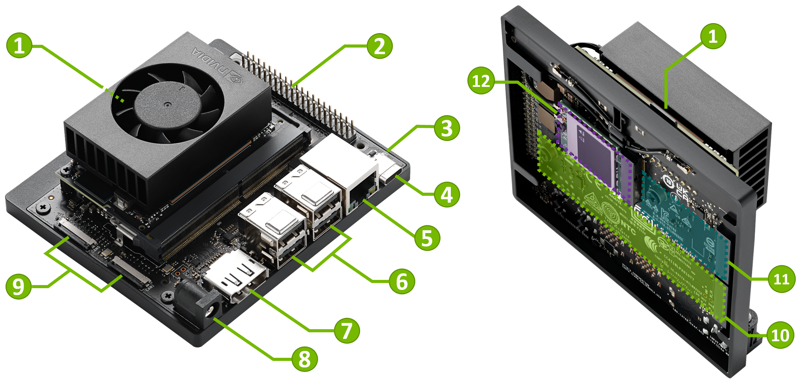

<!-- Plain Markdown. `---` starts a new slide. Preview with the "Marp for VS Code"
     extension, or build with docs/slides/build.sh. The <style> below is the white
     SJSU template (blue + gold lines, compact font); see themes/sjsu.css to reuse it. -->
<style>
:root { --blue:#0055A2; --gold:#E5A823; --ink:#202a3c; }
section { background:#fff; color:var(--ink); font-family:-apple-system,"Segoe UI",Roboto,Helvetica,Arial,sans-serif;
  font-size:21px; line-height:1.45; padding:46px 62px 54px; border-top:7px solid var(--blue); }
section::before { content:""; position:absolute; left:0; right:0; top:7px; height:3px; background:var(--gold); }
h1 { color:var(--blue); font-size:1.85em; margin:0 0 .3em; }
h2 { color:var(--blue); font-size:1.3em; border-bottom:2px solid var(--gold); padding-bottom:6px; margin:0 0 .5em; }
h3 { color:#0a3d7a; }
strong { color:var(--blue); }
a { color:var(--blue); text-decoration:none; border-bottom:1px solid var(--gold); }
code { background:#eef2f8; color:#0a3d7a; border-radius:5px; padding:.05em .35em; font-size:.92em; }
pre { background:#0f1830; border-radius:10px; box-shadow:0 6px 18px rgba(8,20,50,.12); }
pre code { background:transparent; color:#e8eefc; font-size:.8em; line-height:1.5; }
blockquote { border-left:4px solid var(--gold); background:#fbf6e9; color:#5b4a22; padding:.4em .9em; border-radius:6px; }
img { border-radius:10px; }
section::after { color:#9aa7bd; }
.step { background:var(--blue); color:#fff; border-radius:999px; padding:.03em .6em; font-weight:700; font-size:.85em; }
.tiny { font-size:.78em; color:#5d6b82; }
.cols { display:flex; gap:26px; } .cols > * { flex:1; }
section.lead { text-align:center; border-top-width:10px; }
section.lead h1 { font-size:2.3em; }
</style>

<!-- _class: lead -->
# 🤖 SJSU CyberAI Lab — Getting Started
### NVIDIA Jetson Orin Nano · `sjsujetsontool`

`San José State University · Edge AI`

<span class="tiny">A quick tour from first login to chatting with AI models. Follow along step by step.</span>

<span class="tiny">🏕️ [SJSU CyberAI Camp](https://www.sjsu.edu/cmpe/resources/cybercamp.php) &nbsp;·&nbsp; 💻 [github.com/lkk688/edgeai](https://github.com/lkk688/edgeai)</span>

---

## <span class="step">1</span> At your lab station

- Turn on the monitor and **switch its input to DisplayPort** (the Jetson is connected via DisplayPort).
- You should see the **Jetson / Ubuntu login screen** with the green **NVIDIA** logo.



<span class="tiny">No login screen? Check the monitor source button and that the Jetson is powered on.</span>

---

## <span class="step">2</span> Log in as `student`

- On the login screen, pick the **`student`** account.
- Initial password: **`Sjsujetson2026`**

**Change your password right away** (open a Terminal):

```bash
passwd
# Current password: Sjsujetson2026
# New password: ********
```

> Keep your new password somewhere safe — you'll use it every session.

---

## <span class="step">3</span> Your account & the container

The `student` account has **no `sudo`** (on purpose). Most AI tools run inside a
prebuilt **container** that already has PyTorch, CUDA, llama.cpp and more.

```bash
sjsujetsontool shell      # quick way into the container (you're now "inside")
exit                      # leave the container
```

`sjsujetsontool` is **already installed**. Update it once at the start of the lab:

```bash
sjsujetsontool update     # refresh the tool + AI container
```

---

## <span class="step">4</span> The shared `/Developer` folder

Inside the container, **`/Developer` is shared with the host** — files you create in
one show up in the other. Put your work and models here.

- In the desktop, open the **Files** app and browse to **`/Developer`** to see the
  same files from the GUI (drag in datasets, open results, etc.).

```bash
ls /Developer            # same folder inside the container and on the host
```

---

## <span class="step">5</span> Notebooks & scripts

**JupyterLab** — interactive notebooks in your browser:

```bash
sjsujetsontool jupyter           # serves JupyterLab on port 8888
```

**Run a Python file** inside the container (no need to enter the shell):

```bash
sjsujetsontool run /Developer/edgeAI/jetson/test.py
```

> Great for quick experiments and for running lab starter code in `/Developer`.

---

## <span class="step">6</span> Run a local LLM 🧠

```bash
sjsujetsontool llama
```

Press **Enter** to accept the default **Qwen3.5‑2B**, then choose **foreground** so you
can **watch the llama.cpp log** (model load, tokens/sec) live in this terminal.

> It serves an OpenAI‑style API at `http://localhost:8080`. Leave it running here.
<span class="tiny">📖 Details: [Serving LLM via llama-server](https://lkk688.github.io/edgeAI/curriculum/00_sjsujetsontool_guide/)</span>

---

## <span class="step">7</span> Test it — the easy way

Open **another Terminal**. Instead of typing a long `curl`, let the tool build it for you:

```bash
sjsujetsontool curl
```

It asks a few questions — **LLM API** → host/port (Enter for `localhost:8080`), key (optional),
your message, `max_tokens`, **stream?**, **thinking?** — then **prints the full curl and sends it**.

> 👍 Great for learning: it shows you the exact `curl` command it ran.

---

## <span class="step">8</span> Test it — raw `curl` (two modes)

**Non‑streaming** — wait for the full answer (thinking off = short & fast):

```bash
curl http://localhost:8080/v1/chat/completions -H "Content-Type: application/json" -d '{
  "messages":[{"role":"user","content":"Explain Nvidia Jetson in 2 sentences."}],
  "max_tokens":150, "chat_template_kwargs":{"enable_thinking":false} }'
```

**Streaming** — tokens appear live (add `-N` and `"stream":true`):

```bash
curl -N http://localhost:8080/v1/chat/completions -H "Content-Type: application/json" -d '{
  "messages":[{"role":"user","content":"Explain Nvidia Jetson in 2 sentences."}],
  "max_tokens":150, "stream":true, "chat_template_kwargs":{"enable_thinking":false} }'
```

<span class="tiny">📖 Full curl guide (SSE format, options): [HTTP API docs](https://lkk688.github.io/edgeAI/curriculum/00_sjsujetsontool_guide/)</span>

---

## <span class="step">9</span> 👀 Vision — ask about an image

Qwen3.5‑2B and Gemma‑4 are **multimodal**. With the local server running (step 6), attach an
image using `sjsujetsontool curl`:

```bash
sjsujetsontool curl       # LLM API → at "Attach an image?" enter a path
# image: /Developer/models/bus.jpg   message: "What's in this image? How many people?"
```

Or run the ready‑made sample (sends the OpenAI `image_url` format):

```bash
sjsujetsontool run /Developer/edgeAI/jetson/jetson-llm/vision_test.py \
  --image /Developer/models/bus.jpg -p "Describe this image."
# → VISION REPLY: A blue city bus with several people standing beside it.
```

<span class="tiny">📖 Code: <code>jetson/jetson-llm/vision_test.py</code></span>

---

## <span class="step">10</span> Cloud models (optional): NVIDIA API

```bash
sjsujetsontool setup-nvapi       # paste your key (from build.nvidia.com)
sjsujetsontool nv-chat           # chat with cloud Nemotron models + speed stats
```

> Get a free key at **build.nvidia.com** → sign in → open a model → *Get API Key*.
> 🔒 Your key is saved in your **private** `~/.env.local`. **Don't share that file** — you can delete it anytime to remove your keys.

---

## <span class="step">11</span> `sjsujetsontool chat` — one client, many backends

One terminal client for **local and cloud** models; switch any time with **`/server`**.

**Example — the local model (no key needed):**

```bash
sjsujetsontool llama       # 1) start the local server (default Qwen3.5-2B)
sjsujetsontool chat        # 2) (another terminal) → pick "1) Local Jetson llama.cpp"
```

Inside the chat, handy commands: `/think on|off` · `/temp 0.7` · `/save` · `/server` · `/exit`.

---

## <span class="step">12</span> chat — adding cloud backends

The first time you pick a cloud backend, it **prompts for the key and saves it** to `~/.env.local`:

| Backend | Get a key at | Saved as |
|---|---|---|
| **NVIDIA** | build.nvidia.com → *Get API Key* (free) | `NVIDIA_API_KEY` |
| **OpenAI** | platform.openai.com/api-keys (needs billing) | `OPENAI_API_KEY` |
| **Anthropic** | console.anthropic.com/settings/keys (needs credit) | `ANTHROPIC_API_KEY` |

```bash
sjsujetsontool chat        # pick 2 NVIDIA / 3 OpenAI / 4 Anthropic → paste key once → chat
```

> 🔒 `~/.env.local` is **your private file** — don't share it; delete it anytime to remove your keys.
<span class="tiny">📖 Details: [one chat client, many backends](https://lkk688.github.io/edgeAI/curriculum/00_sjsujetsontool_guide/)</span>

---

## <span class="step">13</span> 🖥️ A web chat UI (Gradio)

Prefer a browser? The sample UI uses the **same backends**, plus **file & image** upload:

```bash
sjsujetsontool gradio        # installs deps first run → open http://localhost:7860
```

- Pick **Local / NVIDIA / OpenAI / Anthropic** in the UI (keys read from `~/.env.local`).
- Drop in an **image** to test vision, or a **text file** to ask about its contents.

<span class="tiny">📖 Code: [edgeLLM/gradio_chat_ui.py](https://github.com/lkk688/edgeAI/blob/main/edgeLLM/gradio_chat_ui.py)</span>

> 🚀 Want a full **web app**? Continue with the [**Next.js + Nemotron slides ▶**](nextjs-nemotron.html)
> &nbsp;·&nbsp; [full lab](https://lkk688.github.io/edgeAI/curriculum/11_nextjs_nemotron_app/)

---

<!-- _class: lead -->
## 🎉 You're set!

DisplayPort → log in → `update` → `shell` → `llama` → `chat`

**Full handbook** (CUDA, YOLO, ROS 2, robotics, and more):
[lkk688.github.io/edgeAI](https://lkk688.github.io/edgeAI/)

<span class="tiny">Helpful any time: <code>sjsujetsontool list</code> · <code>sjsujetsontool dockerfix</code></span>
