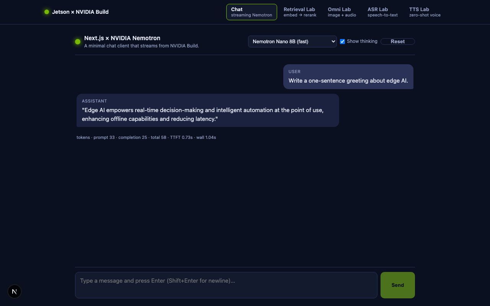
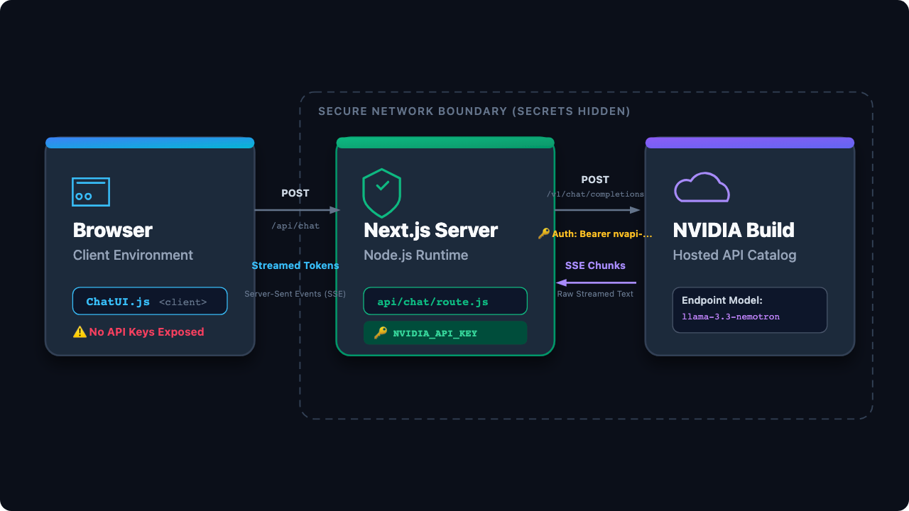
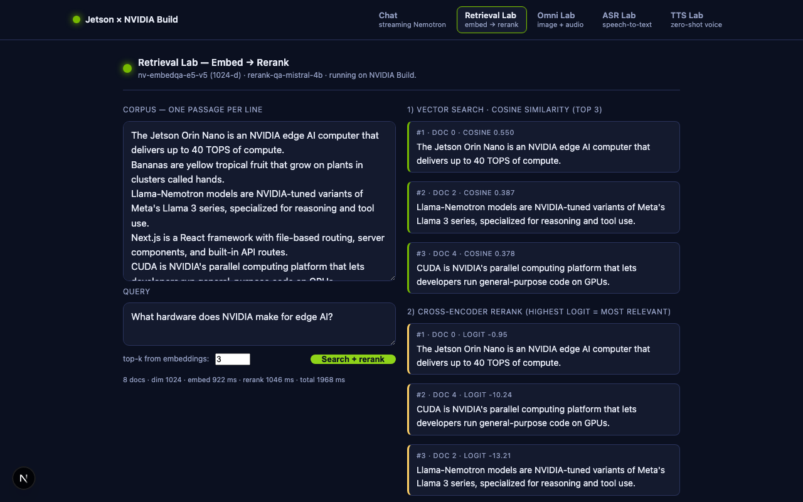
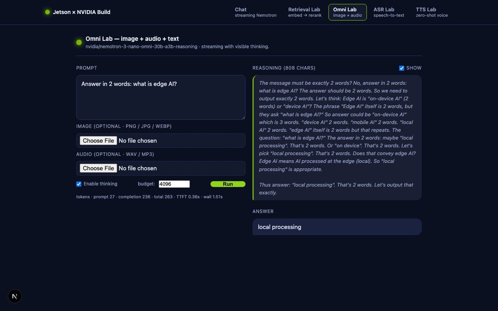
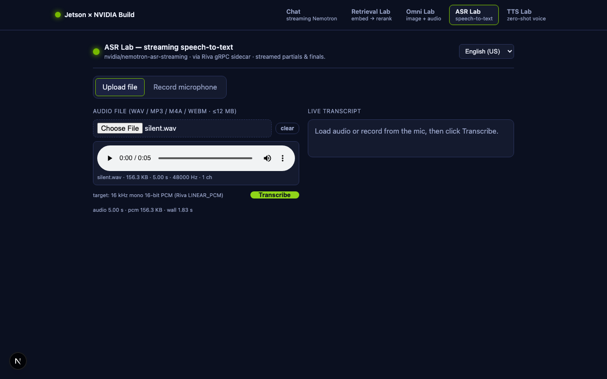
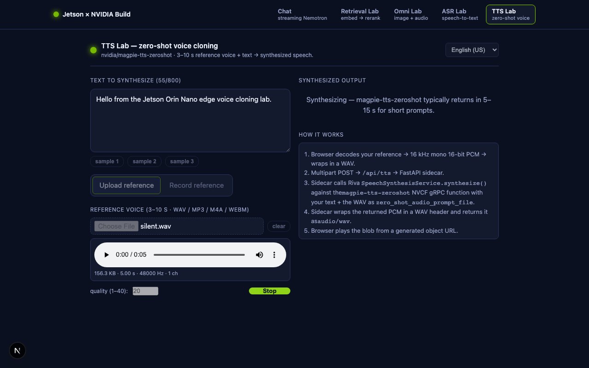

<style>
:root { --blue:#0055A2; --gold:#E5A823; --ink:#202a3c; }
section { background:#fff; color:var(--ink); font-family:-apple-system,"Segoe UI",Roboto,Helvetica,Arial,sans-serif;
  font-size:21px; line-height:1.45; padding:46px 62px 54px; border-top:7px solid var(--blue); }
section::before { content:""; position:absolute; left:0; right:0; top:7px; height:3px; background:var(--gold); }
h1 { color:var(--blue); font-size:1.85em; margin:0 0 .3em; }
h2 { color:var(--blue); font-size:1.3em; border-bottom:2px solid var(--gold); padding-bottom:6px; margin:0 0 .5em; }
h3 { color:#0a3d7a; }
strong { color:var(--blue); }
a { color:var(--blue); text-decoration:none; border-bottom:1px solid var(--gold); }
code { background:#eef2f8; color:#0a3d7a; border-radius:5px; padding:.05em .35em; font-size:.92em; }
pre { background:#0f1830; border-radius:10px; box-shadow:0 6px 18px rgba(8,20,50,.12); }
pre code { background:transparent; color:#e8eefc; font-size:.8em; line-height:1.5; }
blockquote { border-left:4px solid var(--gold); background:#fbf6e9; color:#5b4a22; padding:.4em .9em; border-radius:6px; }
img { border-radius:10px; box-shadow:0 6px 18px rgba(8,20,50,.18); }
section::after { color:#9aa7bd; }
.step { background:var(--blue); color:#fff; border-radius:999px; padding:.03em .6em; font-weight:700; font-size:.85em; }
.tiny { font-size:.78em; color:#5d6b82; }
.cols { display:flex; gap:26px; align-items:center; } .cols > * { flex:1; }
section.lead { text-align:center; border-top-width:10px; }
section.lead h1 { font-size:2.3em; }
</style>

<!-- _class: lead -->
# 🌐 Build a Web AI App
### Next.js + NVIDIA Nemotron (Build API)

`SJSU · Edge AI`

<span class="tiny">A streaming chatbot web app that runs on your Jetson and serves to any browser.</span>

---

## <span class="step">1</span> What you'll build

<div class="cols">
<div>

- A **Next.js** web app with a **streaming chat** UI.
- Powered by **NVIDIA Nemotron** through the **Build API** (cloud GPUs).
- **Runs on the Jetson**, opened from your laptop's browser.
- 🔒 Your API key stays **server‑side** — never exposed to the browser.

</div>
<div>



</div>
</div>

---

## <span class="step">2</span> How it fits together

<div class="cols">
<div>

Browser → **Next.js API route on the Jetson** → NVIDIA Build → back to the browser.

- The page is a **Client Component** (streams tokens live).
- `/api/chat` is a **server route** — it holds the key and calls NVIDIA.
- The browser never sees the key.

</div>
<div>



</div>
</div>

---

## <span class="step">3</span> Where's the code

```text
edgeLLM/nextjs-nemotron-app/
  app/api/chat/route.js     # streaming chat endpoint (holds the API key)
  app/api/models/route.js   # lists available Nemotron models
  app/page.js               # the chat UI (Client Component)
  .env.local                # your NVIDIA_API_KEY (not committed)
```

<span class="tiny">📦 Repo: [edgeLLM/nextjs-nemotron-app](https://github.com/lkk688/edgeAI/tree/main/edgeLLM/nextjs-nemotron-app)</span>

---

## <span class="step">4</span> Setup

1. **Node 20** (via `nvm`, no sudo):

```bash
curl -o- https://raw.githubusercontent.com/nvm-sh/nvm/v0.40.1/install.sh | bash
exec $SHELL && nvm install 20 && nvm alias default 20
```

2. **API key** → get a free one at **build.nvidia.com**, then:

```bash
cd edgeLLM/nextjs-nemotron-app
echo "NVIDIA_API_KEY=nvapi-xxxxx" > .env.local
```

---

## <span class="step">5</span> Run it

```bash
cd edgeLLM/nextjs-nemotron-app
npm install                  # first time
npm run dev                  # dev server on http://localhost:3000
# (for a fast demo build:  npm run build && npm run start)
```

Open it **from your laptop** using the Jetson's IP:

```bash
hostname -I | awk '{print $1}'      # e.g. 192.168.5.206  → http://192.168.5.206:3000
```

> Each `/api/chat` round trip goes Jetson → NVIDIA Build → Jetson → your browser, streaming tokens with a TTFT / tokens-per-second metrics line.

---

## <span class="step">6</span> Extend it — bonus labs

The same app grows into multimodal labs (each has its own page + API route):

<div class="cols">
<div>

- 🔎 **Retrieval** — embeddings + rerank search
- 🖼️ **Omni** — multimodal (image) reasoning
- 🎙️ **ASR** — speech‑to‑text
- 🔊 **TTS** — zero‑shot voice synthesis

</div>
<div>

 
 

</div>
</div>

---

<!-- _class: lead -->
## 📚 Full walkthrough

Step‑by‑step build, code, and all four bonus labs:

[lkk688.github.io/edgeAI/curriculum/11_nextjs_nemotron_app](https://lkk688.github.io/edgeAI/curriculum/11_nextjs_nemotron_app/)

<span class="tiny">← Back to the [Get‑Started slides](get-started.html)</span>
