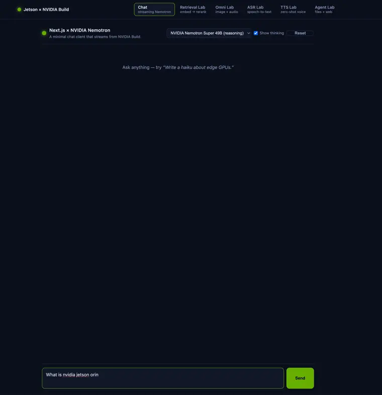
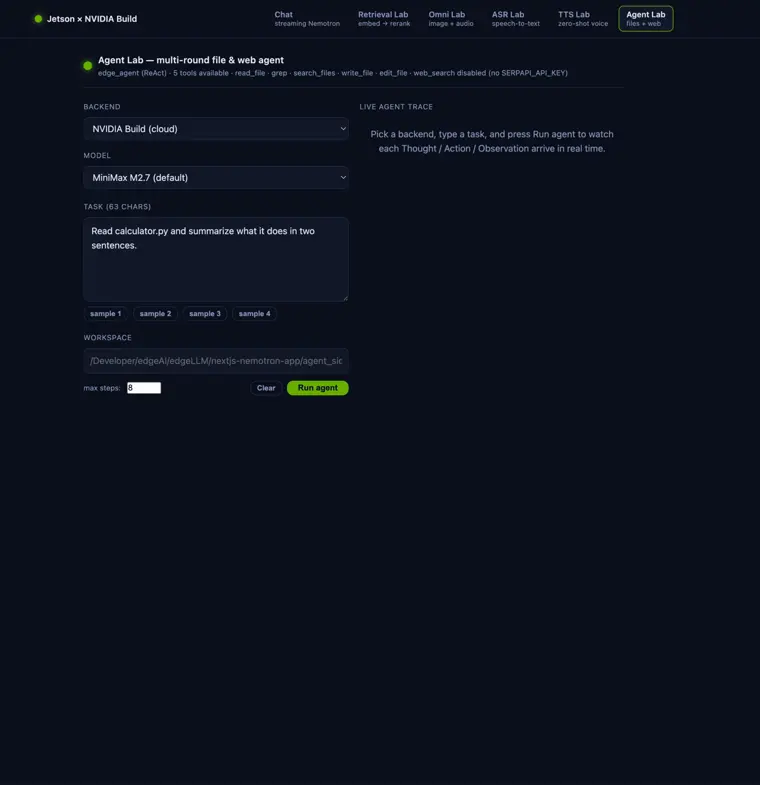

<!-- _class: lead -->
# 🌐 Build a Web AI App
### Next.js + NVIDIA Nemotron (Build API)

`SJSU · Edge AI`

<span class="tiny">A streaming chatbot web app that runs on your Jetson and serves to any browser.</span>

---

## <span class="step">1</span> What you'll build

<div class="cols">
<div>

- A **Next.js** web app with a **streaming chat** UI.
- Talks to **NVIDIA Nemotron** (and optionally **OpenAI** / **Anthropic**) via cloud APIs.
- **Runs on the Jetson**, opened from your laptop's browser.
- 🔒 Your API key stays **server‑side** — never sent to the browser.

</div>
<div>


</div>
</div>

---

## <span class="step">2</span> The big picture

<div class="cols">
<div>

Your browser talks to a small **server on the Jetson**, which talks to the model API:

`Browser → /api/chat (on Jetson) → NVIDIA/OpenAI/Anthropic → stream back`

- The **page** runs in the browser (buttons, live text).
- The **API route** runs on the server — it holds the key and calls the model.
- The browser **never sees the key**.

</div>
<div>


</div>
</div>

---

## <span class="step">3</span> Key web concepts (background)

- **Next.js** = a React framework. Each folder under `app/` is a page (the *App Router*).
- **Server Components / routes** run on the Jetson — they can hold **secrets** and call APIs.
- **Client Components** run in the **browser** — they're interactive (`"use client"`).
- **Streaming (SSE)**: the server forwards tokens one chunk at a time, so the answer appears live.

> Rule of thumb: **secrets + external API calls → server**; **buttons + live updates → client**.

---

## <span class="step">4</span> Where's the code (and what each part does)

```text
edgeLLM/nextjs-nemotron-app/
  app/page.js               # the chat UI  — Client Component (browser)
  app/components/ChatUI.js  # streaming chat box
  app/api/chat/route.js     # server route — holds the key, streams from the model
  app/api/models/route.js   # the model dropdown list
  lib/providers.js          # picks NVIDIA/OpenAI/Anthropic + reads keys from ~/.env.local
  .env.local                # optional local keys (git-ignored)
```

<span class="tiny">📦 Repo: [edgeLLM/nextjs-nemotron-app](https://github.com/lkk688/edgeAI/tree/main/edgeLLM/nextjs-nemotron-app)</span>

---

## <span class="step">5</span> Setup — API keys

**Keys** come from your **`~/.env.local`** (the same file `sjsujetsontool chat` saved). Add any of:

```bash
echo "NVIDIA_API_KEY=nvapi-…"     >> ~/.env.local   # build.nvidia.com (free)
echo "OPENAI_API_KEY=sk-…"        >> ~/.env.local   # platform.openai.com
echo "ANTHROPIC_API_KEY=sk-ant-…" >> ~/.env.local   # console.anthropic.com
```

The app picks the provider from the **model you choose** (`nvidia/…`, `gpt-…`, `claude-…`).

> 🛠️ **No Node on the host or in the container yet?** That's normal — the next slide installs
> everything with one command. *No `sudo` is needed anywhere.*

---

## <span class="step">6</span> Run the **frontend** — `sjsujetsontool node`

One command installs Node in the container, runs `npm install`, and starts the dev server.
Run from **anywhere** on the host (your home is fine):

```bash
sjsujetsontool node             # interactive: prompts for path + mode
```

It asks the path with a sensible default — press *Enter* for this lesson:

```text
🟢 node v20.20.2 · npm 10.8.2  (inside container jetson-dev)
📁 Project path? [Enter = /Developer/edgeAI/edgeLLM/nextjs-nemotron-app]:
📦 Project: /Developer/edgeAI/edgeLLM/nextjs-nemotron-app
▶️  Start the frontend now? [f]oreground / [b]ackground / [n]o:  b
🚀 Starting in BACKGROUND on port 3000.   • URL: http://192.168.5.206:3000
```

**Shortcuts (skip the prompts):**

```bash
sjsujetsontool node bg                          # bg, default path
sjsujetsontool node fg /Developer/my-vite-app   # fg, explicit path (any order)
sjsujetsontool node /Developer/my-app bg        # path + mode, swapped
sjsujetsontool node stop                        # stop a background server
sjsujetsontool node clean                       # wipe .next cache — fixes "Module not found"
sjsujetsontool node clean all                   # also wipe node_modules (forces a fresh npm install)
```

<span class="tiny">**Stuck on `Module not found`?** Run `sjsujetsontool node clean` then `sjsujetsontool node bg`.
Routes through the container so the student account doesn't need `sudo` to delete the root-owned
`.next` folder. `sjsujetsontool update` now also wipes stale caches in Step 5/5 automatically.</span>

---

## <span class="step">7</span> Manual install (what `sjsujetsontool node` does for you)

If you ever need to install Node by hand — or you want to see what the one-step command
runs — open a container shell and use NodeSource's apt repo (Ubuntu 24.04 aarch64, root inside,
*no sudo*):

```bash
sjsujetsontool shell                                # drops into root@jetson-dev:/workspace
curl -fsSL https://deb.nodesource.com/setup_20.x | bash -
apt-get install -y nodejs                           # → node v20.20.2 · npm 10.8.2
```

Then build and run the app the classic way:

```bash
cd /Developer/edgeAI/edgeLLM/nextjs-nemotron-app
npm install                                         # first time only (~30-60 s)
npm run dev                                         # serves on 0.0.0.0:3000
```

> The Node install lives in the **container's writable layer** — it persists across
> `sjsujetsontool shell` invocations until the image is rebuilt. `node_modules/` lives
> on the host SSD because the parent dir is a host mount.

---

## <span class="step">8</span> Open it from your laptop — on the **same LAN**

Find the Jetson's IP and open it in any browser:

```bash
hostname -I | awk '{print $1}'        # e.g. 192.168.5.206  → http://192.168.5.206:3000
```

Each message streams **Jetson → model API → Jetson → your browser**, with a live TTFT and
tokens-per-second line under the chat. To stop a backgrounded server:

```bash
sjsujetsontool node stop
```

---

## <span class="step">9</span> Open it from your laptop — **over SSH (off-LAN)**

Working from home / a hotel / a Headscale tunnel? You don't need Tailscale on your laptop —
SSH itself can forward the port:

```bash
# On your laptop, in a NEW terminal — keep it open while you use the app:
ssh -p 20065 \
    -L 3000:localhost:3000 \      # Next.js dev server
    -L 8002:localhost:8002 \      # Agent Lab sidecar (optional)
    student@headscale.forgengi.org -N
```

Then open <**http://localhost:3000**> in your laptop browser. Traffic rides the encrypted
SSH tunnel; nothing is exposed publicly.

<span class="tiny">**Free bonus:** Browsers treat `http://localhost` as a *secure context*, so the **mic** in
the ASR/Omni labs works through the tunnel without HTTPS. Direct LAN IPs don't get that.</span>

<span class="tiny">
**Common snags** — `bind: Address already in use` → use a different left side
(`-L 13000:localhost:3000` → open `localhost:13000`). Tunnel dies after a few minutes →
add `-o ServerAliveInterval=30`.
</span>

---

## <span class="step">10</span> Extend it — same pattern every time

Every feature = **one page** (UI) + **one API route** (server logic). Copy the pattern:

```text
app/<feature>/page.js        # the page/UI
app/api/<feature>/route.js   # server: read key, call a model, return/stream
```

The bonus labs are exactly this — add a route + page and you've extended the app:

<div class="cols">
<div>

🔎 **Retrieval** · 🖼️ **Omni** (vision) · 🎙️ **ASR** · 🔊 **TTS** · 🛠️ **Agent Lab** (files + web)

</div>
<div>

 

</div>
</div>

<span class="tiny">**Agent Lab backend menu** mirrors `sjsujetsontool chat`:
🟢 **NVIDIA Build** · 🦙 **Local llama.cpp (:8080)** · 🎓 **Shared SJSU `node05`** (no key needed) ·
🤖 OpenAI · ✨ Anthropic · ⚙️ Custom. Switch with one dropdown — see Lesson 11b.</span>

---

## <span class="step">11</span> Make it your own (push to GitHub)

Copy the app into your own folder, then create your repo:

```bash
cp -r /Developer/edgeAI/edgeLLM/nextjs-nemotron-app ~/my-ai-app
cd ~/my-ai-app && rm -rf node_modules .next
git init && git add -A && git commit -m "My Edge AI web app"
```

Create an empty repo on **github.com** (the **＋ → New repository**), then:

```bash
git remote add origin https://github.com/<your-username>/my-ai-app.git
git branch -M main && git push -u origin main
```

<span class="tiny">With the GitHub CLI it's one line: <code>gh repo create my-ai-app --public --source=. --push</code></span>

---

## 🎥 Video Demo: Next.js App in Action

See the Next.js chat interface stream tokens and execute tasks via the FastAPI agent backend.

<div class="fig-center">
  
  <span class="caption">Streaming chat tokens and executing coding agent tasks locally on the Jetson</span>
</div>

---

<!-- _class: lead -->
## 🛠️ Agent Lab — a separate module

The chat lab finished. Next: turn the same app into a **multi-round agent** that can
**read · grep · search · write · edit** files (and optionally **web-search**) on the Jetson.
One more `sjsujetsontool` command brings the backend up.

---

## <span class="step">12</span> Run the **Agent Lab backend** — `sjsujetsontool agent`

The **Agent Lab** (`/agent` page) needs a second server next to Next.js: a small **FastAPI**
process that hosts the `edge_agent` ReAct loop + the file-tool kit
(`read_file / grep / search_files / write_file / edit_file` + optional `web_search`).
One more `sjsujetsontool` command does the whole setup — *no `sudo`*:

```bash
sjsujetsontool agent bg          # install fastapi+uvicorn+edge_agent in ~/.venv, run on :8002
sjsujetsontool agent status      # → 🟢 up on :8002, lists tools + workspace
sjsujetsontool agent stop
```

After that you have **two backgrounded processes** sharing `~/.env.local`:

```text
Next.js  on :3000  ← sjsujetsontool node  bg     # browser-facing UI         (in container)
FastAPI  on :8002  ← sjsujetsontool agent bg     # ReAct loop + tool kit     (on the host)
                            ▲
                       reads ~/.env.local
                       NVIDIA_API_KEY, SERPAPI_API_KEY, …
```

<span class="tiny">**Why one in the container, one on the host?** Node lives where `apt` can install it (the
container). The FastAPI backend needs the same `~/.venv` your `sjsujetsontool chat` command uses,
so it stays on the host. `--network host` lets them reach each other at `localhost`.</span>

---

## 🎥 Video Demo: Agent Lab in Action

Observe how the Next.js Agent Lab runs reasoning-action loops (ReAct) with file tools on the Jetson.

<div class="cols">
<div>

### Key Agent Options
- **Brain Options**: Switch between NVIDIA API, local `llama.cpp` on Orin, or shared server (`node05`).
- **Policy Control**: Change system instructions to require planning first, or enforce a read-only code auditor.
- **Full Architecture**: For details on the ReAct control loop, tools, and python implementation, see [react-agent.md](react-agent.md).

</div>
<div>

<div class="fig-center">
  
  <span class="caption">ReAct agent solving a coding task live</span>
</div>

</div>
</div>

---

<!-- _class: lead -->
## 📚 Full walkthrough

Step‑by‑step build, code, and the four bonus labs:

[lkk688.github.io/edgeAI/curriculum/11_nextjs_nemotron_app](https://lkk688.github.io/edgeAI/curriculum/11_nextjs_nemotron_app/)

<span class="tiny">← Back to the [Get‑Started slides](get-started.html)</span>
